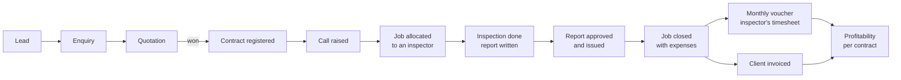

# Role & Flow Documentation

**What this is:** a role-by-role map of the application — who each person is, what
they can see, what they can do, and the path they walk to get their work done.

**Where it comes from:** the code, not from anybody's memory of how the system is
meant to behave. Every claim about a permission carries a `file:line` reference so
you can check it yourself. Where the code is ambiguous or contradicts what a
reasonable person would expect, that is said plainly rather than smoothed over.

**Read in this order:**

| File | What it answers |
|---|---|
| `01-roles.md` | Who are the sixteen roles, in business terms? |
| `02-permission-matrix.md` | Who can do what, module by module? |
| `03-object-lifecycles.md` | What states can a call, job, voucher or contract hold, and who moves them? |
| `04-flows/<role>.md` | What does one person's day actually look like, screen by screen? |
| `99-gaps-and-risks.md` | Where is the permission model wrong, unclear, or dangerous? |

---

## The version this describes

Branch `claude/quotation-management-workflow-5dokb2`, commit `ece1f48`, 23 August 2026.

**A warning before you rely on this.** The repository holds two branches with
**no shared history at all** — `php-app` and the branch above. They are not a fork
and a mainline; they are two unrelated code lines. `php-app` contains roughly fifty
commits of work (vendor audit engine, deputation & site operations, the
nonconformity/CAPA engine, the client & vendor portal, the analytics layer) that do
**not** exist on the branch documented here. This documentation describes the
quotation branch only. If work from the other line is meant to be part of the
product, the two need reconciling, and this document set will need revisiting when
they are.

---

## What the application does

It runs a **third-party inspection company** — the sort that sends a qualified
engineer to a factory or a site to witness that something was built, welded or
tested correctly, and then issues a report the client relies on to accept or reject
the goods.

The money follows one chain, and the software is built around it:



Two things sit on top of that chain and shape the whole permission model.

**It is built for an accredited body.** ISO/IEC 17020 is named directly in the
permission catalogue. That standard requires that the person who *judges* something
is not the person who *did* it — so deciding a complaint, closing a corrective
action and closing a nonconformity are each separate permissions, held apart from
the everyday work of recording them (`phpapp/lib/access.php:76-83`).

**It is multi-branch.** A call can be sold by one office and carried out by another.
The office that does the work is the one that allocates it, even though the office
that sold it can see it and will invoice it (`phpapp/lib/ops.php:550-573`).

---

## Words this documentation uses

Business nouns in this system are **configurable** — an installation can rename
"call" to "work order" or "inspector" to "engineer" under Settings → Terminology,
and the screens follow (`phpapp/lib/access.php:206-220`). This documentation uses
the default words. If your screens say something different, the underlying object
is the same.

| Word | What it means here |
|---|---|
| **Call** | A single request for inspection work, raised against a contract. The unit of demand. Sometimes shown as "work order". |
| **Job** | One call allocated to one named inspector for named dates. The unit of doing. A call can carry more than one job. |
| **Visit / visit day** | One day of a multi-day job. Each is closed with its own report before the job as a whole can close. |
| **Voucher** | An inspector's monthly timesheet-and-expense claim, built from the days they actually worked. This is what they get paid on. |
| **Contract / BOSS number** | The commercial agreement a call is raised under. Profitability is measured per contract, not per job. |
| **Report / IDEMS** | The inspection report and the engine that produces it — templates, sections, approvals, signatures, and the IRN (the report's unique issued number). |
| **Business partner** | One directory record that can be a client, a vendor, or both. There is not a separate client table and vendor table. |
| **Office / branch** | A physical branch of the company. Most people's data is limited to their own. |
| **Business Unit (SBU)** | A line of business cutting across branches. A second, independent way of limiting what someone sees. |
| **Scope** | *Which records* you can see — set by office and business unit. Distinct from permission. |
| **Permission** | *Which features* you may use. Someone can hold a permission and still see nothing, if their scope is empty. |
| **Module** | A switchable area of the app (Calls, Jobs, Vouchers, …). Each gives two permissions: view and edit. |
| **Licence** | Whether the company has *bought* a module. Checked before permissions, and it overrules everyone — including the Master Admin (`phpapp/lib/access.php:505-509`). |

### Two technical terms worth knowing

**`can('something')`** is the single question the whole application asks before
showing a screen or allowing an action. Everything funnels through one function
(`phpapp/lib/access.php:452`). When this documentation says a permission is
"checked", it means a real `can()` call exists at the line cited.

**"Implicit"** means a role can do something *not* because it was granted, but
because nothing stopped it. These are marked `⚠ implicit` in the matrix and listed
again in `99-gaps-and-risks.md`. They matter because taking the permission away does
not take the ability away.

---

## How to check any claim here

Every permission statement cites `file:line`. To verify one:

```bash
sed -n '452,456p' phpapp/lib/access.php     # the line range cited
```

To see a role's complete granted set for yourself, the role defaults are
plain PHP in `phpapp/lib/access.php:360-397` (fine-grained permissions and scope)
and `phpapp/lib/access.php:249-300` (module view/edit access).

---

## Two honest caveats about this document set

**Defaults, not your live system.** Everything here describes the **built-in role
defaults**. A Master Admin can override any role's permissions under
Settings → Roles & access, and individual users can be overridden again on top of
that (`phpapp/lib/access.php:410-424`). If your installation has been tuned, the
shape holds but specific cells may not. The order of precedence is: per-user
override, then role override, then the built-in default.

**Coverage.** `access.php`, `layout_top.php`, `areas.php`, `helpers.php`, the router
and the central permission gate were read in full. `ops.php` is just under seven
thousand lines; its permission gate, dispatch table and the handlers for calls,
jobs, vouchers, profitability and hiring were read closely, and the rest was
searched rather than read line by line. Where a claim rests on a search rather than
a full reading, it is cited to the line found. Absence of a guard is reported only
where a search across the whole codebase found none — those searches are named in
`99-gaps-and-risks.md` so you can repeat them.
