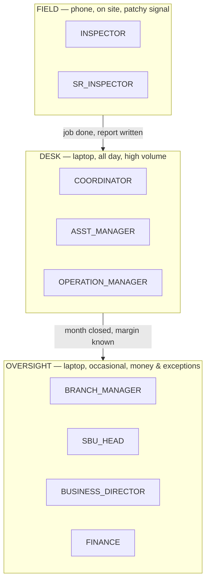
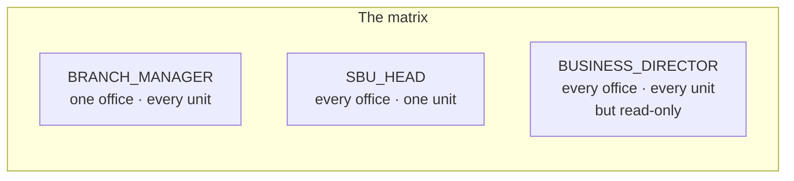

# The Roles

Sixteen roles exist. They are declared in one place — `phpapp/lib/access.php:10-19` —
and that list is the authority. If a role is not in it, the application does not
recognise it.

> **Before you read on.** Everything below is the **built-in default** for each role.
> A Master Admin can rewrite any role's permissions under Settings → Roles & access,
> and can override an individual user on top of that (`phpapp/lib/access.php:410-424`).
> If your installation has been tuned, the shape holds but specific items may not.

---

## The three populations

The sixteen roles are not sixteen equally-weighted jobs. They fall into three
groups that use the software in genuinely different ways, and the code knows it.



Two smaller groups sit alongside: **Sales** (four roles who fill the funnel before
operations begins) and **Administration** (three roles who configure rather than
operate).

---

## A word on "coordinator level"

`is_coordinator_level()` (`phpapp/lib/ops.php:548`) is **a tier, not a role**. It
answers yes for *nine* roles: the seven operations-management roles, plus
`ASST_MANAGER`, plus `COORDINATOR`.

This matters more than it sounds. A large number of operational actions — allocating
a job, reassigning it, closing a visit day, approving a voucher, marking a voucher
paid — are gated on this **tier**, not on the permission that appears to govern them.
Where that is true it is called out under the role, and every instance is listed in
`99-gaps-and-risks.md`.

The tier deliberately **excludes** Finance and all four Sales roles
(`phpapp/lib/access.php:33-40`). That exclusion is recent and intentional: the
comment in the code explains that lumping them in made every operational widget leak
to them — "a salesperson seeing *vouchers to approve*, an accountant seeing *raise
inspection call*". It fixed a real problem, and it created a smaller new one, which
you will find under **FINANCE** below.

---
---

# OPERATIONS — the people who deliver the work

---

## `COORDINATOR`

**Role key:** `COORDINATOR`

### Who this is in real life

The person who turns a signed contract into work that actually happens. A client
rings or emails asking for an inspection next Tuesday in Vadodara; the coordinator
checks there is an open contract to raise it against, creates the call, finds an
inspector who is free and qualified, books the dates, and then chases the job until
the report is in and the file is closed. When the inspector is stuck at a gate
without the right paperwork, the coordinator is who they ring.

This is the highest-volume seat in the company. Most records in the database were
created by somebody in this role.

### Device and context

Desk, laptop, two screens if they can get them, in the app continuously through the
working day. Their dashboard is deliberately reordered to put scheduling first
(`phpapp/views/dashboard.php:66`).

### What they see in the navigation

Dashboard · Search records · **Sales** ✗ · **Operations** ✓ · **Recruitment** ✓ ·
**Quality & Accreditation** ✓ · **Reporting** ✓ · **Money** ✓ · **Insights** ✓ ·
**Directory** ✓ · **Admin** ✓ (Masters only)

Editing rights on Calls, Jobs, Vouchers, Reports, Hiring, Attendance reconcile,
Complaints and the Client portal. Read-only on Clients, Vendors, Masters, Invoicing,
Corrective actions and Contracts (`phpapp/lib/access.php:269-271`).

They do **not** see Profitability — neither the module nor the `data.profitability`
permission. That was a deliberate recent change.

### What they are accountable for

That every call raised gets to a closed job with a report, on time, with the right
inspector on it. Turnaround is theirs. If a job is sitting unallocated three days
before the required date, that is a coordinator failure.

### What they must never be able to do

- **See what the branch earns.** They hold `data.credit` — they must see the credit
  figure to do the job — but not `data.revenue`, `data.salary` or
  `data.profitability` (`phpapp/lib/access.php:380`). The code comments this
  explicitly: a coordinator "has no business seeing what the branch earns on it"
  (`phpapp/lib/ops.php:577-579`).
- **Delete a call.** `ops.call.delete` is not theirs (`phpapp/lib/ops.php:3630`).
- **Change settings, manage users, or edit role permissions.**

> ✅ **Voucher approval is no longer a coordinator's job.** A coordinator could once
> submit a claim, approve it and mark it paid unaided, on any branch. Approval now
> belongs to the engineer's **reporting manager** or an **Operation / Branch
> Manager** (`phpapp/lib/ops.php:4871`), never to whoever submitted it; and the
> register is scoped to your own offices (`phpapp/lib/ops.php:5041`). You still
> prepare and submit claims, and you can still mark an approved one paid. See
> `99-gaps-and-risks.md` risk 3.
>
> ⚠ **One thing changed for you.** Creating a client or vendor now needs edit rights
> on the directory, which a coordinator does not hold by default — the "+ Add new"
> quick-add beside a client dropdown will refuse. Ask a Branch Manager, or ask for
> `mod.clients.edit`.

---

## `INSPECTOR`

**Role key:** `INSPECTOR`

### Who this is in real life

The qualified engineer who actually goes to the factory. They travel, check in at
the gate, witness the test or examine the weld, photograph what they find, write the
report, and claim their travel and expenses at the end of the month. They are the
product. Everything else in this application exists to get them to the right place
with the right paperwork and to pay them correctly afterwards.

### Device and context

**Phone, in the field, frequently on bad signal or none.** This is the one role the
application treats as genuinely mobile — there is a service worker and an offline
queue so a closure entered at a site with no bars is re-sent later
(`phpapp/views/layout_top.php:57`, `phpapp/assets/js/offline.js`). Their body tag
carries an `inspector` class so the whole interface can be styled differently
(`phpapp/views/layout_top.php:62`).

### What they see in the navigation

A deliberately tiny menu — one group, five items, and nothing else
(`phpapp/views/layout_top.php:100-114`):

**My work** → My Jobs · My Reports · New report · Endorsements · My Voucher

They do not see areas, dashboards, registers, directories or admin. They get their
own dashboard entirely (`phpapp/views/dashboard.php:23`).

### What they are accountable for

Turning up, inspecting competently, and getting a truthful report in on time. Also
their own honesty on the voucher — the days and kilometres they claim are what the
company pays and what the contract's margin is calculated from.

### What they must never be able to do

- **Anything with money beyond their own claim.** They hold **no** fine-grained
  permissions at all — the list is literally empty (`phpapp/lib/access.php:390`).
  No revenue, no credit, no salary, no profitability.
- **Touch the assignment console.** Hold, reassign, reschedule, cancel and no-show
  are refused to inspectors *explicitly and first*, before any permission is even
  consulted (`phpapp/lib/tosrm.php:222-223`). The comment is unambiguous: the
  console "can never leak to the field", even if the account somehow carries a stray
  edit permission. This is the most defensively-written gate in the application.
- **See another inspector's work.** Their scope flag is `self`
  (`phpapp/lib/access.php:439`) and My Jobs filters to their own inspector id
  (`phpapp/lib/ops.php:5891`).
- **Close a job after the deadline.** Once the lock window passes they lose the
  ability to close their own job, so late figures cannot simply be typed in as if
  nothing happened (`phpapp/lib/ops.php:5540`).

### What they *can* do that may surprise you

An inspector has **no Jobs module access at all** — yet they can open, upload to and
close their own job. This is a deliberate, narrow exception: a named allowlist of
owner-only actions, each checked against `job_owned_by_me()`
(`phpapp/lib/ops.php:2390-2398`, `phpapp/lib/ops.php:2230-2239`). It is well built
— worth knowing about, not worth worrying about.

---

## `SR_INSPECTOR`

**Role key:** `SR_INSPECTOR`

### Who this is in real life

Intended to be a senior field engineer — someone who still inspects, but who is
also trusted to vet a junior colleague's report before it is issued, and who may be
named as the approver on a report type.

### ⚠ Read this before assigning anyone to this role

**The role is declared but not wired up.** It exists in the role list
(`phpapp/lib/access.php:18`) and it has sensible defaults
(`phpapp/lib/access.php:391-395`) — and then **no other file in the application ever
tests for it.** A search across every PHP file finds it only in `access.php`, in an
unrelated list of job *designations*, and in seed data.

The practical consequences:

| What should happen | What actually happens | Why |
|---|---|---|
| Gets the phone-first field menu | Gets the full desk area rail instead | `is_inspector()` tests `=== 'INSPECTOR'` only (`phpapp/lib/ops.php:549`) |
| Sees only their own records | Sees their whole office's records | the `self` flag also tests `=== 'INSPECTOR'` (`phpapp/lib/access.php:439`) |
| Can open their own monthly voucher | **Cannot open a voucher at all** | the register offers the "mine" path to `INSPECTOR` and the desk path to coordinator-level; a Senior Inspector is neither (`phpapp/lib/ops.php:4857-4863`) |

That third row is the serious one. **Promote your best inspector to Senior Inspector
and they lose access to their own expense claim.** This is not recorded in
`PENDING.md`, so it does not appear to be a deliberate omission.

### Device and context

Intended: phone in the field. Actual: served the desk interface.

### What they see in the navigation

The desk rail — but nearly every area is empty, because the role holds only report
access. In practice: Dashboard · Search · **Reporting** ✓ · **Quality** ✓ (one tile,
which refuses — see `99-gaps-and-risks.md`). No Operations, no My Jobs, no voucher.

### What they are accountable for

Intended: report quality — their own and the reports they vet. `idems.finalize` is
theirs (`phpapp/lib/access.php:395`).

### What they must never be able to do

Everything an ordinary inspector must never do. In addition, they should not have
office-wide visibility of other people's records — which, today, they do.

**Recommendation:** do not use this role until it is wired up. Leave senior people
on `INSPECTOR` and name them as approvers, which works today without a role change.

---

## `ASST_MANAGER`

**Role key:** `ASST_MANAGER`

### Who this is in real life

A senior coordinator who supervises a few others and handles the calls that need
judgement — an awkward client, a job that has already slipped twice. A step on the
ladder between coordinating and running a branch.

### Device and context

Desk, laptop, in the app most of the day. Like the coordinator, their dashboard puts
scheduling first (`phpapp/views/dashboard.php:66`).

### What they see in the navigation

Dashboard · Search · **Operations** ✓ · **Quality** ✓ · **Reporting** ✓ ·
**Insights** ✓ · **Directory** ✓. No Money, no Recruitment, no Admin, no Sales.

Edit on Calls, Jobs, Reports and Complaints; read-only on Clients, Vendors, Reports
and Corrective actions (`phpapp/lib/access.php:266-268`).

### What they are accountable for

The calls and jobs they personally hold, and supporting the coordinators around
them.

### What they must never be able to do

- **Close a job.** They have `ops.call.create` and `ops.job.allocate` but pointedly
  **not** `ops.job.close` (`phpapp/lib/access.php:377`) — the only operations role
  where those three are split.
- **See any money.** No `data.credit`, no revenue, no salary, no profitability — a
  narrower financial view than the coordinator they supervise.
- **Touch vouchers.** No voucher module (`phpapp/lib/access.php:266`).

> ⚠ **The job-close boundary still does not hold.** Withholding `ops.job.close` has
> no practical effect, because the close route never checks that permission — it is
> gated by the Jobs module and job ownership only (`phpapp/lib/ops.php:5716-5719`).
> An Assistant Manager holds Jobs edit, so they can close jobs. That is risk 5, still
> open.
>
> ✅ **The voucher boundary now holds.** They hold no voucher module, and the module
> is now checked (`phpapp/lib/ops.php:2368-2375`), so vouchers are genuinely closed
> to them. If your Assistant Managers do handle vouchers in practice, grant
> `mod.vouchers.view` rather than reverting the fix.

---

## `OPERATION_MANAGER`

**Role key:** `OPERATION_MANAGER`

### Who this is in real life

Runs the delivery engine for a branch or a business unit, one level under the Branch
Manager. Owns the schedule as a whole rather than individual calls: is there enough
inspector capacity next month, which contracts are slipping, which jobs need a
better-qualified engineer. Described in the code as "manager under the branch
manager" (`phpapp/lib/access.php:374`).

### Device and context

Desk, laptop. In the app several times a day rather than continuously.

### What they see in the navigation

Dashboard · Search · **Operations** ✓ · **Recruitment** ✓ · **Quality** ✓ ·
**Reporting** ✓ · **Money** ✓ · **Insights** ✓ · **Directory** ✓ · **Admin** ✓
(Masters only).

Edit on Calls, Jobs, Reports, Vouchers, Hiring, Attendance reconcile, Complaints,
Corrective actions and the Client portal; read-only on Contracts, Clients, Vendors,
Masters, Profitability and Reports (`phpapp/lib/access.php:263-265`).

### What they are accountable for

Delivery and utilisation. Jobs done on time, inspectors neither idle nor
double-booked, and contract margin holding up — they can see profitability
(`data.profitability`) precisely so they can be held to it.

### What they must never be able to do

- **See salaries.** They have revenue and profitability but not `data.salary`
  (`phpapp/lib/access.php:375`) — they can see what a contract made without seeing
  what individuals are paid.
- **Manage users or settings.**
- **Delete calls.**

---

## `BRANCH_MANAGER`

**Role key:** `BRANCH_MANAGER`

### Who this is in real life

The person who runs a single branch and is accountable for that branch's margin.
They hire into it, they answer for its utilisation, and when a client escalates it
lands on their desk. They are a manager first and a system administrator second —
but within their own office they are effectively the top of the tree.

### Device and context

Desk, laptop. Dips in several times a day: approvals in the morning, exceptions
through the day, numbers at month end.

### What they see in the navigation

Everything except the Sales funnel screens. Dashboard · Search · **Sales** ✓
(read-only) · **Operations** ✓ · **Recruitment** ✓ · **Quality** ✓ · **Reporting** ✓
· **Money** ✓ · **Insights** ✓ · **Directory** ✓ · **Admin** ✓.

Edit on Calls, Jobs, Reports, Vouchers, Hiring, Attendance reconcile, Clients,
Vendors, Masters, Dashboards, Users, Complaints, Corrective actions, Audits, Data
control and the Client portal — the widest edit set of any non-administrator
(`phpapp/lib/access.php:259-261`).

### What they are accountable for

**Their branch's margin.** They hold every money permission there is — credit,
revenue, salary and profitability (`phpapp/lib/access.php:369`) — because they are
the person the number belongs to. Also: approving reports, approving vouchers,
hiring, and the branch's people.

### The scope shape that defines this role

`offices => 'OWN'`, `sbus => 'ALL'` (`phpapp/lib/access.php:369`). One branch, every
business unit within it. This is the mirror image of the SBU Head, and the pair is
the heart of the whole access model:



### What they must never be able to do

- **Reach another branch.** Office scope is `OWN` and it is applied in SQL on the
  registers (`phpapp/lib/access.php:479-496`).
- **Manage users outside their own office.** They hold `users.manage.branch`, not
  `users.manage.global` (`phpapp/lib/access.php:369`).
- **Change system settings or edit role permissions.** `settings.manage` is not
  theirs; Roles & access is Master Admin only (`phpapp/lib/ops.php:2423`).
- **Delete a call.** Reserved to the Branch Application Manager — see below.

---
---

# ADMINISTRATION — the people who configure rather than operate

---

## `BRANCH_APP_MANAGER`

**Role key:** `BRANCH_APP_MANAGER`

### Who this is in real life

The branch's system custodian — part office manager, part local IT. They keep the
dropdown lists sensible, set up new starters' logins, own the report numbering
rules, and are the one person allowed to correct a record that has been locked by
mistake. Think of them as the person who holds the keys to the filing cabinet
without being allowed to read the accounts.

### Device and context

Desk, laptop, occasional deep sessions rather than continuous use.

### What they see in the navigation

Dashboard · Search · **Operations** ✓ (read-only) · **Money** ✓ (Overheads only) ·
**Insights** ✓ · **Directory** ✓ · **Admin** ✓.

Edit on Masters, Overheads and Users; read-only on Calls, Jobs and Dashboards
(`phpapp/lib/access.php:261-262`).

### What they are accountable for

That the branch's reference data is correct, its logins are current, and its report
numbering is unbroken. Also the audit trail — `idems.audit.view` is theirs.

### The two powers nobody else has

- **`idems.timestamp.edit`** — editing a locked timestamp. The code names this role
  as the *only* one that may (`phpapp/lib/access.php:371`).
- **`ops.call.delete`** — deleting a call. Not even the Branch Manager has this
  (`phpapp/lib/access.php:372`, enforced at `phpapp/lib/ops.php:3630`).

Both are correct in principle: destructive corrections belong with the custodian,
not the person whose numbers they affect. Both deserve monitoring, because between
them they can make work disappear.

### What they must never be able to do

- **See money.** No credit, no revenue, no salary, no profitability
  (`phpapp/lib/access.php:372`). This is the point of the role: full custodial power
  over the records, no sight of the commercials.
- **Raise or allocate work.** No `ops.call.create`, no `ops.job.allocate`.

> ⚠ **The money boundary does not hold.** `can_see_revenue()` is
> `can('data.revenue') || is_admin_level()` (`phpapp/lib/ops.php:604`), and this role
> is in the management tier — so it sees revenue figures anyway, despite never being
> granted the permission. Note that the salary check on the line above has no such
> bypass, so the two are inconsistent. In `99-gaps-and-risks.md`.

---

## `MASTER_ADMIN`

**Role key:** `MASTER_ADMIN`

### Who this is in real life

The system owner — in most installations the founder or the person they trust with
everything. Not a daily seat. This is who you become to fix something nobody else
can fix.

### Device and context

Desk, laptop, infrequent.

### What they see in the navigation

Everything the licence allows — around forty destinations, which is why the rail has
a search box and folding groups (`phpapp/views/layout_top.php:75-84`).

### What they are accountable for

That the system is correctly configured and that the permission model reflects how
the business actually runs. Uniquely, they can edit what every other role may do
(`phpapp/lib/ops.php:2423`).

### The one thing they cannot do — and it is deliberate

**Open a module the company has not bought.** The licence check runs *before* the
Master Admin bypass (`phpapp/lib/access.php:452-455`). The reasoning is spelled out
in the code and is sound: an unbought module is not a permissions question, and a
Master Admin who could open it would be looking at a screen the customer cannot be
supported on.

### What they must never be able to do

Nothing is withheld by permission. The controls on this role are organisational, not
technical: give it to as few people as possible, and rely on the audit log
(`idems.audit.view`) rather than on restrictions.

---

## `ADMIN` (legacy)

**Role key:** `ADMIN`

### Who this is in real life

A historical role kept for backward compatibility. Its label in the code is
literally "Admin (legacy)" (`phpapp/lib/access.php:18`).

### What it actually is

**A second Master Admin in all but name.** It is granted every permission and every
module, across every office and business unit (`phpapp/lib/access.php:362-363`,
`phpapp/lib/access.php:253`). The only difference is that it does not carry the
`master` bypass flag, so it must hold each permission explicitly — which it does.

### ⚠ Why this role is the most dangerous thing in the permission model

`ADMIN` is the **fallback for any role the system does not recognise**:

```php
// Before — the fallback handed out full company-wide access:
if (!isset(ORG_ROLES[$role])) $role = 'ADMIN';
// Now (phpapp/lib/access.php:433) — an unrecognised role grants nothing:
if (!isset(ORG_ROLES[$role])) { access_note_unknown_role($u, $role); $role = UNKNOWN_ROLE; }
```

✅ **Fixed.** A typo in a user's role field, a role removed in a future version or a
bad import used to hand out full company-wide access. An unrecognised role now
resolves to `UNKNOWN_ROLE`, which carries no permission, no module and no scope —
and the account is logged so an administrator can find it. See
`99-gaps-and-risks.md` risk 1.

**`ADMIN` itself is unchanged**, and it is still a second Master Admin in all but
name. The recommendation below stands.

### Recommendation

Assign this role to nobody. Audit for it: any user carrying `ADMIN` has Master Admin
power without appearing to.

---
---

# OVERSIGHT — the people who watch rather than do

---

## `SBU_HEAD`

**Role key:** `SBU_HEAD`

### Who this is in real life

Runs one line of business — say all pipeline inspection, or all third-party
certification — across every branch the company has. They do not own any single
office; they own a **vertical slice** through all of them. Where a Branch Manager
asks "how did Vadodara do?", the SBU Head asks "how did welding inspection do,
everywhere?".

### Device and context

Desk, laptop. Weekly and monthly rather than daily; travels.

### What they see in the navigation

Dashboard · Search · **Sales** ✓ (read-only) · **Operations** ✓ (read-only) ·
**Recruitment** ✓ · **Quality** ✓ · **Reporting** ✓ · **Money** ✓ · **Insights** ✓ ·
**Directory** ✓ · **Admin** ✓ (Masters only).

**Read-only on everything** — the role has view access to nineteen modules and edit
on none (`phpapp/lib/access.php:257-258`).

### The scope shape that defines this role

`offices => 'ALL'`, `sbus => 'OWN'` (`phpapp/lib/access.php:367`) — every office,
one business unit. The exact mirror of the Branch Manager.

### What they are accountable for

Their business unit's profit and its people's utilisation, company-wide. They hold
all four money permissions and all four dashboards.

### The two things they can actually *do*

Despite being read-only on every module: **approve reports** (`idems.finalize`) and
**approve reports as reporting manager** (`workforce.report.approve`)
(`phpapp/lib/access.php:367`). Sensible — a business unit head signing off technical
work is exactly what an accreditation body expects.

### What they must never be able to do

- **Reach another business unit's records.** Enforced in SQL
  (`phpapp/lib/access.php:490-494`).
- **Create or edit operational records.** No `ops.*` permissions at all.
- **Manage users or settings.**

---

## `BUSINESS_DIRECTOR`

**Role key:** `BUSINESS_DIRECTOR`

### Who this is in real life

A board-level view. Sees the whole company and changes none of it. The role a
founder or non-executive director would be given so they can answer "how are we
doing?" without being able to disturb anything.

### Device and context

Desk or tablet. Occasional — monthly, or when something needs explaining.

### What they see in the navigation

Every area. **View on every module, edit on none** (`phpapp/lib/access.php:256`).

### What they are accountable for

Company performance. They hold every dashboard, every money permission, the
organisation hierarchy and the compliance audit log
(`phpapp/lib/access.php:364-365`) — and no operational permission whatsoever.

### The one exception carved out of "everything"

`identity` — the module holding colleagues' passports and ID documents — is
**explicitly removed** from this role's blanket grant
(`phpapp/lib/access.php:288-293`). The code's reasoning is worth quoting: a Business
Director getting every module by default "is a reasonable default for revenue figures
and a bad one for passports, so it is taken back out here and has to be granted
deliberately."

That is a genuinely thoughtful piece of privacy engineering and it should not be
undone casually.

### What they must never be able to do

- **Change anything at all.** No edit permission on any module, no `ops.*`, no
  `master.manage`, no `users.manage.*`, no `settings.manage`.
- **Read identity documents** without a deliberate grant.

---

## `FINANCE`

**Role key:** `FINANCE`

### Who this is in real life

The accountant. Raises the invoice once the job is done, chases the money, reconciles
inter-office credit between branches, registers the contract when a quotation is won,
and produces the numbers at month end.

### Device and context

Desk, laptop, all day in their own screens. Their dashboard is reordered to put money
first (`phpapp/views/dashboard.php:65`).

### What they see in the navigation

Dashboard · Search · **Sales** ✓ (quotes, read-only) · **Operations** ✓ ·
**Reporting** ✓ · **Money** ✓ · **Insights** ✓ · **Quality** ✓ (one tile). No
Recruitment, no Directory, no Admin.

Edit on Invoicing and Contracts; read-only on Quotes, Sales reports, Profitability,
Dashboards, Jobs, Calls, Vouchers and Reports (`phpapp/lib/access.php:283-284`).

### What they are accountable for

That every completed job is invoiced, that money owed is collected, that inter-office
credit balances, and that the contract is registered so operations can raise calls
against it. `crm.contract.register` is theirs and nobody else's
(`phpapp/lib/access.php:388`) — the handover point from selling to doing runs through
this role.

### Scope

`offices => 'ALL'`, `sbus => 'ALL'` (`phpapp/lib/access.php:388`). Company-wide, which
is correct for an accounts function.

### What they must never be able to do

- **Raise a call or allocate a job.** No `ops.*` permissions, and they were
  deliberately removed from the operations management tier
  (`phpapp/lib/access.php:33-40`).
- **Approve a quotation.** `crm.quote.approve` is not theirs — they register the
  contract *after* somebody else has approved the quote.

> ✅ **Finance can now open vouchers and record payment.** The register used to demand
> the operations tier, which Finance is deliberately not in — so the menu offered a
> screen that refused, and the people who actually pay could not mark anything paid.
> Both are fixed: the register accepts `finance.reconcile`
> (`phpapp/lib/ops.php:5033`) and so does mark-paid (`phpapp/lib/ops.php:4894`).
> See `99-gaps-and-risks.md` risks 3 and 11.

---
---

# SALES — the funnel before operations begins

These four roles fill the pipeline. None of them can touch a call, a job or a
voucher, and none is in the operations management tier
(`phpapp/lib/access.php:33-40`).

---

## `BUSINESS_DEV_MANAGER`

**Role key:** `BUSINESS_DEV_MANAGER`

**Who this is:** the hunter. Finds companies that do not yet buy from you, works the
lead into a real opportunity, and gets a quotation in front of them.

**Device and context:** laptop and phone, frequently travelling or at a client site.

**Navigation:** Dashboard · Search · **Sales** ✓ · **Insights** ✓ · **Directory** ✓.
Nothing else. Edit on Enquiries, Quotations and Contracts; read-only on Sales
reports, Clients and Dashboards (`phpapp/lib/access.php:301-303`).

**Accountable for:** new business won. They can create quotes, send them and manage
follow-ups (`phpapp/lib/access.php:382`).

**Must never be able to:** **approve their own quotation** — `crm.quote.approve` is
withheld, which is the single most important boundary in the sales model. Also: no
operational access, no salary or profitability figures. They do hold `data.credit`,
so they can see the credit figure on a deal.

---

## `KEY_ACCOUNTS_MANAGER`

**Role key:** `KEY_ACCOUNTS_MANAGER`

**Who this is:** the farmer. Owns the handful of clients that make up most of the
revenue, and is measured on keeping and growing them rather than on finding new ones.

**Device and context:** laptop and phone, often at the client's office.

**Navigation and permissions:** **identical to `BUSINESS_DEV_MANAGER`** — the two
share a single branch in the code (`phpapp/lib/access.php:403`,
`phpapp/lib/access.php:381-382`). They are two business roles with one permission
set. That is reasonable today; it means any future change to one silently changes
the other, which is worth knowing.

**Accountable for:** retention and growth of named accounts.

**Must never be able to:** approve their own quotations; reach operations.

---

## `MARKETING_MANAGER`

**Role key:** `MARKETING_MANAGER`

**Who this is:** runs the commercial function above the individual salespeople. Owns
pricing discipline, the quotation templates, and the approval of deals that need a
second signature.

**Device and context:** desk, laptop.

**Navigation:** Dashboard · Search · **Sales** ✓ · **Money** ✓ · **Insights** ✓ ·
**Directory** ✓ · **Admin** ✓ (document templates only). Edit on Enquiries,
Quotations, Contracts, Sales reports and Clients
(`phpapp/lib/access.php:304-306`).

**Accountable for:** the quality and profitability of what is sold. They uniquely
hold `crm.quote.approve` and `crm.template.manage` among the sales roles
(`phpapp/lib/access.php:384`).

**Must never be able to:** touch operations — no calls, jobs or vouchers.

> ⚠ **This role has company-wide profitability.** `data.profitability` plus
> `data.revenue`, with `offices => 'ALL'` and `sbus => 'ALL'`
> (`phpapp/lib/access.php:384`) — broader financial reach than the Operation Manager
> who actually delivers the work. Defensible for a commercial director; worth an
> explicit decision rather than an inherited default. In `99-gaps-and-risks.md`.

---

## `MARKETING_EXECUTIVE`

**Role key:** `MARKETING_EXECUTIVE`

**Who this is:** the junior in the sales office. Types up enquiries, drafts
quotations for someone else to check, and chases customers for a decision.

**Device and context:** desk, laptop.

**Navigation:** the narrowest of any desk role — Dashboard · Search · **Sales** ✓
and nothing else. No Insights (they hold no dashboard permission at all), no Money,
no Directory beyond clients, no Admin. Edit on Enquiries and Quotations only
(`phpapp/lib/access.php:280-281`).

**Accountable for:** accurate, timely quotation drafts and disciplined follow-up.

**Must never be able to:** send a quotation to a customer (`crm.quote.send` is
withheld — they draft, someone else sends), approve one, or see any money figure.
Their permission set is two entries long (`phpapp/lib/access.php:386`), and that
restraint is correct.

---

## Roles the brief did not name

Six of the sixteen were not in the original list and are documented above:
`ASST_MANAGER`, `SR_INSPECTOR`, `BUSINESS_DEV_MANAGER`, `KEY_ACCOUNTS_MANAGER`,
`MARKETING_MANAGER`, `MARKETING_EXECUTIVE`.

Of these, **`SR_INSPECTOR` needs a decision** — it is declared but not implemented,
and assigning someone to it today costs them access to their own expense claim. The
other five are complete and behave as their names suggest.
