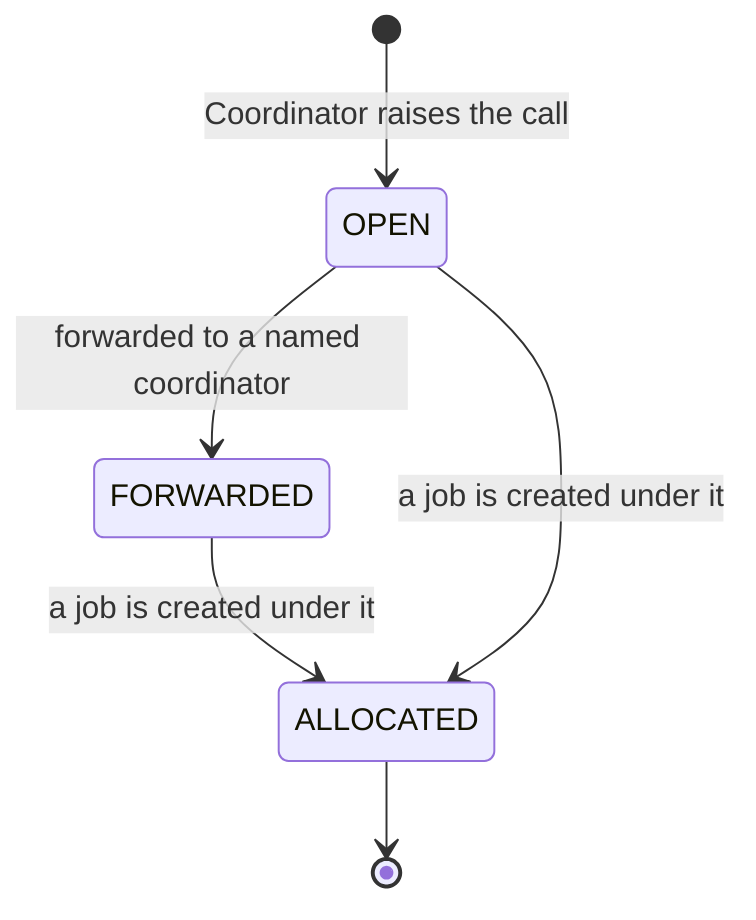
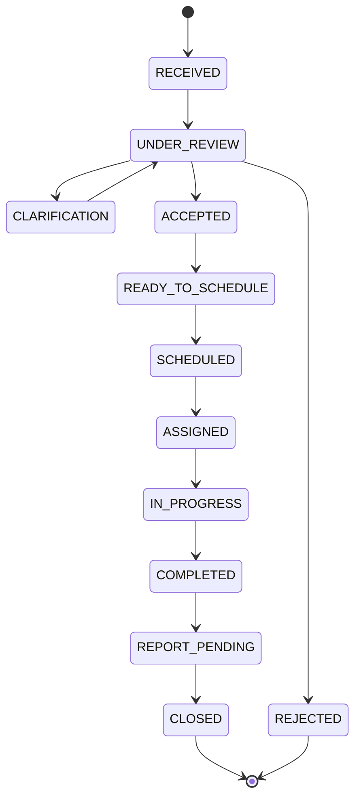
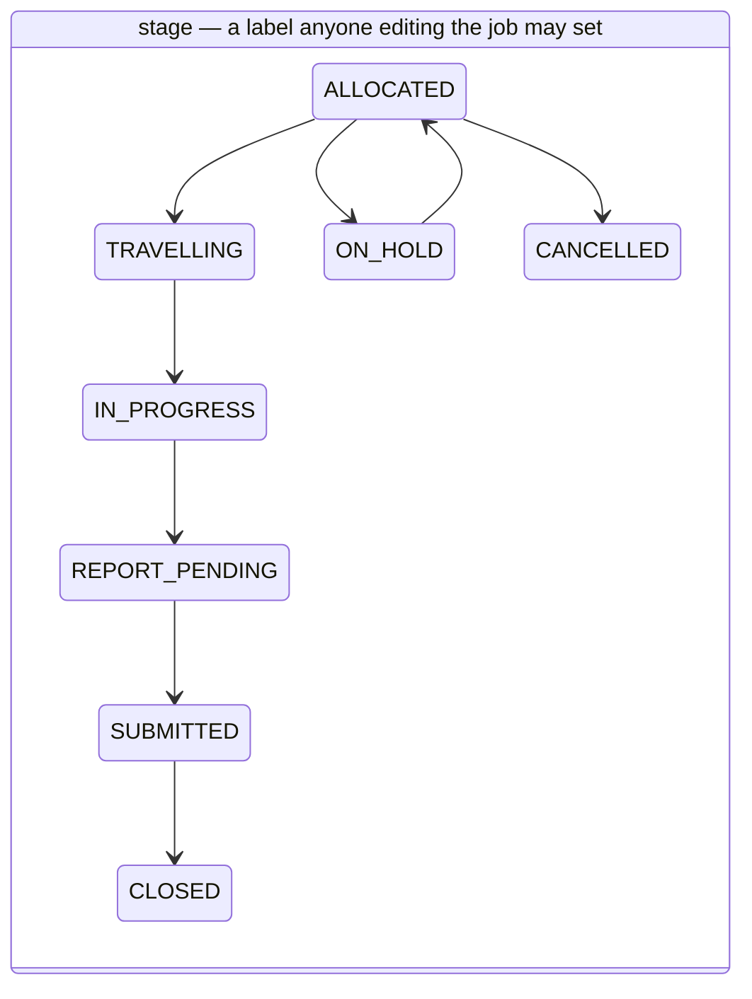
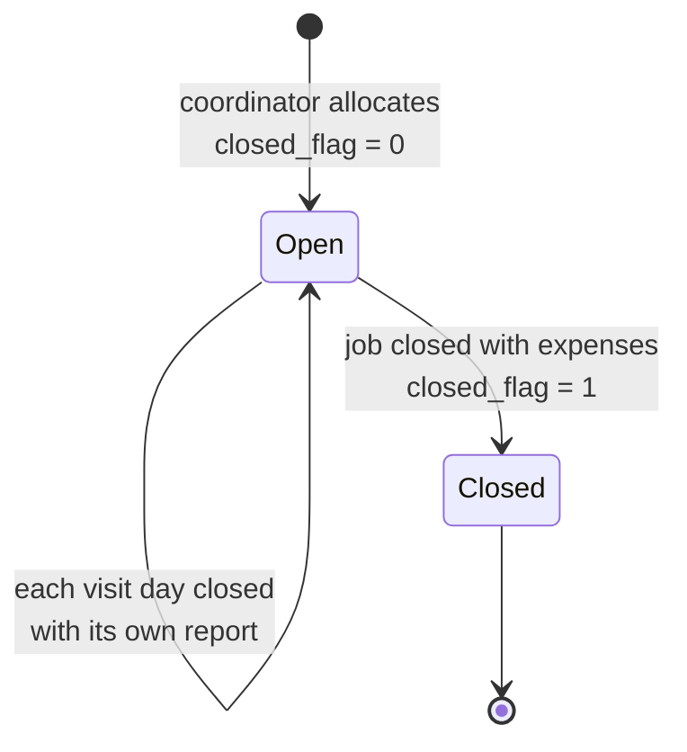
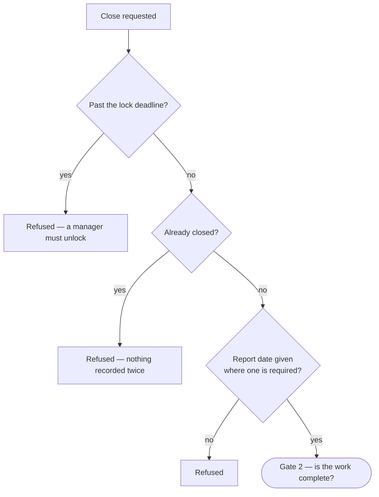
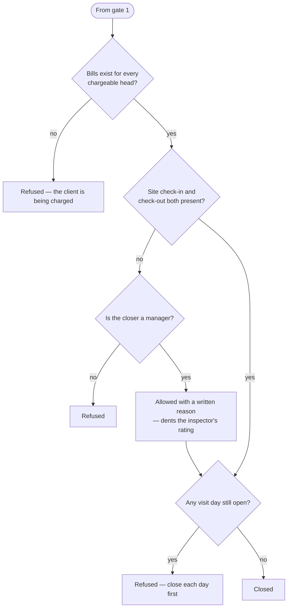
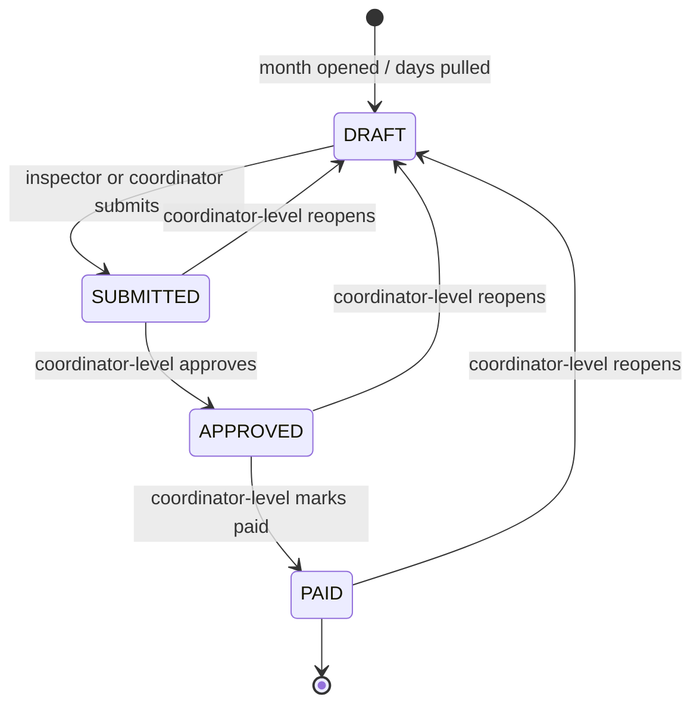
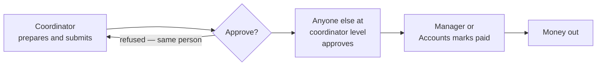
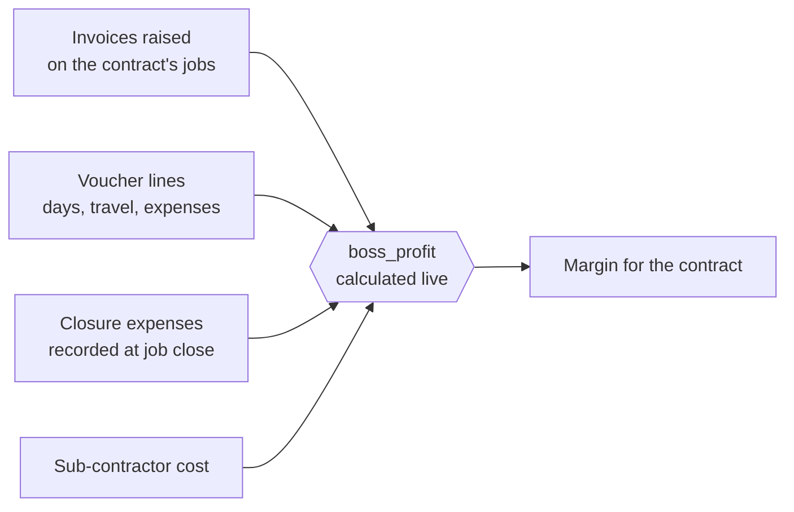
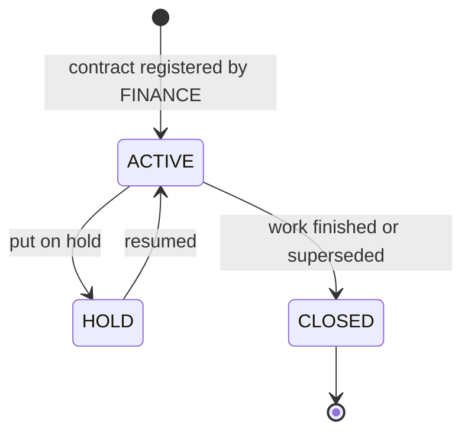

# Object Lifecycles

Every state each core object can hold, every transition between them, and which
role is allowed to trigger each one.

**These are the lifecycles that exist, not tidier ones.** Where the code has two
competing notions of the same thing, both are drawn.

---

## 1. The Call

### ⚠ Read this first: a call has *three* different notions of "done"

This is the single most confusing thing in the data model, and it is better to know
it than to be surprised by it later.

| # | Where it lives | Who moves it | What it is for |
|---|---|---|---|
| 1 | `calls.status` — the **legacy** column | The application, automatically | Left over from the original design. Moves on its own as work progresses. |
| 2 | `calls.op_status` — the **service-request** column | A person, from a dropdown | The 15-state lifecycle added later. Never moves on its own. |
| 3 | *Nothing* — derived on the fly | Nobody | The register decides a call is done when **every job under it is closed**. |

They can disagree, and they have. A recent fix (`b7cdc71`, 23 Aug 2026) records the
symptom: closing a job never set the call's status, so the call detail screen said
"Done" while the register said "In progress, not allocated, no report" — about the
same call, on the same day.

`tosrm_call_status()` reconciles the first two by preferring `op_status` and falling
back to a translation of the legacy column (`phpapp/lib/tosrm.php:117-128`). Nothing
reconciles the third.

### 1a. The legacy column — moves by itself

| Transition | Who triggers it | Where |
|---|---|---|
| `→ OPEN` | Anyone with `ops.call.create`: `BRANCH_MANAGER`, `OPERATION_MANAGER`, `ASST_MANAGER`, `COORDINATOR`, `MASTER_ADMIN`, `ADMIN` | `phpapp/lib/ops.php:3695` |
| `→ FORWARDED` | Automatic, when the call is forwarded to a coordinator | `phpapp/lib/ops.php:3957` |
| `→ ALLOCATED` | Automatic, when a job is raised against it | `phpapp/lib/ops.php:5413` |

`CLOSED` and `CANCELLED` are read by the translation function
(`phpapp/lib/tosrm.php:119-120`) but **nothing in the current code ever writes
them**. They exist for historic records only.

### 1b. The service-request column — moved only by a person

Fifteen states (`phpapp/lib/tosrm.php:26-42`). The code is explicit that this is
"a DEFAULT lifecycle. The actual path is **not enforced**" — an audit service, for
example, is expected to skip most of it.

Two further states — `DRAFT` and `ON_HOLD` — can be entered from anywhere and are
left out of the diagram to keep it readable. `CANCELLED` likewise.

**The arrows above are the intended path, not a rule the software enforces.** In
reality the transition function accepts **any state from any state**: it validates
only that the target exists in the list, then writes it
(`phpapp/lib/tosrm.php:132-143`). A call can go from `RECEIVED` straight to
`CLOSED`, or from `CLOSED` back to `DRAFT`.

**Who may trigger any of them:** a single gate, `tosrm_can_edit()`
(`phpapp/lib/tosrm.php:215-227`), applied at `phpapp/lib/tosrm.php:495`:

- **Yes:** `MASTER_ADMIN`, `ADMIN`, `BUSINESS_DIRECTOR`, `SBU_HEAD`,
  `BRANCH_MANAGER`, `BRANCH_APP_MANAGER`, `OPERATION_MANAGER`, `ASST_MANAGER`,
  `COORDINATOR` — anyone with `mod.calls.edit`, `ops.job.allocate`, or in the
  management tier.
- **No, and refused first:** `INSPECTOR`. The check rejects inspectors before it
  consults any permission, so the console "can never leak to the field"
  (`phpapp/lib/tosrm.php:218-223`).
- **No:** all four Sales roles, `FINANCE`, `SR_INSPECTOR`.

**Every transition is recorded** — old status, new status, reason, who, when — in
`call_status_events`, plus the compliance audit log
(`phpapp/lib/tosrm.php:139-141`). This is the best-audited transition in the
application.

---

## 2. The Job

### ⚠ The job's "stage" is a label, not a state machine

`jobs.stage` holds eight values (`phpapp/lib/ops.php:32`) and it is edited as **a
free dropdown on the job form** (`phpapp/views/ops/job_form.php:171`, saved as an
ordinary field at `phpapp/lib/ops.php:4121`). There is no transition table, no
ordering, and no check that one state may follow another. Anyone who can edit the
job can set any stage at any time, including straight to `CLOSED`.

The state that actually *governs* anything is a separate flag: `closed_flag`, which
is `0` or `1` and is set in exactly one place, by the closure route.

The stage diagram above is the *intended* progression. Any arrow you can imagine
between any two of those boxes is also permitted by the code.

Only one stage transition is ever set by the application rather than typed by a
person: `→ CANCELLED`, when an assignment is cancelled and the job is not already
closed (`phpapp/lib/tosrm.php:656`).

### 2a. The real job lifecycle — the closed flag

**This transition happens once and is not reversible through the interface.** The
handler refuses a second closure explicitly, because a re-post — a refresh, a
back-and-resend, the offline queue re-sending — used to file another set of expenses
and double the engineer's claim (`phpapp/lib/ops.php:5544-5551`).

**Who may close a job:**

| Role | May close? | Why |
|---|---|---|
| `INSPECTOR` | **Their own job only** | Owner allowlist, checked with `job_owned_by_me()` (`phpapp/lib/ops.php:2379-2387`) |
| `COORDINATOR`, `ASST_MANAGER`, `OPERATION_MANAGER`, `BRANCH_MANAGER` | Yes | Hold `mod.jobs.view` |
| `BUSINESS_DIRECTOR`, `SBU_HEAD`, `BRANCH_APP_MANAGER` | ⚠ **Yes** | Hold `mod.jobs.view`; nothing else is checked |
| `MASTER_ADMIN`, `ADMIN` | Yes | Everything |
| `FINANCE` | ⚠ **Yes** | Holds `mod.jobs.view` — and nothing more is required |
| Sales roles, `SR_INSPECTOR` | No | No jobs module |

**The closure route checks no permission at all** (`phpapp/lib/ops.php:5571-5534`).
The `ops.job.close` permission that appears to govern this is never consulted here —
holding `mod.jobs.view` is sufficient. That is why Finance and the Business Director
appear in that table.

### 2b. What the closure actually enforces

The permission model is loose here; the **business rules are not.** Before
`closed_flag` is set, the handler refuses closure for any of these
(`phpapp/lib/ops.php:5576-5610`):

**Gate 1 — may this be closed at all?** The lock deadline, the
already-closed check, and the report date.

**Gate 2 — is the work actually complete?** The bills, the site check-in, and
every visit day.

Each of those gates is a real business promise. The bills gate in particular is
checked on the server rather than only in the browser, and the comment says why:
"this is a promise made to a customer" (`phpapp/lib/ops.php:5573-5576`).

---

## 3. The Voucher

The inspector's monthly timesheet and expense claim. **The cleanest lifecycle in the
application** — four states, four transitions, each with a real precondition.

| Transition | Who may trigger it | Precondition | Where |
|---|---|---|---|
| `→ DRAFT` (create) | The owning inspector, or coordinator-level | — | `phpapp/lib/ops.php:5015` |
| `DRAFT → SUBMITTED` | **The owning inspector**, or coordinator-level | Must be `DRAFT` | `phpapp/lib/ops.php:5109` |
| `SUBMITTED → APPROVED` | Coordinator-level, **excluding whoever submitted it** | Must be `SUBMITTED` | `phpapp/lib/ops.php:4842`, applied at `:5108` |
| `APPROVED → PAID` | Coordinator-level **or** `finance.reconcile` | Must be `APPROVED` | `phpapp/lib/ops.php:4851`, applied at `:5116` |
| `any → DRAFT` (reopen) | Coordinator-level **only** | ⚠ **none** | `phpapp/lib/ops.php:5128` |

### Three things to know about this lifecycle

**A closed month freezes its vouchers.** Once the month-end cost run has been
calculated, the vouchers behind it can no longer be edited — because the stored cost
allocation was worked out from those days, and changing one would make the figures
still add up while being wrong (`phpapp/lib/ops.php:4715-4730`). To correct a day,
reopen the month first. This is well-designed and the error message explains itself.

**A daily hours cap is enforced on save.** No inspector may log more than the
configured daily limit on any one date, validated across the whole submission before
anything is written (`phpapp/lib/ops.php:5000-5010`).

**⚠ The reopen has no precondition and no audit trail.** Unlike every other
transition here, `reopen` does not check the current status
(`phpapp/lib/ops.php:4974`) — so a **`PAID` voucher can be sent back to `DRAFT` and
edited**. And unlike a call's status change, which writes a full history row
(`phpapp/lib/tosrm.php:139-141`), no voucher transition is recorded anywhere. There
is no way to answer "who reopened this, and what did it say before?"

### ✅ The segregation-of-duties problem was fixed

It used to read like this — `is_coordinator_level()` appeared on all three money
transitions, and one `COORDINATOR` satisfied all three, so a claim could go from
creation to paid with nobody else seeing it. Meanwhile Finance, who actually pays,
could not mark anything paid.

Both halves are now closed (`99-gaps-and-risks.md` risk 3c):

A `submitted_by_uid` column records who put the claim forward
(`phpapp/lib/ops.php:457`), and `voucher_can_approve()` refuses that same person
(`phpapp/lib/ops.php:4842`). Anyone else at the same level still may — a branch with
two coordinators needs no manager, a branch with one does. `voucher_can_mark_paid()`
now also accepts `finance.reconcile` (`phpapp/lib/ops.php:4851`), and the register
opens for accounts (`:4992`), so the people who pay can record payment.

**Two things did not change.** The `reopen` transition still has no precondition, so
a `PAID` voucher can still be sent back to `DRAFT` — that is risk 12. And there is
still no audit trail on any voucher transition.

---

## 4. Profitability

### It is not a workflow object

There is no profitability record with states. **Profitability is a calculation**,
computed on demand from the jobs, invoices and voucher lines that hang off a
contract (`phpapp/lib/ops.php:6095-6116`).

The only thing with a lifecycle is the **contract** the figure is calculated for.

### 4a. The contract

Three states (`phpapp/lib/ops.php:47`):

| Transition | Who may trigger it | Where |
|---|---|---|
| `→ ACTIVE` (register) | `FINANCE` — uniquely holds `crm.contract.register` | `phpapp/lib/access.php:388` |
| `ACTIVE ↔ HOLD`, `→ CLOSED` | Edited as an ordinary master field by anyone with masters edit rights | `phpapp/lib/ops.php:2104` |
| Renewal / supersede | Tracked through `supersedes` / `superseded_by`, refused while jobs are still open | `phpapp/lib/ops.php:6240` |

**A call cannot be raised without an open contract** — that rule was added
deliberately (commit `b1a2ab1`), and it is what makes the contract the spine of the
whole chain.

### 4b. Who may see the figure

Two independent checks, both explicit — the strictest gate on any screen:

1. The module: `mod.profitability.view` (`phpapp/lib/ops.php:2262`)
2. The permission: `can('data.profitability')` (`phpapp/lib/ops.php:6096`)

Allowed: `MASTER_ADMIN`, `ADMIN`, `BUSINESS_DIRECTOR`, `SBU_HEAD`,
`BRANCH_MANAGER`, `OPERATION_MANAGER`, `FINANCE`, `MARKETING_MANAGER`.

Refused: `COORDINATOR`, `ASST_MANAGER`, `INSPECTOR`, `SR_INSPECTOR`,
`BRANCH_APP_MANAGER` and the three junior sales roles. Hiding it from coordinators
and inspectors was a deliberate recent change (commits `6e37d46`, `b9b1c91`).

Salary and loaded cost are a **further** gate on top (`can_see_salary()`,
`phpapp/lib/ops.php:576`) — so an Operation Manager sees what a contract made without
seeing what individuals are paid.

---

## Summary — how well-governed is each object?

| Object | States | Transitions guarded? | Audit trail? | Verdict |
|---|---|---|---|---|
| **Call** (service-request) | 15 | Yes — one clear gate | **Yes**, full history | Well governed; the free any-to-any movement is deliberate |
| **Call** (legacy) | 4 | Automatic only | No | Vestigial. Three competing notions of "done" |
| **Job stage** | 8 | **No** — free dropdown | No | A label, not a state |
| **Job closure** | 2 | Weak on permission, **strong on business rules** | `closed_at`, `closed_by` | The business gates are excellent; the permission gate is absent |
| **Voucher** | 4 | Yes, except reopen | **No** | Clean shape and a real second pair of eyes; still no audit trail |
| **Contract** | 3 | Registration yes; hold/close no | No | Adequate |
| **Profitability** | — | Read-only, doubly gated | n/a | The best-protected figure in the system |

The pattern is consistent: **this application governs its business rules far more
carefully than its permissions.** A job cannot be closed without its bills, its
report and its check-in — but almost anyone can be the one to close it.
