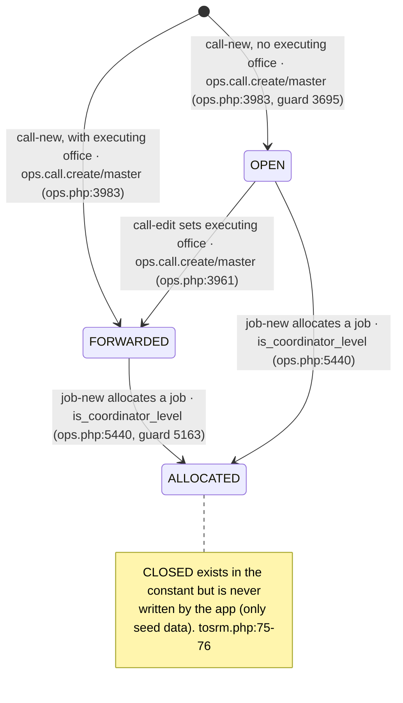
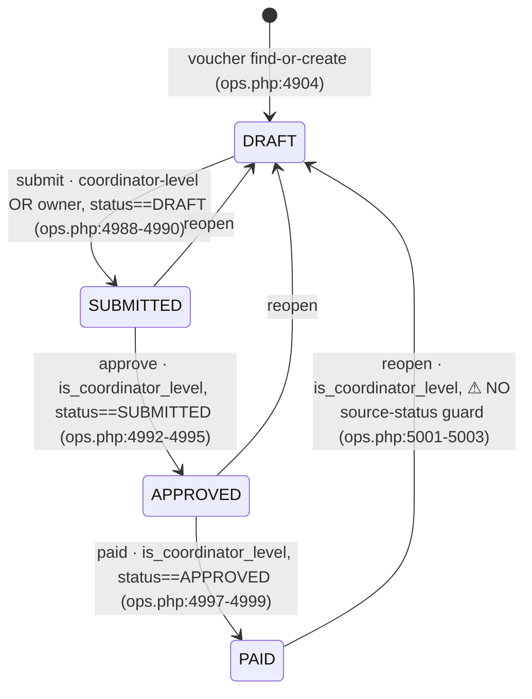
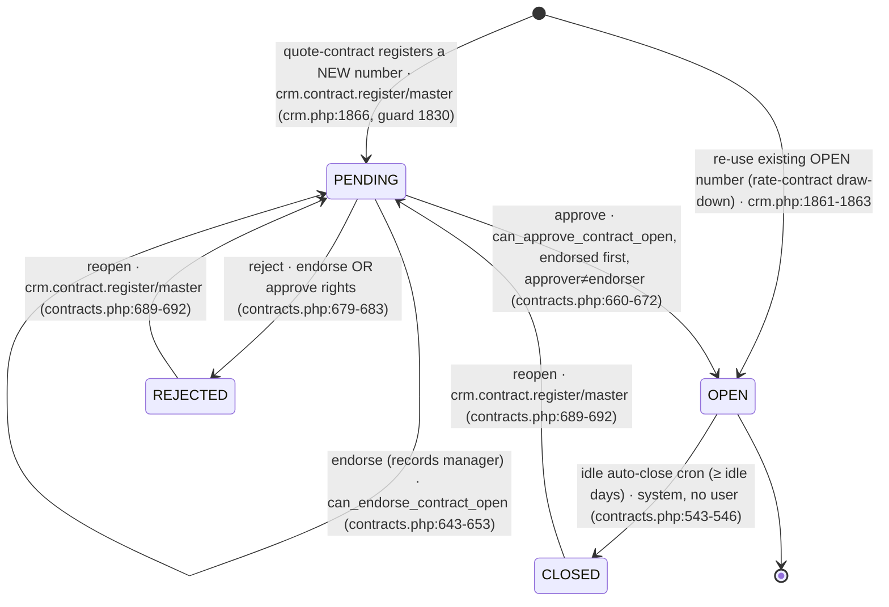

# 03 — Object Lifecycles

The real statuses each core object can hold and the transitions between them, with
the role/permission that triggers each. Extracted from the schema + code — including
**vestigial fields** (defined but never advanced) and **unguarded transitions**,
which are called out and repeated in `99-gaps-and-risks.md`.

Paths are relative to `phpapp/`.

---

## Call

A call carries **two** status columns:

- **Legacy `calls.status`** (`ops.php:153`) — in normal operation it only ever reaches
  `OPEN → FORWARDED → ALLOCATED`. **`CLOSED` is read as a guard but never written by
  app code** (only by seed data) — treat it as vestigial (`ops.php:5175`, `:6459` read it; no write).
- **`calls.op_status`** (`tosrm.php:77`) — the richer TOSRM service-request lifecycle
  (`CALL_STATUSES`, `tosrm.php:26-42`), set by a **free-form manual picker** with no
  per-transition rules (only set-membership validation).

### Legacy `calls.status` (what actually moves)

### `calls.op_status` (TOSRM — manual, unguarded per-transition)

Any user passing `tosrm_can_edit()` (master, or `mod.calls.edit`/`ops.job.allocate`,
or coordinator-level; **inspectors refused** — `tosrm.php:216-227`) can set **any** of
the 15 `CALL_STATUSES` via `call-status` (`tosrm.php:499-503`, setter `132-142`). There
is **no rule about which state may follow which** — validated only for membership
(`tosrm.php:134`); every change writes an audit row (`tosrm.php:139`). When blank it is
*derived* from the legacy status + jobs (`tosrm_derive_status()` `tosrm.php:117-124`).

> States: RECEIVED, DRAFT, UNDER_REVIEW, CLARIFICATION, ACCEPTED, REJECTED, ON_HOLD,
> READY_TO_SCHEDULE, SCHEDULED, ASSIGNED, IN_PROGRESS, COMPLETED, REPORT_PENDING,
> CLOSED, CANCELLED (`tosrm.php:26-42`). **⚠ free-form — see gaps doc.**

---

## Job

The real job lifecycle is driven by **`closed_flag`** (`ops.php:163`) +
**`report_approval`** (`ops.php:445`) + **`invoice_raised`** (`ops.php:428`). The rich
`jobs.stage` field (`JOB_STAGES`, `ops.php:32`) is **vestigial**: the only write anywhere
is `stage='CANCELLED'` (`tosrm.php:656`); it never advances through the intermediate stages.

```mermaid
stateDiagram-v2
  [*] --> Open : job-new allocates · is_coordinator_level (ops.php:5163)
  Open --> Closed : job-close · ⚠ NO permission guard, only business-rule blocks (ops.php:5559-5668)
  Closed --> ReportPending : report produced at close → report_approval=PENDING (ops.php:5666)
  ReportPending --> ReportApproved : report-approve (approve) · can_approve_report (workforce.php:700-704)
  ReportPending --> ReportRejected : report-approve (reject) · can_approve_report (workforce.php:700-704)
  Closed --> Invoiced : job-bill/job-invoice · finance.reconcile/invoicing/master; needs Closed (ops.php:5514,5518)
  Invoiced --> [*]
```

- **`job-close` has no `ops_require`** — it is gated only by business blocks (deadline
  lock, bills on file, site check-in, open visit-days, final docs). Comment says
  "Inspector (or coordinator) closes" (`ops.php:5560`). **⚠ implicit — see gaps doc.**
- Re-close is refused if already closed (`ops.php:5573`).
- `report_approval`: `'' → PENDING` at close; `PENDING → APPROVED/REJECTED` via
  `report-approve` (`workforce.php:701-704`), gated by `can_approve_report` (master, the
  inspector's reporting manager, `workforce.report.approve`, or `ops.job.close`+admin/coord).

---

## Voucher

`vouchers.status` (`ops.php:217-225`) — **DRAFT → SUBMITTED → APPROVED → PAID**, with a
`reopen` back to DRAFT. A separate **month-freeze** overlay (`voucher_month_frozen()`
→ `cost_month_frozen()`, `costing.php:282`) locks *editing* regardless of status.

- **⚠ Two weaknesses (gaps doc):** `reopen` has no source-status check — a coordinator
  can revert **any** voucher, including PAID, to DRAFT (`ops.php:5001`). And **approve has
  no segregation of duties** — the same coordinator-level person who submits can approve
  (`ops.php:4992`), unlike contracts and reports.

---

## Contract opening (`partner_contracts.open_status`)

`CONTRACT_OPEN_STATES` (`contracts.php:462-467`) — **PENDING, OPEN, REJECTED, CLOSED**.
A deliberate two-signature model: **endorse** (a manager) then **approve** (the branch
manager), with segregation enforced (approver ≠ endorser unless master).

- `can_endorse_contract_open()` (`contracts.php:473-477`): master, or OPERATION_MANAGER /
  SBU_HEAD / ADMIN / BUSINESS_DIRECTOR, or `users.manage.branch`.
- `can_approve_contract_open()` (`contracts.php:478-481`): master, or BRANCH_MANAGER /
  BRANCH_APP_MANAGER.
- Each action guards `status==='PENDING'` (endorse 645, approve 662, reject 681); reopen is
  the deliberate from-closed/rejected path.

---

## Inspection report (`report_docs.status`) — IDEMS

`IDEMS_STATUS` (`idems.php:59`) — **DRAFT, SUBMITTED, VETTING, UNDER_REVIEW, APPROVED,
ISSUED, REJECTED (label "Sent back"), ARCHIVED**. `finalized` flag (`idems.php:116`) locks
the row at issue. `ARCHIVED` is defined but never set (vestigial).

```mermaid
stateDiagram-v2
  [*] --> DRAFT : document-new · idems.edit/master (idems.php:4250, guard 4185)
  DRAFT --> VETTING : document-submit, vetting gate ON · idems_can_edit_doc (idems.php:4430)
  DRAFT --> UNDER_REVIEW : document-submit, no vetting gate · idems_can_edit_doc (idems.php:4446)
  VETTING --> UNDER_REVIEW : vet VETTED (auto-forward) · idems_can_vet = master/idems.finalize (idems.php:5892)
  VETTING --> DRAFT : vet RETURNED · idems_can_vet (idems.php:5875-5877)
  UNDER_REVIEW --> UNDER_REVIEW : approve, more chain levels · idems_can_act_step (idems.php:5740)
  UNDER_REVIEW --> APPROVED : approve, last level · idems_can_act_step (idems.php:5743)
  UNDER_REVIEW --> REJECTED : reject (remark required) · idems_can_act_step (idems.php:5750)
  UNDER_REVIEW --> DRAFT : sendback (remark required) · idems_can_act_step (idems.php:5757)
  APPROVED --> ISSUED : document-finalize · idems.finalize/master, approver≠issuer (idems.php:4518, seg 4460)
  ISSUED --> [*] : locked (finalized=1); revise spawns a NEW DRAFT row (idems.php:4578)
  REJECTED --> DRAFT : editable again (idems_status_allows_edit idems.php:3463)
```

- **Segregation (new, this codebase):** at finalize, if the current user approved this
  report, issue is refused — approver ≠ issuer (`idems.php:4458-4463`), master excepted.
  Finalize also needs full chain approval, a completeness gate, an AI-QA critical gate
  (`4473-4487`) and a calibration/authorisation gate (`4497-4503`).
- Editable only in '', DRAFT, REJECTED (`idems_status_allows_edit`, `idems.php:3463-3466`).

---

## Profitability — **computed, no lifecycle**

There is **no stored profitability record and no status**. The profitability screen
(`callprofit.php` `ops_call_profit()` `:59-97`) queries jobs/calls/expenses live and calls
`job_profit()` (`ops.php:1547+`), a pure calculator, summing in memory — no writes, no
table (grep for a profitability `CREATE TABLE` is empty). Access is a **read gate** only
(`data.profitability` / `data.revenue` / admin, `callprofit.php:62`). The only related
persisted state is the month-end **cost freeze** (`cost_month_frozen()`, `costing.php:282`),
which locks voucher/cost editing for a frozen month — an editing lock, not a status.
