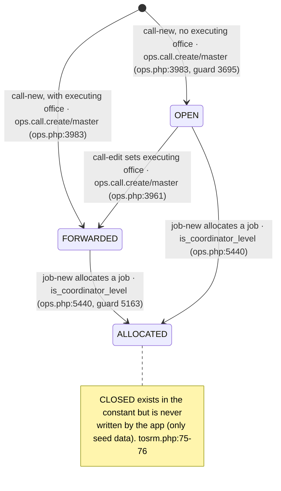
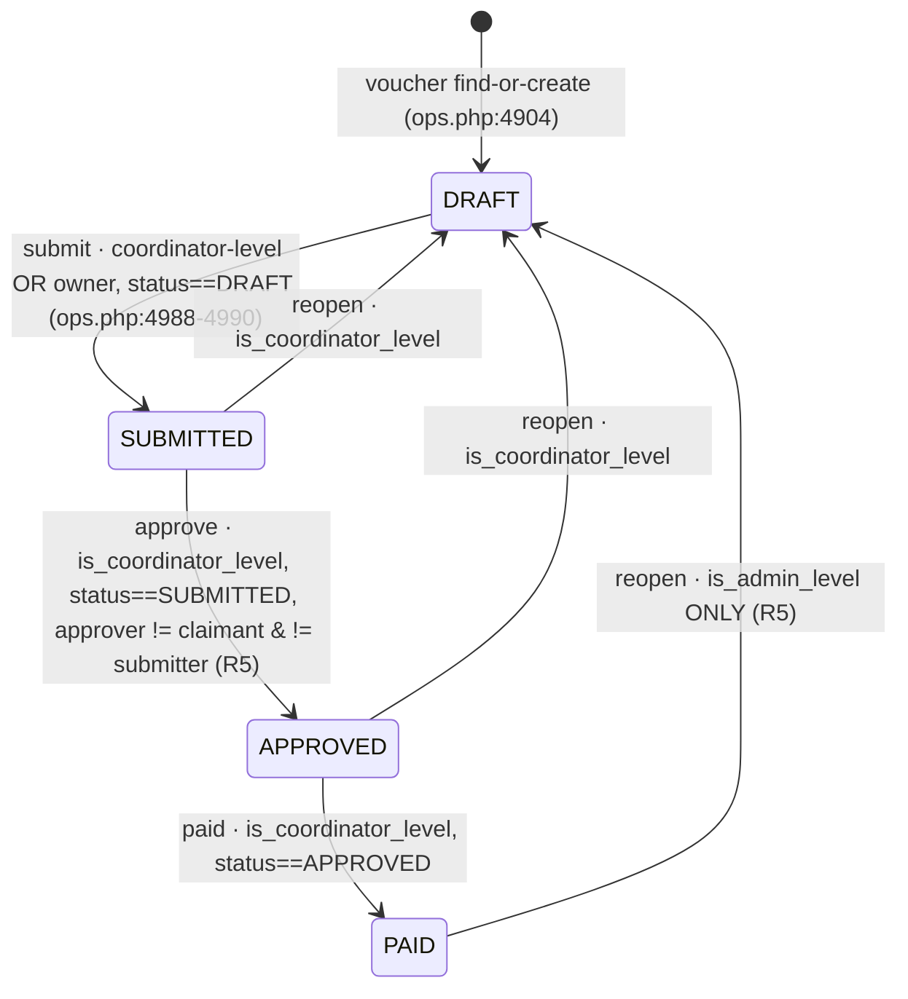
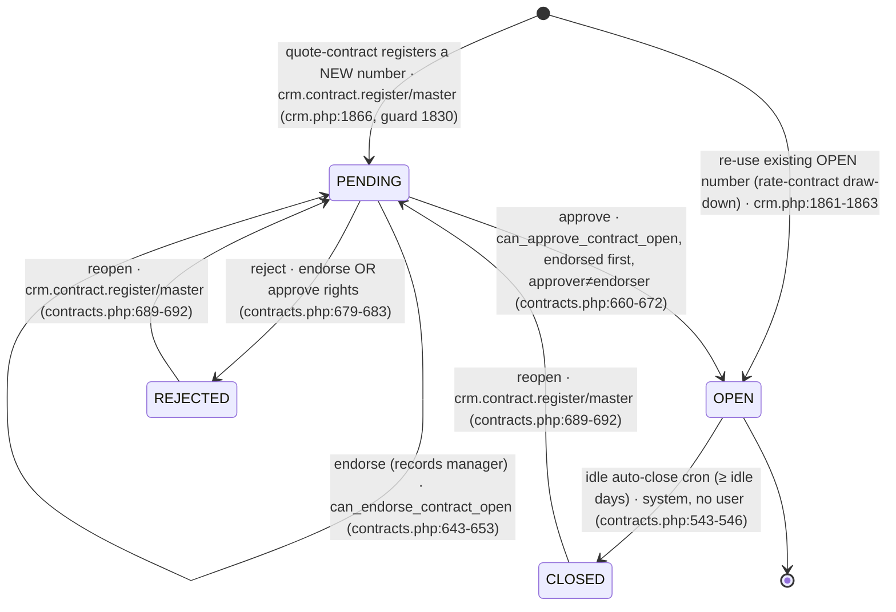

# 03 — Object Lifecycles

The real statuses each core object can hold and the transitions between them, with
the role/permission that triggers each. Extracted from the schema + code — including
**vestigial fields** (defined but never advanced) and **unguarded transitions**,
which are called out and repeated in `99-gaps-and-risks.md`.

Paths are relative to `phpapp/`.

---

## Call

A call carries **two** status columns:

- **Legacy `calls.status`** (`ops.php:153`) — in normal operation it only ever reaches
  `OPEN → FORWARDED → ALLOCATED`. **`CLOSED` is read as a guard but never written by
  app code** (only by seed data) — treat it as vestigial (`ops.php:5175`, `:6459` read it; no write).
- **`calls.op_status`** (`tosrm.php:77`) — the richer TOSRM service-request lifecycle
  (`CALL_STATUSES`, `tosrm.php:26-42`), set by a manual picker that now follows
  **forward-rank transition rules** (R6 fixed): forward/same-phase moves, ON_HOLD/CANCELLED
  from any live status, REJECTED only in intake, terminal states have no exit; a manager may
  override with a reason.

### Legacy `calls.status` (what actually moves)

### `calls.op_status` (TOSRM — rank-based transitions, R6)

Any user passing `tosrm_can_edit()` (master, or `mod.calls.edit`/`ops.job.allocate`,
or coordinator-level; **inspectors refused** — `tosrm.php:216-227`) can advance a call
via `call-status`. The active statuses carry a forward **rank** (`tosrm_status_rank`):
`tosrm_set_status` now allows only a **legal next step** (`tosrm_can_transition` /
`tosrm_allowed_next`) — forward or same-phase, ON_HOLD/CANCELLED from any live status,
REJECTED only in intake — and the picker lists only those. The terminal states
(CLOSED / REJECTED / CANCELLED) have **no exit**. A manager (`is_admin_level`) may
**override with a reason**, recorded as `[override]` in history. Every change writes an
audit row (`tosrm.php`). When blank it is *derived* from the legacy status + jobs
(`tosrm_derive_status()`).

> States (by rank): RECEIVED/DRAFT (1) → UNDER_REVIEW/CLARIFICATION (2) → ACCEPTED (3)
> → READY_TO_SCHEDULE (4) → SCHEDULED (5) → ASSIGNED (6) → IN_PROGRESS (7) →
> COMPLETED/REPORT_PENDING (8) → CLOSED (9); plus ON_HOLD, REJECTED, CANCELLED
> (`tosrm.php:26-42`).

---

## Job

The real job lifecycle is driven by **`closed_flag`** (`ops.php:163`) +
**`report_approval`** (`ops.php:445`) + **`invoice_raised`** (`ops.php:428`). The rich
`jobs.stage` field (`JOB_STAGES`, `ops.php:32`) is **vestigial**: the only write anywhere
is `stage='CANCELLED'` (`tosrm.php:656`); it never advances through the intermediate stages.

```mermaid
stateDiagram-v2
  [*] --> Open : job-new allocates · is_coordinator_level (ops.php:5163)
  Open --> Closed : job-close · is_master OR ops.job.close OR job owner (R2), then business-rule blocks (ops.php job-close)
  Closed --> ReportPending : report produced at close → report_approval=PENDING (ops.php:5666)
  ReportPending --> ReportApproved : report-approve (approve) · can_approve_report (workforce.php:700-704)
  ReportPending --> ReportRejected : report-approve (reject) · can_approve_report (workforce.php:700-704)
  Closed --> Invoiced : job-bill/job-invoice · finance.reconcile/invoicing/master; needs Closed (ops.php:5514,5518)
  Invoiced --> [*]
```

- **`job-close` has no `ops_require`** — it is gated only by business blocks (deadline
  lock, bills on file, site check-in, open visit-days, final docs). Comment says
  "Inspector (or coordinator) closes" (`ops.php:5560`). **⚠ implicit — see gaps doc.**
- Re-close is refused if already closed (`ops.php:5573`).
- `report_approval`: `'' → PENDING` at close; `PENDING → APPROVED/REJECTED` via
  `report-approve` (`workforce.php:701-704`), gated by `can_approve_report` (master, the
  inspector's reporting manager, `workforce.report.approve`, or `ops.job.close`+admin/coord).

---

## Voucher

`vouchers.status` (`ops.php:217-225`) — **DRAFT → SUBMITTED → APPROVED → PAID**, with a
`reopen` back to DRAFT. A separate **month-freeze** overlay (`voucher_month_frozen()`
→ `cost_month_frozen()`, `costing.php:282`) locks *editing* regardless of status.

- **R5 fixed:** `reopen` now checks the source status — a **PAID** voucher reopens only for a
  real manager (`is_admin_level`), not any coordinator; SUBMITTED/APPROVED reopen by
  coordinator-level. **Approve now enforces segregation of duties** — the approver must be
  neither the claimant nor the person who submitted it (`vouchers.submitted_by`), matching the
  maker≠checker control used for contracts and reports.

---

## Quotation (`quotations.status`)

`QUOTE_STATUS` (`crm.php:129-138`) — **DRAFT, PENDING_APPROVAL, APPROVED, SENT, REJECTED,
ACCEPTED, LOST, EXPIRED**. `QUOTE_OPEN_STATES / PENDING / CLOSED` (`crm.php:140-142`) group
them for the §14 register views. A sent quotation is **immutable** — the way forward is a new
**revision** (`parent_id`/`rev`/`is_current`), which is a fresh DRAFT with its own approval.

```mermaid
stateDiagram-v2
  [*] --> DRAFT : quote-new / opp-create-quote · crm.quote.create/master (crm.php:1372)
  DRAFT --> PENDING_APPROVAL : submit · builds the approval chain (crm.php:1550, crm_build_approvals 2588)
  REJECTED --> PENDING_APPROVAL : re-submit after correction (crm.php:1550)
  PENDING_APPROVAL --> APPROVED : final chain step acted · crm_can_act_approval (crm.php:1844-1845)
  PENDING_APPROVAL --> REJECTED : approver rejects, reason required (crm.php:1830-1836)
  DRAFT --> APPROVED : direct set · crm.quote.approve; if amount/BU matches a rule it is routed to the chain instead (crm.php:1548 guard, Module 03)
  APPROVED --> PENDING_APPROVAL : retract before it leaves · quote_can_retract (crm.php:1858)
  APPROVED --> SENT : send · crm.quote.send/master, emails + schedules follow-ups (crm.php:1589-1591)
  SENT --> ACCEPTED : client accepts (staff-recorded) · lands client + wins deal + converts originating lead (crm.php:1616)
  SENT --> LOST : client declines · reason captured, closes deal (crm.php:1566)
  SENT --> EXPIRED : validity lapsed · crm_expire_quotes cron, no user (crm.php, Module 03)
  EXPIRED --> ACCEPTED : accepted after expiry · recorded as accepted-after-expiry (crm.php:1616, Module 03)
  SENT --> SENT : raise a revision (new rev, new DRAFT; this row stays, is_current moves)
  EXPIRED --> EXPIRED : raise a revision to re-issue
  ACCEPTED --> [*] : locked; Accounts registers the contract number separately
  LOST --> [*]
```

- **Immutable once SENT / sent_at set** (`quote_is_locked` `crm.php:959-973`) — not even the
  master edits it; only a revision moves forward (`canRevise` bypasses the lock, `crm.php:1498`).
- **Validity → EXPIRED** (Module 03): a SENT quote past `sent_at + validity_days` is stamped
  `EXPIRED` by the `crm_expire_quotes()` cron (`cron.php`); `validity_days=0`/blank never
  expires; a quote that became a contract is skipped. `quote_validity()` is the read-only
  computation; expiry never blocks accepting or revising. EXPIRED is its own closed state,
  counted separately from LOST.
- **Approval segregation** (Module 03): when an active `quote_approval_rules` row matches the
  amount/BU, the direct `quote-status → APPROVED` path is routed through the chain
  (`crm_quote_needs_chain` / `crm_quote_chain_satisfied`); a master may override, logged as a
  bypass. When no rule matches, the direct set is unchanged.
- **Closed unlock** — ACCEPTED/LOST are locked; a time-boxed unlock is granted by the master
  only in answer to a `quote_edit_requests` row (`crm.php:1007`, `quote_is_locked` 968-971).
- **On acceptance the outcome propagates back up the funnel** (Field #8): the sync lands the
  client on the master (`quote_land_on_client`), wins the linked deal (`opp_move` → the pipeline's
  WON stage), and — when the quote was raised straight off a lead (`quotations.lead_id` set), or is
  linked to a deal that itself came from a lead — **converts that lead**
  (`lead_convert_on_quote_win`, `leads.php`): lead `OPEN → CONVERTED` with the customer,
  `converted_partner_id` and `converted_at` stamped, and the deal filled with the customer. No
  duplicate customer or inquiry is created (both already exist by acceptance time). A lead already
  `CONVERTED`/`LOST` is left alone (idempotent), and the whole propagation is best-effort — it
  never blocks the acceptance it rides on.

---

## Contract opening (`partner_contracts.open_status`)

`CONTRACT_OPEN_STATES` (`contracts.php:462-467`) — **PENDING, OPEN, REJECTED, CLOSED**.
A deliberate two-signature model: **endorse** (a manager) then **approve** (the branch
manager), with segregation enforced (approver ≠ endorser unless master).

- `can_endorse_contract_open()` (`contracts.php:473-477`): master, or OPERATION_MANAGER /
  SBU_HEAD / ADMIN / BUSINESS_DIRECTOR, or `users.manage.branch`.
- `can_approve_contract_open()` (`contracts.php:478-481`): master, or BRANCH_MANAGER /
  BRANCH_APP_MANAGER.
- Each action guards `status==='PENDING'` (endorse 645, approve 662, reject 681); reopen is
  the deliberate from-closed/rejected path.

---

## Inspection report (`report_docs.status`) — IDEMS

`IDEMS_STATUS` (`idems.php:59`) — **DRAFT, SUBMITTED, VETTING, UNDER_REVIEW, APPROVED,
ISSUED, REJECTED (label "Sent back"), ARCHIVED**. `finalized` flag (`idems.php:116`) locks
the row at issue. `ARCHIVED` is defined but never set (vestigial).

```mermaid
stateDiagram-v2
  [*] --> DRAFT : document-new · idems.edit/master (idems.php:4250, guard 4185)
  DRAFT --> VETTING : document-submit, vetting gate ON · idems_can_edit_doc (idems.php:4430)
  DRAFT --> UNDER_REVIEW : document-submit, no vetting gate · idems_can_edit_doc (idems.php:4446)
  VETTING --> UNDER_REVIEW : vet VETTED (auto-forward) · idems_can_vet = master/idems.finalize (idems.php:5892)
  VETTING --> DRAFT : vet RETURNED · idems_can_vet (idems.php:5875-5877)
  UNDER_REVIEW --> UNDER_REVIEW : approve, more chain levels · idems_can_act_step (idems.php:5740)
  UNDER_REVIEW --> APPROVED : approve, last level · idems_can_act_step (idems.php:5743)
  UNDER_REVIEW --> REJECTED : reject (remark required) · idems_can_act_step (idems.php:5750)
  UNDER_REVIEW --> DRAFT : sendback (remark required) · idems_can_act_step (idems.php:5757)
  APPROVED --> ISSUED : document-finalize · idems.finalize/master, approver≠issuer (idems.php:4518, seg 4460)
  ISSUED --> [*] : locked (finalized=1); revise spawns a NEW DRAFT row (idems.php:4578)
  REJECTED --> DRAFT : editable again (idems_status_allows_edit idems.php:3463)
```

- **Segregation (new, this codebase):** at finalize, if the current user approved this
  report, issue is refused — approver ≠ issuer (`idems.php:4458-4463`), master excepted.
  Finalize also needs full chain approval, a completeness gate, an AI-QA critical gate
  (`4473-4487`) and a calibration/authorisation gate (`4497-4503`).
- Editable only in '', DRAFT, REJECTED (`idems_status_allows_edit`, `idems.php:3463-3466`).

---

## Profitability — **computed, no lifecycle**

There is **no stored profitability record and no status**. The profitability screen
(`callprofit.php` `ops_call_profit()` `:59-97`) queries jobs/calls/expenses live and calls
`job_profit()` (`ops.php:1547+`), a pure calculator, summing in memory — no writes, no
table (grep for a profitability `CREATE TABLE` is empty). Access is a **read gate** only
(`data.profitability` / `data.revenue` / admin, `callprofit.php:62`). The only related
persisted state is the month-end **cost freeze** (`cost_month_frozen()`, `costing.php:282`),
which locks voucher/cost editing for a frozen month — an editing lock, not a status.

---

## Credential (held certificate) — verification & derived status (Slice P1)

A held credential (`inspector_certs`) now carries an **additive** verification
verdict `verify_status` (`competence.php` `competence_migrate()`), set by a
manager via `/cert-verify` (gated by `competence_can_authorise()` — admin-level or
master). It is **not** a workflow with transitions so much as a manager-set flag;
a blank value (the default on every existing row) reproduces the previous
date-only behaviour exactly.

- **`verify_status` values** (`CREDENTIAL_VERIFY_STATES`): `''` (not verified),
  `UNDER_VERIFICATION`, `VERIFIED`, `REJECTED`, `SUPERSEDED`.
- **Derived display status** (`credential_status()`, read-only —
  `CREDENTIAL_STATUS`): `VALID`, `EXPIRING` (within 45 days), `EXPIRED`,
  `UNDER_VERIFICATION`, `REJECTED`, `SUPERSEDED`, `MISSING`. `REJECTED` /
  `SUPERSEDED` stand regardless of dates; an expired certificate reads `EXPIRED`
  even while `UNDER_VERIFICATION`; `VERIFIED` classifies by date like a normal
  in-date credential.
- **No gate change.** The allocation gate (`competence_lapsed()` /
  `auth_block()`) is untouched — it still reads `is_mandatory` + `valid_to`. The
  derived status is display-only (the Credential Vault), not a new block.
- **No new permission** — reuses `competence_can_authorise()` for setting the
  verdict and `mod.competence.view` / `person.iddoc.view` for viewing.

---

## Billable event (`billable_events.status`) — Revamp P4

The operational→commercial bridge (`lib/billable.php`). One additive record per
approved operational occurrence, keyed idempotently by
`(source_module, source_kind, source_id)`. The **books ledger stays the money
truth**: a billed event is reconciled to the invoice that consumed it and never
invents money.

`BILLABLE_STATUS`: **PENDING → APPROVED → BILLED**, plus **CANCELLED** and
**DISPUTED**.

```mermaid
stateDiagram-v2
  [*] --> PENDING : derived by billable_events_sync() from a closed, not-yet-invoiced billable job (idempotent upsert)
  PENDING --> APPROVED : billable-approve · billable_can_manage (finance.reconcile / master)
  PENDING --> CANCELLED : billable-cancel (reason required)
  APPROVED --> DISPUTED : billable-dispute (reason required)
  APPROVED --> CANCELLED : billable-cancel (reason required)
  DISPUTED --> APPROVED : billable-approve (re-approve)
  DISPUTED --> CANCELLED : billable-cancel
  APPROVED --> BILLED : (job source) reconciliation — the source job becomes invoiced (books_invoices_for_job); amount taken from the invoice
  PENDING --> BILLED : (job source) reconciliation, if invoiced before review
  APPROVED --> BILLED : (non-job source) billable-bill — finance attests the invoice number (bill_ref); P4c
  BILLED --> [*] : terminal, linked to invoice_id (reconciled) or bill_ref (attested)
  CANCELLED --> [*] : terminal
```

- **BILLED for a job source is never a manual transition** (`billable_allowed_next()`
  excludes it); it is set by `billable_events_sync()` when `books_invoices_for_job()`
  shows a non-cancelled invoice, taking the amount from the invoice.
- **BILLED for a non-job source (P4c)** — timesheet / placement, which have no
  automatic invoice linkage — is set by `billable_mark_billed()` via the
  `billable-bill` action, and **requires the invoice number** (`bill_ref`): finance
  attests the real invoice they raised, so the ledger still never claims BILLED
  without an invoice behind it. Only an APPROVED event can be billed this way.
- **Sources (`BILLABLE_SOURCES`):** `JOB_CLOSED` (inline hook + sync, job-invoice
  reconciled), `TIMESHEET_APPROVED` (inline hook on `pdso_att_approval_set_status`
  APPROVED; qty=man-days, amount priced at invoice), `PLACEMENT_FEE` (sync-derived
  from inspectors with `fee_status='CONFIRMED'` and a real `placement_fee`).
- **Permission:** reuses **`finance.reconcile`** (decision D1) via
  `billable_can_manage()`; viewing via `billable_can()` (`finance.reconcile` /
  `data.credit` / master). **No new permission** → `docs/02-permission-matrix.md`
  unchanged. Route gate maps to the existing `invoicing` module.
- **Idempotent:** re-running the sync refreshes only the derived fields while an
  event is still PENDING; a human decision (APPROVED/BILLED/CANCELLED/DISPUTED) is
  never overwritten.
- **P4a scope:** only the `JOB_CLOSED` source is wired, populated by the sync
  pass. Inline hooks at job-close / report-issue / timesheet-approval and more
  sources are P4b.

---

## Connect Requirement (`cx_requirements.status`) — marketplace (K2a)

A posted technical-manpower requirement in the marketplace folded into EXAACT
(`lib/connect_market.php`, `CX_REQ_TRANSITIONS`). Additive `cx_requirements` table;
no existing object touched.

> **DRAFT → OPEN → SHORTLISTING → AWARDED → CLOSED**, plus **CANCELLED** and
> **EXPIRED** as off-ramps.

- `DRAFT → OPEN` (post) · `DRAFT → CANCELLED`
- `OPEN → SHORTLISTING` · `OPEN → CLOSED` · `OPEN → CANCELLED` · `OPEN → EXPIRED`
- `SHORTLISTING → AWARDED` (via `cx_requirement_award`, which also accepts the
  chosen application) · `SHORTLISTING → OPEN` (reopen) · `SHORTLISTING → CLOSED` ·
  `SHORTLISTING → CANCELLED`
- `AWARDED → CLOSED`
- Terminal: `CLOSED`, `CANCELLED`, `EXPIRED`. Transitions are enforced by
  `cx_req_can_transition()`; an illegal move is refused, not applied.

## Connect Application (`cx_applications.status`) — marketplace (K2a)

A professional's application to a requirement (`CX_APP_TRANSITIONS`). Additive
`cx_applications` table; one live application per professional per requirement.

> **APPLIED → SHORTLISTED → OFFERED → ACCEPTED**, plus **DECLINED**, **WITHDRAWN**,
> **REJECTED** as off-ramps.

- `APPLIED → SHORTLISTED | REJECTED | WITHDRAWN`
- `SHORTLISTED → OFFERED | REJECTED | WITHDRAWN`
- `OFFERED → ACCEPTED | DECLINED | WITHDRAWN`
- Terminal: `ACCEPTED`, `DECLINED`, `WITHDRAWN`, `REJECTED`. Enforced by
  `cx_app_can_transition()`. Awarding a requirement drives the chosen application
  to `ACCEPTED` via its legal path.

- **Permission (K2a):** the staff desk reuses existing **coordinator/master**
  gates (`connect_market_can()`) — **no new permission**; `docs/02-permission-matrix.md`
  unchanged. External self-service (client-portal post, vendor/inspector-portal
  apply) is **K2b**, where the new portal permissions will be added to the matrix
  with the owner's sign-off.

## Connect Engagement / Booking (`cx_engagements.status`) — marketplace (K20)

The booking created once a requirement is **AWARDED** — it captures the *basis* on
which the person is engaged (`lib/connect_engage.php`). Additive `cx_engagements`
table; one engagement per requirement (upsert). The **basis** is one of
`MAN_DAYS · MAN_MONTHS · DEPUTATION · CONTINUOUS · FREQUENCY` (a descriptor, not a
status). The **status** is the engagement's own lifecycle:

> **BOOKED → ACTIVE → COMPLETED**, plus **CANCELLED** as an off-ramp.

- `BOOKED → ACTIVE | CANCELLED`
- `ACTIVE → COMPLETED | CANCELLED`
- Terminal: `COMPLETED`, `CANCELLED`. Set via `connect_engage_set_status()`.
- Recorded/edited only after the requirement is `AWARDED`
  (`connect_engage_save_for_requirement()`); the subject is derived from the awarded
  application (professional / inspector / agency-bench). It does not replace the P4
  **billable event** — it enriches the award with the basis finance bills on.
- **Permission (K20):** the staff desk reuses **coordinator/master**
  (`connect_market_can()`) — **no new permission**; a professional sees only their
  own bookings (`/pro/bookings`, subject-scoped) and withdraws only their own live
  application. `docs/02-permission-matrix.md` records this.
- **Rate model & voucher cadence (K21):** the booking also carries how the rate is
  quoted — `rate_inclusive` = `INCLUSIVE` (the rate covers fee + travel / hotel /
  local conveyance / allowances) or `EXCLUSIVE` (fee only; those are reimbursed) —
  and `voucher_cadence` = `PER_DAY | PER_DEPLOYMENT`. Both are chosen by the client
  at posting (`cx_requirements.rate_inclusive / voucher_cadence`, via
  `cx_requirement_save_terms()`) and inherited by the booking. Descriptors, not
  statuses.

## Connect Engagement Voucher (`cx_engagement_vouchers.status`) — marketplace + on-roll (K21)

A claim the engaged person raises against their booking (`lib/connect_engvoucher.php`).
**ONE** model serves every case because the engagement's subject is already
`professional | inspector | bench`: a marketplace freelancer, an inspector on a
company/agency roll, or an agency-bench person all raise the same voucher. A voucher
= header + day/period lines; **fee = Σ(units × rate)**; **reimbursable = Σ(expense
heads)** *only* when the engagement is `EXCLUSIVE`; **grand = fee + reimbursable**.
Cadence (`PER_DAY | PER_DEPLOYMENT`) is inherited from the engagement.

> **DRAFT → SUBMITTED → APPROVED → PAID**, with **REJECTED** ("sent back") as a
> return path.

- `DRAFT → SUBMITTED` (needs at least one line)
- `SUBMITTED → APPROVED | REJECTED | DRAFT`
- `APPROVED → PAID | REJECTED`
- `REJECTED → DRAFT | SUBMITTED`
- Terminal: `PAID`. Transitions via `connect_engv_set_status()`; only a `DRAFT`
  accepts new/removed lines. On an `INCLUSIVE` engagement every expense head is
  forced to 0 (the rate already covers them).
- **Who reviews / approves**: for a **client-posted** marketplace engagement the
  **client** who posted the job is the reviewer — the platform is a matchmaker, not a
  paymaster. The client **returns for clarification** (`SUBMITTED → REJECTED`, with a
  note in `decided_note`) or **approves** (`SUBMITTED → APPROVED`); the professional
  reopens a returned voucher (`REJECTED → DRAFT`, which clears the note), revises and
  resubmits. For an **on-roll / bench** engagement the internal desk plays that role
  on the existing coordinator/master gate. Same states, no new status — only who is
  allowed to move them (client, via the `market.vouchers` portal permission, scoped
  to their own `poster_party_id`).
- **Supporting documents** (receipts / bills): a voucher carries an additive
  `cx_engagement_voucher_files` set — the claimant attaches receipts to back the
  claim and the approver sees them with the voucher. Attachments may be added or
  removed only while the voucher is **DRAFT or SUBMITTED** (`connect_engv_can_attach`);
  once `APPROVED`/`PAID` the set is frozen with the decision. Uploads go through the
  shared `upload_reject_reason()` guard; a document may optionally be pinned to one
  day line. No new status and **no new permission** — the freelancer serves their own
  via `/pro/voucher-file`, the desk via `/connect-voucher-file` on the same
  marketplace gate.
- **New object lifecycle** (this table did not exist before K21); documented here in
  the same commit as the code. Additive `cx_engagement_vouchers` +
  `cx_engagement_voucher_lines`; **no new named permission** — a professional owns
  only their own vouchers (`/pro/vouchers`, subject-scoped), and the desk
  approves/pays on the same coordinator/master gate used for the marketplace.

## Connect Dispute (`cx_disputes.status`) — marketplace (K9b)

A concern raised on a marketplace engagement (`lib/connect_disputes.php`,
`CX_DISPUTE_TRANSITIONS`). Additive `cx_disputes` table; no existing object touched.

> **OPEN → UNDER_REVIEW → RESOLVED**, plus **WITHDRAWN** as an off-ramp.

- `OPEN → UNDER_REVIEW | RESOLVED | WITHDRAWN`
- `UNDER_REVIEW → RESOLVED | WITHDRAWN`
- Terminal: `RESOLVED` (records a resolution note + who/when), `WITHDRAWN`.
  Enforced by `cx_dispute_can_transition()`.

Categories: `PROCESS`, `COMMERCIAL`, `CONDUCT`, `FINDING`. **The M14 rule is
encoded:** a `FINDING` dispute (about whether the material passed or was rejected)
has `affects_fee = 0` — it is settled by review and **never** by withholding the
professional's fee (`cx_dispute_affects_fee()`). Staff gate reuses
coordinator/master (`connect_market_can`) — **no new permission**.
