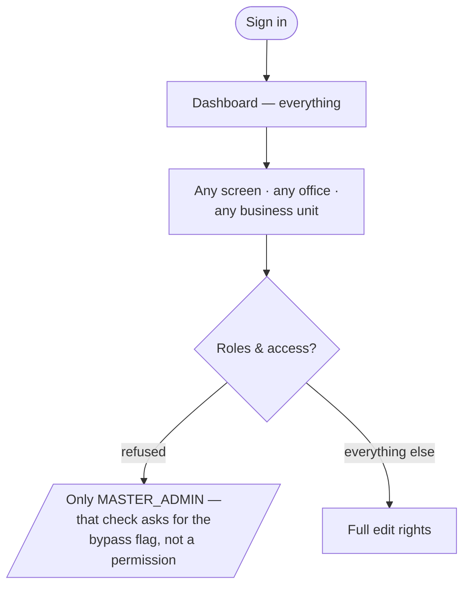

# Flow — `ADMIN` (legacy)

**Device:** desk, laptop.
**Landing screen:** the Dashboard, everything visible.

---

## ⚠ Read this before anything else

**Assign this role to nobody.** It is a historical role — its own label in the code
is "Admin (legacy)" (`phpapp/lib/access.php:18`) — and it is a **second Master Admin
in all but name**. It is granted every permission and every module across every
office and business unit (`phpapp/lib/access.php:362-363`, `phpapp/lib/access.php:253`).

It also **used to be the silent fallback** for any role the system did not
recognise, so a typo in a user's role field, a role removed in a later version, or a
bad import handed out full company-wide access. That is fixed
(`phpapp/lib/access.php:440`) — an unrecognised role now grants nothing and is
logged. See `99-gaps-and-risks.md` risk 1.

**The role itself is unchanged.** Anyone explicitly assigned `ADMIN` still holds
every permission across every office.

---

## Main flow

### Walkthrough

1. **Sign in.** Every module, every permission, every office.
2. **Do anything** — with one exception.
3. **Roles & access refuses you.** It checks `is_master()`
   (`phpapp/lib/ops.php:2412`), which tests the bypass flag rather than a permission.
   `ADMIN` holds every permission and still cannot open it. That is the only
   practical difference between this role and `MASTER_ADMIN`.

### Click count

Identical to `MASTER_ADMIN` for every task except editing role permissions, which is
not available.

### Recommendation

1. **Audit now.** Any user carrying `ADMIN` has Master Admin power without appearing
   to.
2. **Move them** to a role that reflects what they actually do.
3. ~~Change the fallback so it denies rather than grants.~~ ✅ Done — see
   `99-gaps-and-risks.md` risk 1.
