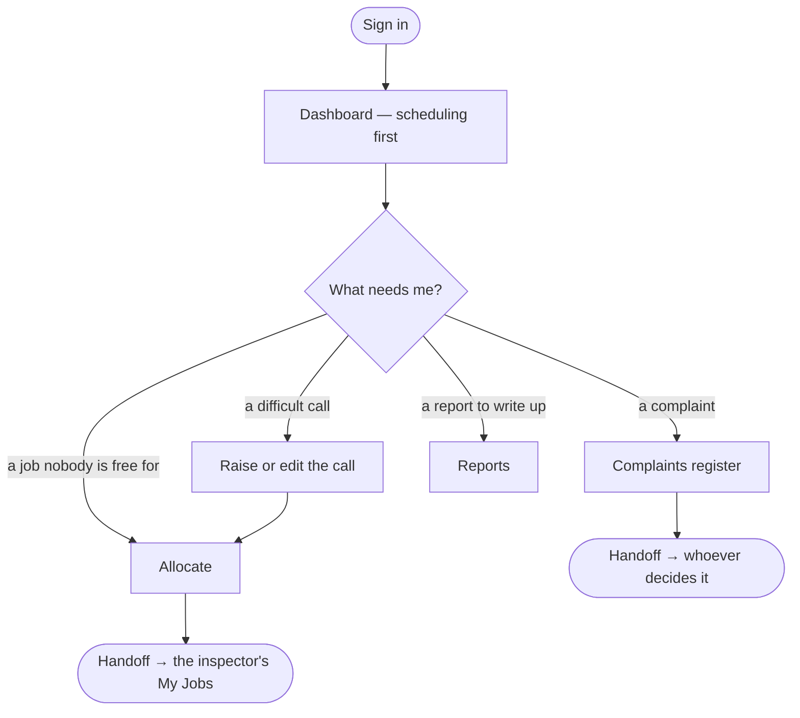

# Flow — `ASST_MANAGER`

**Device:** desk, laptop, most of the day.
**Landing screen:** the Dashboard, reordered to put scheduling first — the same
treatment the Coordinator gets (`phpapp/views/dashboard.php:66`).

A senior coordinator who supervises a few others and takes the calls that need
judgement.

---

## Main flow

### Walkthrough

1. **Sign in.** Scheduling first, same as your coordinators. You hold **no money
   permissions at all** — not even `data.credit`, which your coordinators do have
   (`phpapp/lib/access.php:377`). Your financial view is narrower than theirs.
2. **Raise and edit calls.** You hold `ops.call.create`.
3. **Allocate jobs.** You hold `ops.job.allocate`.
4. **Handle complaints.** Edit rights on the complaints register — you can record and
   investigate, but **not decide**. `complaints.decide` is held by nobody by default,
   and that is an accreditation requirement, not an oversight
   (`phpapp/lib/access.php:76-83`).
5. **Reports.** Edit rights, but no `idems.finalize` — you write, someone else
   approves.

### 🔁 Handoff points

- **The coordinator → you.** *Anything they cannot resolve.*
- **You → the inspector.** *An allocated job.*
- **You → a decider.** *A complaint you have investigated.*

### Click count

**Task: allocate a job to an inspector.** Dashboard → the awaiting-scheduling card
(1) → allocate (1) → pick inspector (1) → dates (1) → save (1) = **≈ 5 clicks**,
counted as discrete clicks on the shortest path.

### Cannot do

See any money figure · touch vouchers · approve reports · manage users or settings.

> ⚠ **One of those boundaries still does not hold.** You are deliberately not granted
> `ops.job.close` (`phpapp/lib/access.php:377`) but can close jobs anyway, because the
> close route never checks that permission (`phpapp/lib/ops.php:5571`). That is risk 5,
> still open.
>
> ✅ **The voucher boundary now holds.** You hold no voucher module, and the module is
> now checked (`phpapp/lib/ops.php:2357-2364`) — so vouchers are genuinely closed to
> you, where before you could view, approve and mark paid every claim in the company.
> If you do handle vouchers in practice, ask for `mod.vouchers.view`.
