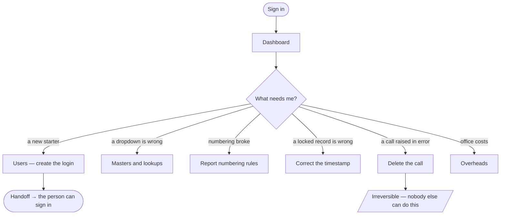

# Flow — `BRANCH_APP_MANAGER`

**Device:** desk, laptop. Occasional deep sessions rather than continuous use.
**Landing screen:** the Dashboard, operations and utilisation panels only.

The branch's system custodian — part office manager, part local IT. Holds the keys
to the filing cabinet without being allowed to read the accounts.

---

## Main flow

### Walkthrough

1. **Sign in.** You see operations and utilisation, and **no money at all** — no
   credit, no revenue, no salary, no profitability (`phpapp/lib/access.php:372`).
   That is the point of the role.
2. **Create logins.** You hold `users.manage.branch` — your own office only.
3. **Keep the lists right.** Masters and lookups are yours. Note these are gated on
   the management tier, not on the `master.manage` permission
   (`phpapp/lib/lookups.php:635`).
4. **Own the numbering.** `idems.type.manage` — report types and IRN rules.
5. **Correct a locked timestamp.** `idems.timestamp.edit`. The code names your role
   as the **only** one that may (`phpapp/lib/access.php:370-371`).
6. **Delete a call raised in error.** `ops.call.delete` — again, uniquely yours
   (`phpapp/lib/ops.php:3588`). Not even the Branch Manager has it.
7. **Office overheads.** The per-office cost model and the month-end cost run.

### 🔁 Handoff points

- **The Branch Manager → you.** *Anything needing a correction they cannot make.*
- **You → everyone.** *Correct reference data is what every other role's dropdowns
  depend on.*

### Click count

**Task: add a new value to a dropdown list.** Admin → Masters (1) → the list (1) →
add (1) → type the value → save (1) = **≈ 4 clicks plus one typed field**, counted as
discrete clicks on the shortest path.

### Three things about this role that were wrong — one is now fixed

**Your two signature powers are unreachable.** You hold `idems.type.manage` and
`idems.timestamp.edit` — and the role has **no IDEMS module access**
(`phpapp/lib/access.php:261-262`), while every one of those screens is gated on that
module (`phpapp/lib/ops.php:2293-2295`). The permissions are real; the screens refuse
you.

**You can see money you were never granted.** `can_see_revenue()` is
`can('data.revenue') || is_admin_level()` (`phpapp/lib/ops.php:580`) and you are in
the management tier — so revenue figures appear despite the role being built to
exclude them.

**You can allocate work.** Being in the management tier puts you past the
job-allocation gate (`phpapp/lib/ops.php:5136`) even though you hold no
`ops.job.allocate`.

✅ **Vouchers are no longer reachable.** You hold no voucher module and the module is
now checked (`phpapp/lib/ops.php:2357-2364`), so the claims you were never meant to
see are genuinely closed to you. If your role does handle vouchers in practice, ask
for `mod.vouchers.view` rather than reverting the fix.

The first two are in `99-gaps-and-risks.md` (risks 5 and 14); the third is risk 3,
now fixed.
