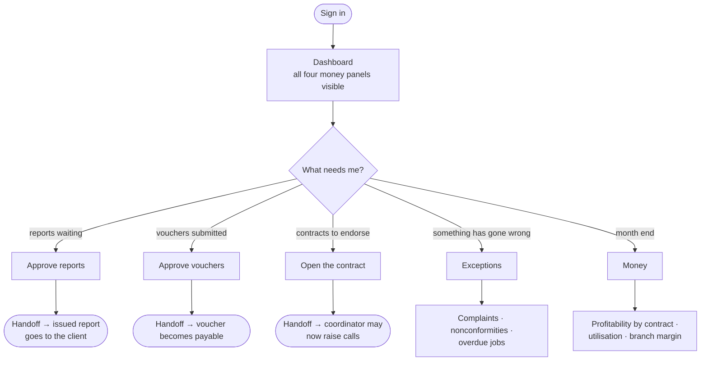
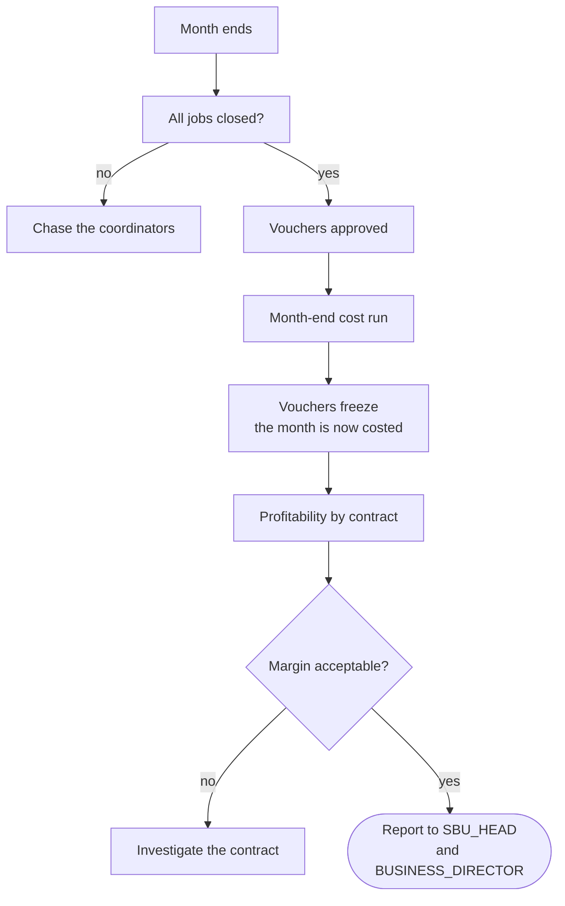

# Flow — `BRANCH_MANAGER`

**Device:** desk, laptop. Dips in several times a day rather than living in the app.
**Landing screen:** the standard Dashboard, with every money panel visible.

The person who runs a single branch and is accountable for that branch's margin.
They are not a data-entry seat — their day is **approvals and exceptions**.

---

## Main flow — the manager's day

### Walkthrough

1. **Sign in.** Unlike the coordinator's, your dashboard is not reordered — you hold
   every dashboard permission and every money permission
   (`phpapp/lib/access.php:369`), so you see operations and money side by side.

2. **Approve reports.** You hold `idems.finalize`. A report you approve can then be
   issued — but **not by you**, if you were the approver: the person who approves
   cannot also be the person who finalises and issues (commit `6d7c7da`). This is an
   accreditation control and it is working as intended.

3. **Approve vouchers.** Submitted vouchers move to `APPROVED` on your action
   (`phpapp/lib/ops.php:4965`). *See the warning at the end of this file about what
   else can do this.*

4. **Endorse contracts.** When a quotation is won and Finance registers the contract,
   it is not yet usable — a contract must be **opened** before any call can be raised
   against it (`phpapp/lib/ops.php:3569-3574`). Endorsement and approval have their
   own screen (commit `53fef1a`), and you can nominate which coordinator will own the
   calls that follow (commit `6e2c5fd`).

5. **Handle exceptions.** Complaints, nonconformities, corrective actions, overdue
   jobs. You have edit rights on all of these.

6. **Look at the money.** Profitability by contract, business-unit P&L, and profit by
   call — all open to you (`phpapp/lib/access.php:369`).

### 🔁 Handoff points

- **Finance → you.** *A registered contract arrives on your endorsement queue.*
- **You → the coordinator.** *The moment you open the contract, calls can be raised
  against it* — and if you nominated a coordinator, it is theirs.
- **The inspector → you.** *A submitted report arrives in your approval queue.*
- **You → whoever issues.** *An approved report leaves you and must be issued by
  somebody else.*
- **The coordinator → you.** *A submitted voucher becomes yours to approve.*

---

## Sub-flow — month end

**The freeze is the important step.** Once the cost run has been calculated, every
voucher behind it locks — because the costs already allocated were worked out from
those days, and changing one would leave figures that still add up and are still
wrong (`phpapp/lib/ops.php:4715-4730`). Reopening the month is possible but should be
a decision, not a reflex.

---

## Click count — the most common task

**Task: approve a submitted voucher.**

| Step | Clicks |
|---|---|
| Dashboard → the vouchers-awaiting card | 1 |
| Open the voucher | 1 |
| Review the days (scroll) | 0 |
| **Approve** | 1 |

**≈ 3 clicks.**

*How this was counted:* discrete clicks on the shortest path, excluding scrolling and
any drill-down into a questionable day. Approving several vouchers means repeating
steps 2–4, so a branch of ten inspectors is roughly **21 clicks** at month end.

**Report approval is comparable** — 3 clicks from the dashboard queue, plus reading
time, which is the part that actually takes the effort.

---

## Scope — the shape that defines this role

`offices => 'OWN'`, `sbus => 'ALL'` (`phpapp/lib/access.php:369`). **One branch,
every business unit inside it.** Enforced in SQL on the registers
(`phpapp/lib/access.php:479-496`), so another branch's calls and jobs are not merely
hidden from the menu — they are not returned by the query.

This is the mirror image of the `SBU_HEAD`, who has every office and one business
unit. Between the two of you, every job in the company is covered twice from
different directions.

---

## What a Branch Manager cannot do

| You need to… | Ask |
|---|---|
| Reach another branch's records | `SBU_HEAD`, `BUSINESS_DIRECTOR` or `MASTER_ADMIN` |
| Create a user outside your own office | `MASTER_ADMIN` — you hold `users.manage.branch`, not `.global` |
| Change system settings | `MASTER_ADMIN` |
| Edit what a role may do | `MASTER_ADMIN` only (`phpapp/lib/ops.php:2412`) |
| Delete a call | `BRANCH_APP_MANAGER` — you do not have `ops.call.delete` |
| Correct a locked timestamp | `BRANCH_APP_MANAGER` |
| Decide a complaint or close a nonconformity | Nobody holds these by default — they must be granted deliberately (`phpapp/lib/access.php:76-83`) |

---

> ⚠ **Two things worth knowing about your approvals.**
>
> **Voucher approval is not exclusive to managers.** It is gated on the management
> tier (`phpapp/lib/ops.php:4965`), which includes the `COORDINATOR` who prepared the
> claim — so the same person can submit, approve and mark it paid. If you believe you
> are the control on inspector pay, today you are one of several.
>
> **The voucher register is not filtered to your branch.** The query carries no
> office filter (`phpapp/lib/ops.php:4864`), so you see — and can approve — vouchers
> from branches that are not yours, and coordinators in other branches can see yours.
>
> Both are in `99-gaps-and-risks.md` with recommended fixes.
