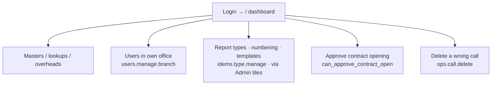

# Flow — BRANCH_APP_MANAGER (Branch Application Manager)

The branch's system/config custodian: sets up master data, report types & numbering,
and branch logins, and can delete a wrongly-raised call. Desk-first. Scope OWN/ALL.
Permissions: `access.php:445-447`. **Only role with `idems.timestamp.edit`.**

- **Landing:** `/` dashboard (ops emphasis).
- **Can:** edit masters/overheads/users; configure report types, IRN numbering and templates (`idems.type.manage`); edit locked report timestamps (`idems.timestamp.edit`, `idems.php:7357`); approve contract openings (`can_approve_contract_open()`, `contracts.php:478-481`); delete calls (`ops.call.delete`).
- **Cannot:** run inspections or approve/issue reports (read-only on IDEMS; no `idems.finalize`).
- **Reporting rail (R8 fixed):** the role now holds `mod.idems.view` (read-only), so the Reporting module and its config screens appear on the rail — no longer only via Admin tiles.
- **Handoffs:** approves an endorsed contract → floats the order to Operations.
- Most common task = maintain masters / add a login (a few clicks per record).
