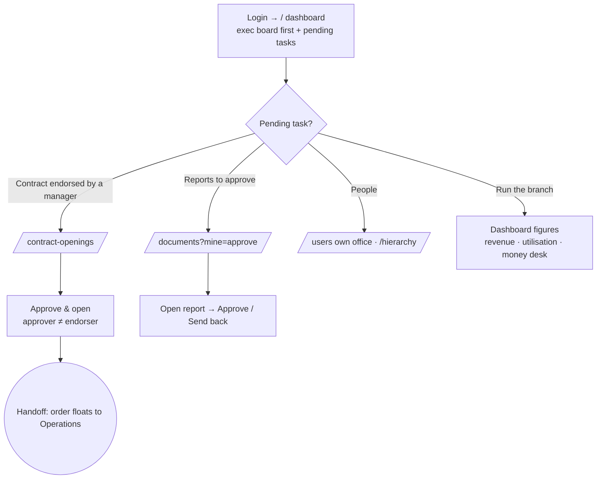

# Flow — BRANCH_MANAGER

Runs a single branch and owns its margin, people and delivery. Desk-first, laptop;
exec-board dashboard. Permissions: `access.php:443-444` (offices **OWN**, sbus ALL).
Its real approval surface is **contract openings** and **reports** — not quotes
(quote-approve is a Sales/Marketing permission, `access.php:459`).

**Landing:** `/` → `views/dashboard.php` exec order (`dashboard.php:391`): Business
overview (FY) → Sales pipeline → Money desk → Charts → Availability → Reports-awaiting-
approval → Quick → Pending scheduling. The "Your pending tasks" panel (`dashboard.php:389`)
is where its approval queues appear.

**Walkthrough:**
1. Land on the exec dashboard; read the pending-tasks panel.
2. **Approve a contract opening:** `/contract-openings` (`contracts.php:603`). After a manager has **endorsed** it, the Branch Manager **approves** it (`can_approve_contract_open()` true for BRANCH_MANAGER, `contracts.php:478-481`). Approval is blocked until endorsed and refuses the same person doing both (`contracts.php:663-670`).
3. **Approve/return reports:** "Reports awaiting your approval" (`dashboard.php:253`); with `idems.finalize` also "to issue" approved reports (`ops.php:6342`). `workforce.report.approve` covers report sign-off.
4. **People:** own-office logins `/users` (`users.manage.branch`, scope OWN), org chart `/hierarchy`.
5. **Run the branch:** the exec board shows revenue/YoY, utilisation, top clients and the money desk (`dashboard.php:328-382`).

**Decision points:**
- Contract opening: **endorse** vs **approve** vs **reject** (`contracts.php:643-687`); approve → `open_status='OPEN'` and floats the order (`contracts.php:660-677`).
- Report: approve / send back; issue vs not (approver-may-not-issue, `idems.php:3521-3525`).
- Job-close manager override for a missing site check-in (`ops.php:5615-5628`).

**Handoff points (named):**
- **Manager (endorser) → Branch Manager:** an endorsed contract lands as "contracts to approve" on `/contract-openings` (`ops.php:6316`).
- **Branch Manager → Coordinator/Operations:** approving the opening flips the contract to OPEN and **floats the order to operations** (`crm_float_ops_packet`, `contracts.php:674-676`) — coordinators can now raise calls.
- **Inspector → Branch Manager:** submitted reports arrive in "reports to approve".

**Click-count — approve something:**
- **Contract opening:** pending-task card → `/contract-openings` (1) → **Approve** (1) = **2 clicks**.
- **Report:** pending-task card → `/documents?mine=approve` (1) → open report (1) → Approve (1) = **~3 clicks**.
