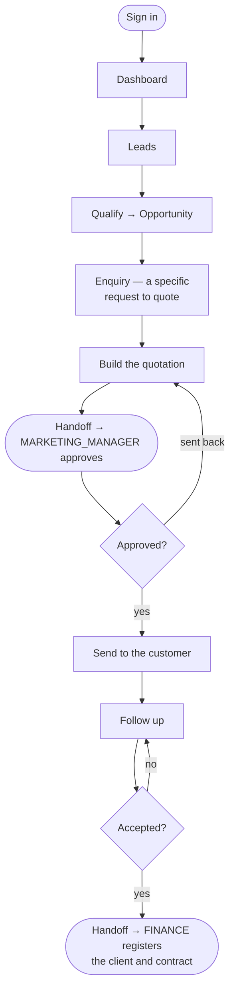

# Flow — `BUSINESS_DEV_MANAGER`

**Device:** laptop and phone, frequently travelling or at a client's office.
**Landing screen:** the Dashboard — money panels, no operational widgets.

The hunter. Finds companies that do not yet buy from you.

---

## Main flow

### Walkthrough

1. **Sign in.** You see money panels but **no operational widgets** — those are gated
   on holding a real operations permission (`phpapp/views/dashboard.php:62`), which
   you do not. You will never be offered "raise a call".
2. **Work the lead** into a real opportunity.
3. **Raise the enquiry**, then build the quotation. `crm.quote.create` is yours
   (`phpapp/lib/access.php:382`).
4. **You cannot approve your own quotation.** `crm.quote.approve` is withheld — the
   single most important boundary in the sales model. It goes to the Marketing
   Manager.
5. **Send it.** `crm.quote.send` is yours.
6. **Follow up.** `crm.followup.manage` is yours.
7. **When it is accepted**, it becomes a "contract to register" task for Accounts
   (commit `37e46a7`).

### 🔁 Handoff points

- **You → the Marketing Manager.** *A quotation needing approval.*
- **You → Finance.** *An accepted quotation becomes a contract to register.*
- **Finance → the Branch Manager → the coordinator.** *Only then can work begin.*

### Click count

**Task: raise a quotation from an enquiry.** Sales (1) → Enquiries (1) → open the
enquiry (1) → raise quote (1) → fill the lines → save (1) = **≈ 5 clicks plus the
line items**, counted as discrete clicks on the shortest path.

### Cannot do

Approve your own quotation · touch any call, job or voucher · see salary or
profitability. You do hold `data.credit`, so the credit figure on a deal is visible.
