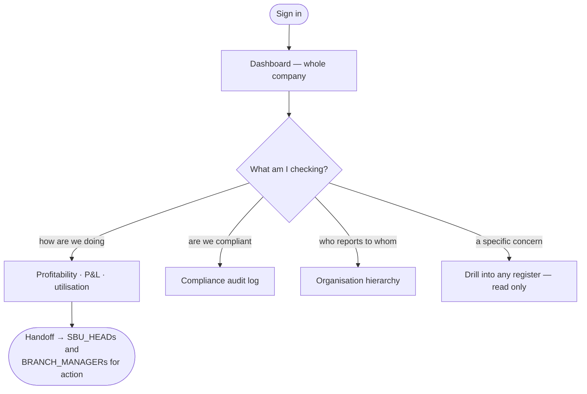

# Flow — `BUSINESS_DIRECTOR`

**Device:** desk or tablet. Monthly, or when something needs explaining.
**Landing screen:** the Dashboard, every panel.

A board-level view. Sees the whole company and — by design — changes none of it.

---

## Main flow

### Walkthrough

1. **Sign in.** Scope is `ALL` / `ALL` (`phpapp/lib/access.php:365`). Every office,
   every business unit.
2. **Read the numbers.** All four dashboards, all four money permissions.
3. **Check compliance.** `idems.audit.view` — who changed what, and when.
4. **See the structure.** `org.hierarchy.view`.
5. **Look at anything.** View access to every module.
6. **Ask someone else to act.** No `ops.*` permission, no `master.manage`, no
   `users.manage.*`, no `settings.manage` — nothing to change anything with.

### The one thing deliberately withheld

**Identity documents.** The blanket "every module" grant explicitly removes
`identity` (`phpapp/lib/access.php:288-293`). The code's reasoning: a Business
Director getting every module by default "is a reasonable default for revenue figures
and a bad one for passports". It must be granted deliberately. Do not undo this
casually.

### 🔁 Handoff points

- **Everyone → you.** *The numbers.*
- **You → the SBU Heads and Branch Managers.** *Everything, because you cannot act
  yourself.*

### Click count

**Task: check company profitability for the quarter.** Dashboard → Money (1) →
Profitability (1) → set the period (1) = **≈ 3 clicks**, counted as discrete clicks on
the shortest path.

### Cannot do

Change anything at all — that is the entire design of the role.

> ⚠ **Except that you can.** You are in the management tier
> (`phpapp/lib/access.php:27`) and hold `mod.jobs.view`, which is all the job routes
> check — so the board-level, read-only role can **allocate, edit, reassign and close
> jobs** (`phpapp/lib/ops.php:5136`, `:5531`) and **approve and mark paid any voucher
> in the company** (`phpapp/lib/ops.php:4863-4977`). This is the widest gap between
> what a role is documented to be and what it can actually do, and it is ranked
> accordingly in `99-gaps-and-risks.md`.
