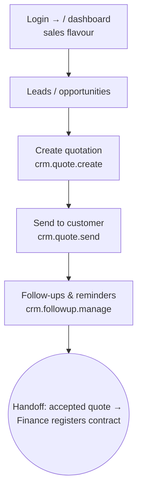

# Flow — BUSINESS_DEV_MANAGER

Front-line sales: chases leads, builds and sends quotations, follows up. Desk/mobile.
Scope OWN/ALL. Permissions: `access.php:456-457` (shared with KEY_ACCOUNTS_MANAGER).

- **Landing:** `/` dashboard, sales flavour (`dashboard.php:63`); sees Sales, Insights, Directory (clients).
- **Can:** edit inquiries/quotes/orders, create & send quotes, manage follow-ups; view sales reports & clients.
- **Cannot:** approve quotes (that's MARKETING_MANAGER), register contracts (Finance), touch operations, or manage users.
- **Handoff:** an accepted quote becomes Finance's "contracts to register" task (`ops.php:6306`).
- Most common task = create & send a quote (a few clicks through the quote form).
