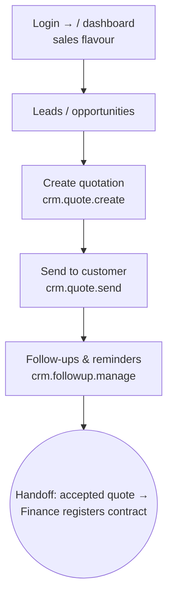

# Flow — BUSINESS_DEV_MANAGER

Front-line sales: chases leads, builds and sends quotations, follows up. Desk/mobile.
Scope OWN/ALL. Permissions: `access.php:456-457` (shared with KEY_ACCOUNTS_MANAGER).

- **Landing:** `/` dashboard, sales flavour (`dashboard.php:63`); sees Sales, Insights, Directory (clients).
- **Can:** edit inquiries/quotes/orders, create & send quotes, manage follow-ups; view sales reports & clients.
- **Cannot:** approve quotes (that's MARKETING_MANAGER), register contracts (Finance), touch operations, or manage users.
- **Handoff:** an accepted quote becomes Finance's "contracts to register" task (`ops.php:6306`). On the quote page a sales viewer sees an explicit **"✓ Won — handed to Accounts"** wall (C1, `quote_detail.php`): the accepted quote is locked (`quote_is_locked`), the only way to change it is a **revision**, and the contract/calls are Accounts' and Operations' to do — sales' part is done.
- **Won without a quotation (direct order):** on the deal, **"Send to Accounts to register the contract"** (`/opportunity-send-to-accounts`) hands it to Finance the same way — no quote needed — and it flows contract → endorse → approve → OPEN → calls. A quick **"raise a work order directly"** (no contract, doesn't pass Finance) is kept as a secondary, folded option for one-offs.
- **Generate quotation (quote-of-record):** any deal without a quotation offers **"Generate quotation"** (`/opportunity-generate-quote`) — a draft quote pre-filled from the deal (client, subject, value), linked to it, so even a direct order can carry a quote for the record. One is enough: the button greys out once the deal has a quotation. (Quotes are *not* mandatory per order — the invariant is order→contract and contract→rate-basis; this just makes a quote always **available**.)
- Most common task = create & send a quote (a few clicks through the quote form).
