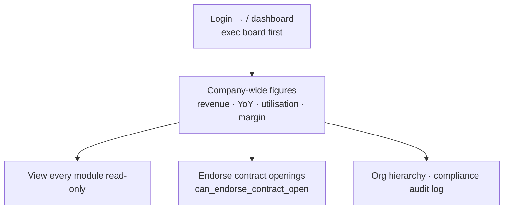

# Flow — BUSINESS_DIRECTOR

The top executive: reads the whole business across every branch and unit but does not
run the desks. Desk-first. Scope **ALL/ALL**. Permissions: `access.php:439-440`
(all dashboards + all `data.*` figures + `org.hierarchy.view` + `idems.audit.view`).

- **Landing:** `/` exec dashboard (`dashboard.php:391`).
- **Can:** view **every** module (except identity, stripped at `access.php:366-369`); read all money figures; view the compliance audit log; endorse contract openings (`contracts.php:473-477`).
- **Cannot (by default):** edit operational records, manage users, change **system settings** (no `settings.manage` — the settings tile is hidden, `areas.php:213`), or see identity documents.
- **Handoffs:** primarily a reader; endorsing a contract hands off to the Branch Manager.
- Most common task = read dashboards (0-click landing) and drill into figures.
