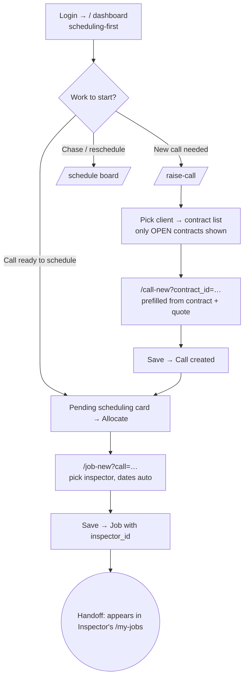

# Flow — COORDINATOR

The operational engine of a branch: takes a live contract from Accounts, raises
inspection calls against it, allocates and schedules inspectors, and closes jobs.
Desk-first, laptop; scheduling-first dashboard (`dashboard.php:66,395`).
Permissions: `access.php:453-455`.

**Landing:** `/` → `views/dashboard.php`, scheduling-first order (`dashboard.php:395`):
Quick-actions → Pending scheduling → Availability → Reports-awaiting-approval → Money →
Charts. Both work-starters live on this first screen.

**Walkthrough (plain English):**
1. Land on the dashboard; the "Pending scheduling" cards and a "Raise call" quick action are right there (`dashboard.php:201,222`).
2. **Raise a call:** open `/raise-call` → pick the client (the dropdown auto-submits and lists that client's **OPEN** contracts only, `raise_call.php:11`, `ops.php:3573`) → press "Raise call ▶" on the contract row → `/call-new?contract_id=…` (`raise_call.php:60`).
3. The call form arrives **prefilled** from the contract and its originating quote — client, contract #, business unit, activity, managing office, nominated coordinator (`ops.php:3727-3758`) — and inherits the previous call's format on the same contract (`ops.php:3772-3783`). Save.
4. **Allocate a job:** from a "Pending scheduling" card press **Allocate** → `/job-new?call=…` (`ops.php:5162`) → name the inspector (or subcontractor), dates resolve from the engagement type (`ops.php:5246`). Save → the job now carries `inspector_id`.
5. Optionally manage the day-by-day plan on the **schedule board** (`/schedule`).

**Decision points:**
- Raise from a contract vs a **direct call with no contract** (`raise_call.php:30,65`).
- A call under a registered contract can be raised **only once that contract is OPEN** — a PENDING one is blocked (`ops.php:3792-3801`).
- Client **HOLD/BLOCK**: BLOCKED stops a non-manager, HOLD warns (`ops.php:3803-3815`).
- **Cross-office** call → the inter-office credit (₹) must be entered before save (`ops.php:3822-3834`).
- A **contracting-office** coordinator cannot allocate — only the **executing** office does (`call_can_allocate`, `ops.php:5183-5190`).

**Handoff points (named):**
- **Coordinator → Inspector:** the moment a job is allocated with an `inspector_id`, it appears in that inspector's **My Jobs** (`/my-jobs`, `ops.php:5917`) and their dashboard KPIs.
- **Upstream (Finance/Branch Manager → Coordinator):** the coordinator can only raise a call after Accounts registered the contract and the Branch Manager opened it; "won quotes without a contract number" shows on the exec/coordinator dashboard (`dashboard.php:290-315`).

**Click-count — most common task:**
- **Raise a call from a contract:** `/raise-call` (1) → select client (1) → "Raise call ▶" (1) → Save prefilled form (1) = **~4 clicks**.
- **Allocate a job:** landing "Allocate" (1) → pick inspector (1) → "Allocate" submit (1) = **~3 clicks**.
