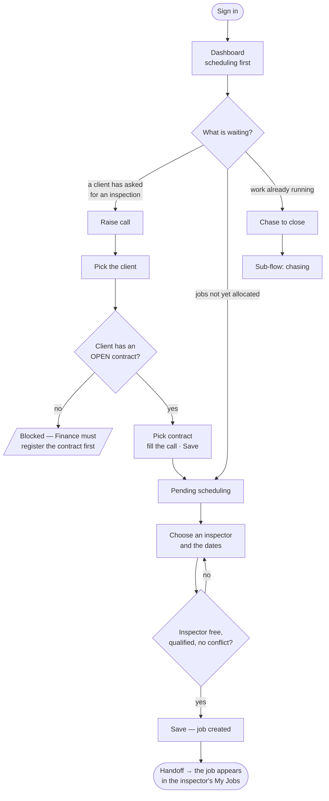
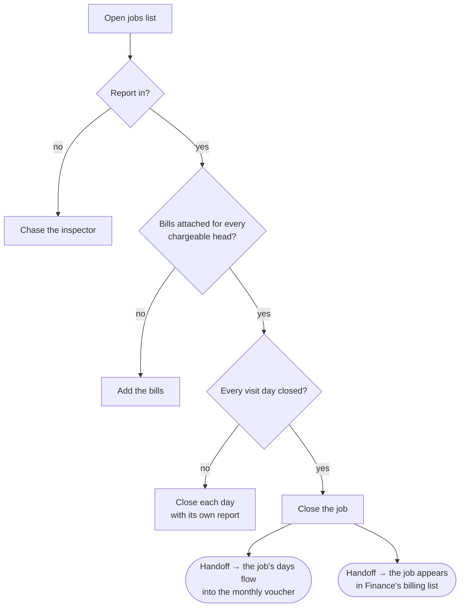

# Flow — `COORDINATOR`

**Device:** desk, laptop, in the app all day.
**Landing screen:** the Dashboard, reordered to put scheduling first
(`phpapp/views/dashboard.php:66`).

The highest-volume seat in the company. Everything below is what they do between
nine and six.

---

## Main flow — a call from request to allocated work

### Walkthrough

1. **Sign in.** You land on the Dashboard. Because you are a coordinator, the app
   puts the scheduling panels above the money panels — that ordering is specific to
   your role and to Assistant Managers (`phpapp/views/dashboard.php:66`).

2. **Read what is waiting.** The four cards across the top are your day: open calls,
   open jobs, overdue jobs, and jobs pending scheduling. These counts are **limited
   to your own office and business unit** — the query applies your scope before
   counting (`phpapp/views/dashboard.php:46-52`).

3. **A client asks for an inspection.** Click **Raise call** — a quick card on the
   dashboard, offered because you hold `ops.call.create`
   (`phpapp/views/dashboard.php:201`). Its own subtitle describes the path: *pick
   client → contract → done*.

4. **Pick the client.** The screen then looks for that client's contracts.

5. **You may be blocked here, and it is deliberate.** Only contracts that are
   **OPEN** can take a call (`phpapp/lib/ops.php:3569-3574`). A contract still
   awaiting its endorsement or the Branch Manager's approval will not appear. The
   code is explicit that this two-person control "is the whole point of opening a
   contract". If nothing is listed, the work cannot start and Finance or the Branch
   Manager must act first. **This is not a fault — do not work around it.**

6. **Fill the call and save.** Business unit and activity carry over from the
   quotation automatically if the contract came from one (commit `eef6e68`), so
   there is less to type than it looks.

7. **Allocate it.** Back on the dashboard, calls awaiting scheduling are listed with
   a direct link to the allocation form — one click, no navigating
   (`phpapp/views/dashboard.php:222`).

8. **Choose the inspector and the dates.** The app will stop you if the inspector is
   not competent for the work or has a conflict of interest declared; these are
   separate accreditation checks and they are meant to interrupt you.

9. **Save.** The job now exists, and the call's legacy status moves to `ALLOCATED`
   on its own (`phpapp/lib/ops.php:5413`).

### 🔁 Handoff points

- **Finance → you.** You cannot raise a call until Finance has registered the
  contract and it has been opened. `crm.contract.register` is Finance's alone
  (`phpapp/lib/access.php:388`).
- **You → the inspector.** *At step 9 the job leaves you and appears in the
  inspector's **My Jobs**.* Nothing else needs to happen — their screen queries jobs
  by their own inspector id (`phpapp/lib/ops.php:5891`). They will see it the next
  time they open the app.

---

## Sub-flow — chasing work to closed

### Walkthrough

1. **Open jobs** shows what has not finished. Overdue ones are flagged separately.
2. **Chase the report.** Until a report upload date exists the job cannot close
   (`phpapp/lib/ops.php:5552-5555`), unless the call agreed no report was needed.
3. **Check the bills.** Any expense head the client is being charged for must have a
   bill behind it. This is checked on the server, not just in the browser, because
   it is a promise made to a customer (`phpapp/lib/ops.php:5573-5576`). If a head
   genuinely was not incurred, mark it "nil" rather than inventing a bill —
   that satisfies the rule honestly (`phpapp/lib/ops.php:5559-5566`).
4. **Close each visit day.** A multi-day job cannot close while any day is still
   open (`phpapp/lib/ops.php:5604-5610`).
5. **Close the job.** Expenses are recorded at the same moment, via a popup on the
   dashboard or on My Jobs (commit `7bdbf2b`).

### 🔁 Handoff points

- **You → the voucher.** The days on a closed job feed the inspector's monthly
  voucher, one line per job per day (`phpapp/lib/ops.php:4740-4760`).
- **You → Finance.** A closed job with no invoice raised lands in Finance's
  "pending" billing list (`phpapp/lib/ops.php:1302`).

---

## Click count — the most common task

**Task: raise a call against an existing contract and allocate it to an inspector.**

| Step | Clicks |
|---|---|
| Dashboard → **Raise call** quick card | 1 |
| Select the client | 1 |
| Select the contract | 1 |
| Fill the call form (dates, scope, deliverables) | ~4 fields |
| **Save** | 1 |
| Dashboard → the call's "allocate" link | 1 |
| Select the inspector | 1 |
| Set the dates | 1 |
| **Save** | 1 |

**≈ 9 clicks plus about 4 typed fields**, assuming the contract is already open and
the first inspector you pick is free and qualified.

*How this was counted:* discrete mouse actions on the shortest path available today,
excluding typing, scrolling and any re-selection after a competence or conflict
warning. If the contract is **not** open, the task cannot be completed at all until
another role acts.

**Where the clicks go.** Six of the nine are navigation and selection; three are
saves. The quick card and the direct allocate link already remove several steps that
would otherwise be menu navigation — this path has clearly been tightened before.

---

## What a coordinator cannot do, and who to ask

| You need to… | Ask |
|---|---|
| Open a contract so calls can be raised | `FINANCE`, then `BRANCH_MANAGER` to endorse |
| Delete a call raised in error | `BRANCH_APP_MANAGER` — uniquely holds `ops.call.delete` |
| See what the job made | `BRANCH_MANAGER` or `OPERATION_MANAGER` — profitability is not yours |
| Add or change an inspector's master record | `BRANCH_MANAGER` or above — the inspector master is management-tier only (`phpapp/lib/ops.php:2185`) |
| Correct a locked timestamp | `BRANCH_APP_MANAGER` |

> ⚠ **Two things you can do that you probably should not.** You can approve and mark
> paid the same voucher you prepared (`phpapp/lib/ops.php:4961-4977`), and the
> voucher register you open is not filtered to your branch
> (`phpapp/lib/ops.php:4864`) — you can see every inspector's claims company-wide.
> Both are recorded in `99-gaps-and-risks.md`.
