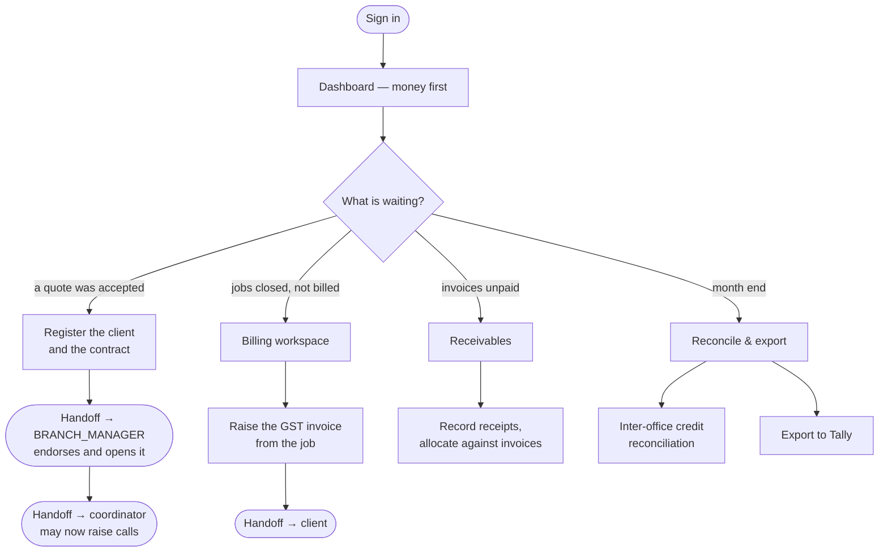

# Flow — `FINANCE`

**Device:** desk, laptop, all day in their own screens.
**Landing screen:** the Dashboard, reordered to put **money first** — an ordering
specific to this role (`phpapp/views/dashboard.php:65`).

The accountant. Company-wide scope (`offices => 'ALL'`, `sbus => 'ALL'` —
`phpapp/lib/access.php:388`), which is correct for an accounts function.

---

## Main flow — from won quotation to money in

### Walkthrough

1. **Sign in.** Money panels come first. The operational widgets — "raise a call",
   "pending scheduling", "team availability" — are **deliberately not shown to you**,
   because they are gated on holding a real operations permission
   (`phpapp/views/dashboard.php:62`). That was a deliberate fix; it is not something
   missing.

2. **Register the contract.** When a quotation is accepted it is handed to Accounts
   as a pending task (commit `37e46a7`). You hold `crm.contract.register` and
   **nobody else does** (`phpapp/lib/access.php:388`). This is the single narrowest
   handover in the whole system: until you act, operations cannot begin.

3. **Hand it on.** Registering is not the end — the contract must then be **endorsed
   and opened** by the Branch Manager before a call can be raised against it
   (`phpapp/lib/ops.php:3569-3574`). That two-person control is the point.

4. **Bill the closed jobs.** A closed job with no invoice raised sits in the pending
   list (`phpapp/lib/ops.php:1302`). Raising a GST invoice from a job is
   **idempotent** — pressing it twice does not produce two invoices (commit
   `ece1f48`), and each voucher line carries a note explaining what it is.

5. **Chase the money.** Receipts, allocation against invoices, ageing, credit notes.
   A credit note is capped at what the invoice was for, and cancelling is refused
   once anything has settled — the number is kept so the GST series has no gaps
   (`phpapp/PENDING.md:940`).

6. **Reconcile inter-office credit.** You hold `finance.reconcile`
   (`phpapp/lib/access.php:388`). When one branch sells and another executes, this is
   where the split is settled.

7. **Export to Tally.** Invoices go over as Sales vouchers, payments as Receipts with
   an "Agst Ref" that knocks the invoice off, credit notes against the original
   invoice. **Exporting is remembered**, so the same voucher is never imported twice,
   and Undo brings it back and clears the stamp (`phpapp/PENDING.md:1345-1364`).

### 🔁 Handoff points

- **Sales → you.** *An accepted quotation arrives as a "contract to register"
  task.*
- **You → the Branch Manager.** *A registered contract goes to them to endorse and
  open.* You cannot open it yourself.
- **The coordinator → you.** *A closed job with no invoice appears in your billing
  queue.*
- **You → the client.** *The issued invoice.*
- **You → Tally.** *The month's exports.*

---

## Click count — the most common task

**Task: raise the GST invoice on a closed job.**

| Step | Clicks |
|---|---|
| Dashboard → the awaiting-billing card | 1 |
| Open the job | 1 |
| **Raise GST invoice** | 1 |
| Confirm | 1 |

**≈ 4 clicks.**

*How this was counted:* discrete clicks on the shortest path, excluding review time
and excluding any correction to the invoice lines. Because the action is idempotent,
a mistaken second click costs nothing.

---

## ✅ Vouchers: you can now open them, and record payment

Finance was **deliberately removed from the operations management tier** (commit
`ff0b94a`, `phpapp/lib/access.php:33-40`). That was the right call — it stopped an
accountant being shown "raise inspection call". But it had two consequences that were
not intended, and both are now fixed.

**You could not open the voucher register.** You hold view access to Calls, Jobs and
Vouchers, which puts **Operations** in your sidebar
(`phpapp/views/layout_top.php:128`) — but the register demanded the management tier,
so the menu offered a screen that refused you. It now accepts `finance.reconcile`
(`phpapp/lib/ops.php:5033`), which you hold.

**You could not mark a voucher paid, while a coordinator could.** The control was
inverted: the people who prepare a claim could record it as paid, and the person who
actually moves the money could not. Marking paid now accepts `finance.reconcile` too
(`phpapp/lib/ops.php:4894`).

Alongside this, nobody can now approve a voucher they submitted themselves
(`phpapp/lib/ops.php:4871`), and the register is scoped to the viewer's offices
(`phpapp/lib/ops.php:5041`). See `99-gaps-and-risks.md` risks 3 and 11.

**Still open:** the rest of the Operations rail is still driven by a different rule
from the screens behind it — that is the remainder of risk 11.

---

## What Finance cannot do

| You need to… | Ask |
|---|---|
| Raise a call or allocate a job | `COORDINATOR` or `OPERATION_MANAGER` — correct, and should stay that way |
| Open a contract you have registered | `BRANCH_MANAGER` — the two-person control |
| Approve a quotation | `MARKETING_MANAGER` — you register *after* approval |
| Approve a voucher | A manager or coordinator — you may open it and mark it paid, not approve it |
| Manage users or settings | `MASTER_ADMIN` |
