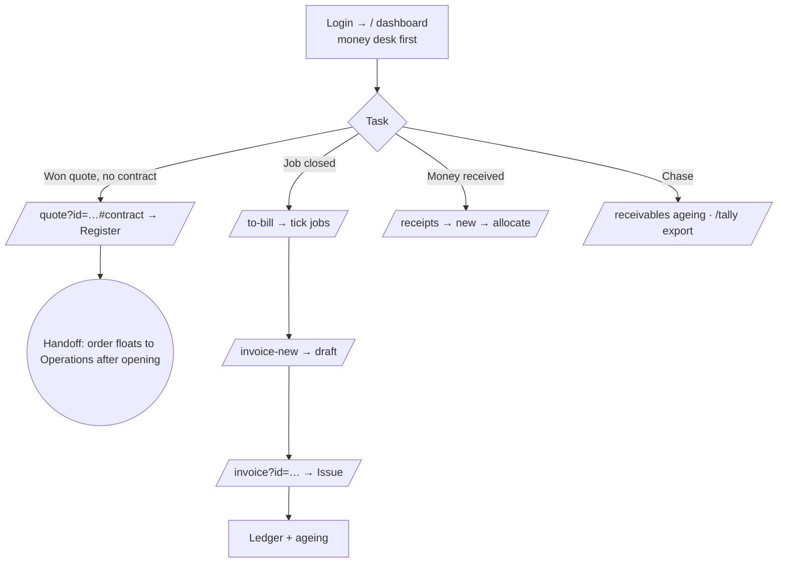

# Flow — FINANCE

Accounts: registers contracts off won quotes, raises and issues GST invoices, records
receipts, and reconciles credit. Desk-first, laptop; money-first dashboard. Scope
**ALL offices / ALL SBUs**. Permissions: `access.php:462-463`. Has **no** ops
create/allocate/close, so it sees money tiles, not ops KPIs (`dashboard.php:60-99`).

**Landing:** `/` → `views/dashboard.php` money-first order (`dashboard.php:394`): Money
desk (invoice pending / awaiting payment / overdue / credit not received, `:156-163`) →
Charts → … The pending-tasks panel shows "contracts to register" (`ops.php:6306`).

**Walkthrough:** the five accounts screens are one tabbed **Billing workspace**
(`booksui.php:26-46`): To bill → Invoices → Money in → Ageing → Export.
1. Land on the Money desk.
2. **Register a contract** (sales→accounts handoff): from "won quotes without a contract number" → `/quote?id=…#contract` "Register" → POST `/quote-contract` (`crm.php:1828`, gated `crm.contract.register`). Registers the client + contract number and e-mails the ops packet. The handoff is now explicit on the quote: sales see a "✓ Won — handed to Accounts" wall (C1) and the accepted quote is locked to them; Finance is the "This is yours to do — register…" side of the same panel.
   - **Direct wins (no quotation):** a deal Won *without* a quote is handed to Accounts from the opportunity ("Send to Accounts to register the contract"); it appears in the dashboard's **"won deals without a quote waiting for a contract"** queue, and Finance registers the contract straight from `/opportunity?id=…` (POST `/opportunity-contract`, `opportunities.php`, gated `crm.contract.register`). This runs the **same** PENDING→endorse→approve→OPEN lifecycle; the contract links back to the deal, and calls are raised from the OPEN contract. So both quoted and direct wins reach Finance the same way.
   - **Group companies (one rate quote → many contracts):** a rate quotation stays **one primary contract** by default, but Accounts can register **additional contracts for related group companies** under the same quote (POST `/quote-add-contract`, `crm.php` `crm_add_group_contract`), each a normal PENDING→endorse→approve→OPEN contract at the same rates, for a subsidiary billing on its own number. The eligible companies are the client's group tree (`partner_group_ids`); the primary `contract_id` is untouched, and each group contract points back via `partner_contracts.quotation_id`. Quotes are **not** mandatory per order — the invariant is *order → contract → rate-basis*.
3. **To bill:** `/to-bill` (`booksui.php:123-151`) pools closed, un-invoiced jobs by customer → contract/project, filterable by closed month.
4. **Raise & issue an invoice:** tick jobs → "Draft this project" carries the work onto the draft (`booksui.php:207-216`) → review lines on `/invoice?id=` → **Issue** (`/invoice-issue`, `ops_require($canIssue)`, `booksui.php:256-262`) — enters the ledger and ageing, taking the branch's next number.
5. **Receipts (money in):** `/receipts` → `/receipt-new` records a receipt (`booksui.php:303-318`) → `/receipt-allocate` spreads it across open invoices (`:320-331`).
6. **Ageing & export:** `/receivables` (`ops.php:2526`), credit reconciliation (`finance.reconcile`), Tally export `/tally` (`ops.php:2528`).

**Decision points:**
- Invoice rhythm off the same pool: per call / per month / per project (`booksui.php:125-150`).
- Issue vs cancel (`books_can_cancel`, `booksui.php:264`); credit note (`:339`).
- Refused lines (a deputation already on another invoice) are reported, not dropped (`booksui.php:217-224`).
- A same-office call bills from the **contract's branch** so it always has a numbering series (invoice office resolution `invoice_office_for`, `ops.php`).

**Handoff points (named):**
- **Operations → Finance:** a closed job (`closed_flag=1`) appears in **/to-bill** (`books_billable_jobs`, `booksui.php:123`).
- **Sales → Finance:** accepted quotes without a contract number surface as "contracts to register" (`ops.php:6306`).
- **Finance → Operations:** registering + opening the contract floats the order back for calls (see the Branch Manager flow).

**Reconciliation worklists (read-only — change no figure):**
- **Revenue reconciliation** — `/revenue-reconciliation` (`revrecon.php`, Money → Billing): where a job's legacy invoice figure (`jobs.invoice_amount`) matches neither the net nor gross books-ledger total. Gated to `can_see_salary` / `finance.reconcile` / master.
- **Cost reconciliation** — `/cost-reconciliation` (`costrecon.php`, Money → Costs & margins): where a job's legacy sub-contractor cost (`jobs.subcon_cost`) disagrees with what a committed month-end cost run put in the ledger (`cost_allocations` `SUBCON`). Same gate. CLI: `php tools/cost-reconciliation.php --list`.
- Both surface a live count on the system-status attention band. Driving each to **green** is the gate before any legacy reader is switched onto the ledger (a deliberate, separately-validated step — never part of the detector).

**Click-count — most common task:**
- **Issue an invoice:** `/to-bill` (1) → tick job(s) (1) → "Draft invoice" (1) → **Issue** (1) = **~4 clicks** for a single-job invoice.
- **Record a receipt:** `/receipts` (1) → New receipt (1) → fill + Save (1) → Allocate (1) = **~4 clicks**.
