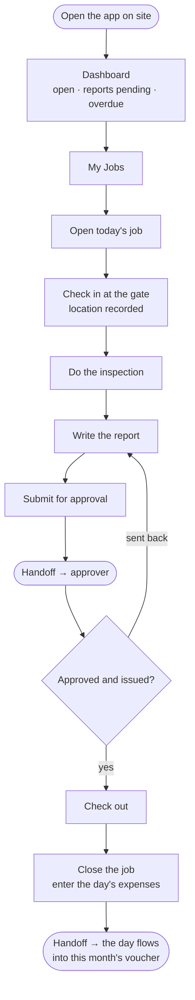
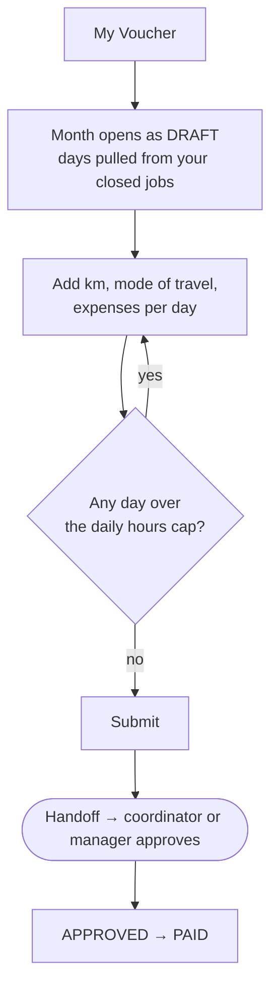

# Flow — `INSPECTOR`

**Device:** **phone, in the field, frequently on bad signal or none.**
**Landing screen:** a dedicated inspector dashboard — not the one everyone else sees
(`phpapp/views/dashboard.php:23`).

This is the only role the application treats as genuinely mobile. There is a service
worker and an offline queue, so a job closed at a site with no signal is re-sent when
signal returns (`phpapp/views/layout_top.php:57`). Design every change to this role's
screens for one thumb and a bad connection.

---

## The whole menu

Five items. That is deliberate and it should stay that way
(`phpapp/views/layout_top.php:100-114`):

**My work** → My Jobs · My Reports · New report · Endorsements · My Voucher

---

## Main flow — one job, gate to closed

### Walkthrough

1. **Open the app.** Your dashboard shows four numbers, all about you and nobody
   else: open jobs, reports pending, overdue, and this month's voucher
   (`phpapp/views/dashboard.php:32-36`). Each is a link.

2. **My Jobs.** Only your jobs — the query filters to your own inspector id
   (`phpapp/lib/ops.php:5891`). You cannot see a colleague's work and there is no
   screen that would let you.

3. **Open today's job.** You reach it even though you hold **no Jobs module access
   at all** — a narrow owner-only exception lets you open, upload to and close a job
   that is yours (`phpapp/lib/ops.php:2390-2398`, ownership checked at
   `phpapp/lib/ops.php:2230-2239`). If you are named on the job or on one of its
   visit days, it is yours.

4. **Check in at the gate.** Where the company has switched this on, arrival and
   departure are recorded with your location. It is **off by default**, and the
   reason is good: a body whose engineers hand their phones in at a refinery gate
   could not comply (`phpapp/lib/ops.php:5508-5581`). If your company has it on, you
   cannot close the job without both check-in and check-out — only a manager can
   approve closing without them, they must give a reason, and it affects your rating
   (`phpapp/lib/ops.php:5586-5600`).

5. **Do the inspection.**

6. **Write the report.** You hold edit rights on the report module — you are the
   person who writes every report, so it is on your menu
   (`phpapp/lib/access.php:285`). Prefill does a lot: the project name, the vendor
   and the site come from the call context (commits `8194aa5`, `d416485`).

7. **Submit it.** You cannot issue your own report. Somebody with `idems.finalize`
   approves it, and — importantly — the approver **cannot also be the person who
   finalises and issues it** (commit `6d7c7da`). That is a segregation of duties an
   accreditation assessor will look for.

8. **Check out, then close the job.** Closing records the day's expenses in the same
   step, through a popup you can reach from the dashboard or My Jobs directly
   (commit `7bdbf2b`). Enter travel, local, food, lodging and anything incidental.

9. **The day is now in your voucher.** You do not do anything to make that happen.

### 🔁 Handoff points

- **The coordinator → you.** *A job appears in your **My Jobs** the moment a
  coordinator saves the allocation.* Nothing notifies you; you see it next time you
  open the app.
- **You → the approver.** *At step 7 the report leaves you* and lands with whoever is
  mapped as its approver — commonly the `BRANCH_MANAGER`, `OPERATION_MANAGER`,
  `SBU_HEAD` or a `SR_INSPECTOR`, all of whom hold `idems.finalize`.
- **You → the coordinator.** *At step 8 the closed job appears in the coordinator's
  completed list and in Finance's billing queue* (`phpapp/lib/ops.php:1302`).
- **You → your own voucher.** The days feed in automatically, following the **booked
  visit dates** rather than the job's whole date span — so a month-long posting no
  longer floods every day of the voucher (commit `ba1106e`).

---

## Second flow — the monthly voucher

### Walkthrough

1. **Open My Voucher.** The month is created for you and the days are pulled from
   the jobs you closed — one line per job per day (commit `5e36c85`).
2. **Fill in each day.** Kilometres and mode of travel produce the travel figure from
   the rates set for you. Kilometres to a vendor you have visited before are
   remembered and pre-filled.
3. **The daily hours cap is enforced.** No day may exceed the configured limit, and
   the whole submission is validated before anything saves
   (`phpapp/lib/ops.php:5000-5010`).
4. **Submit.** You can do this yourself — the transition accepts the voucher's owner
   (`phpapp/lib/ops.php:4962`).
5. **Wait.** Approval and payment are not yours.

> **If the month has been closed off, the voucher locks.** Once the month-end cost
> run has been calculated, the days behind it cannot be edited — the stored costs
> were worked out from them (`phpapp/lib/ops.php:4715-4730`). The message says so and
> tells you the month must be reopened. Ask your coordinator.

---

## Click count — the most common task

**Task: close today's job and record the day's expenses.**

| Step | Clicks |
|---|---|
| Dashboard → **Open jobs to do** card | 1 |
| Tap today's job | 1 |
| Close → expense popup opens | 1 |
| Enter expenses | ~5 fields |
| **Confirm** | 1 |

**≈ 4 taps plus about 5 typed fields.**

*How this was counted:* taps on the shortest path on a phone, excluding typing and
scrolling, and assuming the report is already in and check-in/check-out are complete.
If either is missing the flow stops and returns you to the job.

**This is a genuinely short path** and it was made short deliberately — closing from
the dashboard or My Jobs with the expense popup was added specifically so an engineer
does not have to navigate into the job and out again (commit `7bdbf2b`). Any future
change to this role should be measured against that four-tap benchmark.

---

## Hard boundaries — and one that is unusually well built

You hold **no fine-grained permissions at all** (`phpapp/lib/access.php:390`). No
revenue, no credit, no salary, no profitability. That is the design.

The boundary worth pointing out is the **assignment console** — hold, reassign,
reschedule, cancel, no-show. Inspectors are refused there *before any permission is
consulted*, so it cannot leak to the field even if the account somehow acquires a
stray edit permission (`phpapp/lib/tosrm.php:218-223`). It is the most defensively
written gate in the application, and it is a good model for how the rest should look.

| You need to… | Ask |
|---|---|
| Change your dates, or hand the job to someone else | Your `COORDINATOR` |
| Close a job after the deadline has passed | A manager — the lock is intentional (`phpapp/lib/ops.php:5540`) |
| Correct a day in a closed month | Your `COORDINATOR` — the month must be reopened first |
| Get your voucher approved or paid | Your `COORDINATOR` or a manager |
