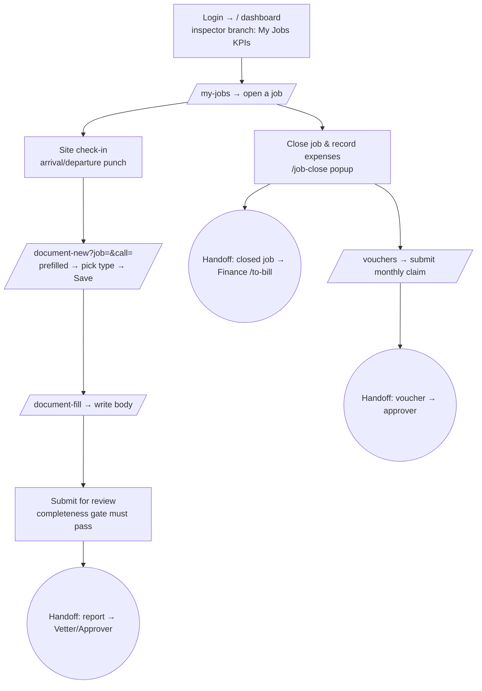

# Flow — INSPECTOR

The field engineer: goes to site, checks in, does the inspection, writes and submits
the report, then closes the job and files their expense/time voucher. **Phone-first,
patchy 4G** (offline queue). Least-privilege: no permissions, `idems` module only
(`access.php:464-465,360`); identified by having an `inspector_id`. The phone-first field UI
(My Jobs, site check-in, My Voucher, the stripped job view) triggers on `is_field_inspector()`
— **INSPECTOR or SR_INSPECTOR** (a senior inspector who also does field work), or any
non-management login seated on an inspector record (R7).

**Landing:** `/` → `views/dashboard.php` **inspector branch** (`dashboard.php:23-43`):
attendance widget + four KPI cards — Open jobs, Reports pending, Overdue, This month's
voucher — plus "All my jobs", "My Voucher", and the "Your pending tasks" panel.

**Walkthrough:**
1. Land on the personal dashboard; tap into **My Jobs** (`/my-jobs`) — job cards + a week/month schedule.
2. Open a job (`/job?id=`). *(An assigned inspector can open and act on their own job even without the jobs module, via the owner bypass, `ops.php:2384-2388`.)*
3. **Site check-in** — arrival/departure punch (`/site-checkin`, `job_detail.php:263`); the timesheet is built from these punches, geofenced if enabled (`job_detail.php:204-219`).
4. **New report** → `/document-new?job=&call=` (`job_detail.php:504`) — prefilled (client/vendor/PO/scope carried from the call), pick the report type, Save.
5. **Fill** → `/document-fill?id=` — write the body (dictation/AI-polish helpers available).
6. **Submit for review** → `/document-submit` (`idems.php:4392`). A completeness gate must pass first (`idems.php:4399-4409`); untouched text fields default to "NA".
7. **Close the job & record expenses** — the close popup on `/my-jobs` posts to `/job-close` (`my_jobs.php:220`), capturing the day's travel/food/lodging.
8. **Voucher** → `/vouchers` — a monthly draft is generated from the inspector's jobs (`voucher_generate`, `ops.php:4766`); submit it for approval. Travel & incidental expenses go here (the voucher is also the timesheet). **On a phone** the 12-column grid reflows into one card per day (`voucher_detail.php`, `@media ≤720px`): each cell becomes a "Label: value" line and inputs go full-width — the same inputs and the same live-total JS, just stacked so it is usable with a thumb instead of scrolling sideways.

**The job view is phone-first and stripped for the inspector.** The job screen
(`views/ops/job_detail.php`) is shared with coordinators and managers, so it carries
desk/commercial panels the field engineer neither needs nor can act on. For a user
whose role is `INSPECTOR` (`$fieldInspector`, `job_detail.php`) those panels are
**hidden, not merely collapsed**:
- the **communication log** (client/coordinator correspondence),
- the **"contract number not available"** notice (a commercial gap they cannot cause or clear — work is never actually blocked for it),
- the **client-bills** panel ("Charged to the client — bills required"),
- the whole **Expenses & profitability** fold (client-billable cost is the coordinator's; profitability is managers-only).

With nothing left on it, the **Money tab stops appearing** for the inspector, leaving
**Overview** (who to contact / where to go, full job details, client documents),
**Schedule & site** (site check-in, day-by-day plan) and **Reports & QA** (QAP,
report formats, hold/witness points, approval status). Their own travel and
out-of-pocket expenses are pointed to on the **Site check-in** panel ("Travel &
expenses go on your voucher"), so no inspector-facing guidance is lost by dropping
the Money tab. This is a **visibility** change only — no permission changes; a
coordinator, manager or anyone holding the money permissions still sees the full record.

**Decision points:**
- **Job close is gated by business rules:** report upload date required unless NOREPORT (`ops.php:5581`); the chargeable bill must be on file (`ops.php:5602`); both site check-ins must exist or the close is bounced (a manager can override with a recorded reason that dents the rating, §WO-9 `ops.php:5609-5628`).
- **Report path forks on the vetting gate:** Submit → `VETTING` (to a vetter first) if the gate is on, else straight to the approval chain (`idems.php:4428-4436`).

**Handoff points (named):**
- **Inspector → Vetter/Approver:** on submit the report leaves the inspector and shows on the approver's dashboard "Reports awaiting your approval" and their pending tasks (`dashboard.php:253`, `ops.php:6336`). A rejected report returns as "to fix & resubmit" (`ops.php:6370`).
- **Inspector → Report issuer:** once approved, an `idems.finalize` holder sees "to issue" (`ops.php:6342`) and produces the locked PDF.
- **Inspector/Coordinator → Finance:** closing the job (`closed_flag=1`) makes it appear in Finance's **/to-bill** (`booksui.php:123`).
- **Inspector → Voucher approver:** submitting the voucher surfaces "vouchers to approve" (`ops.php:6323`).

**Click-count — fill & submit a report:** open job (1) → New report → Save (2) →
Fill report (1) → write body + Save (1) → Submit for review (1) = **~6 clicks** (form
and body pre-populated from the job).
