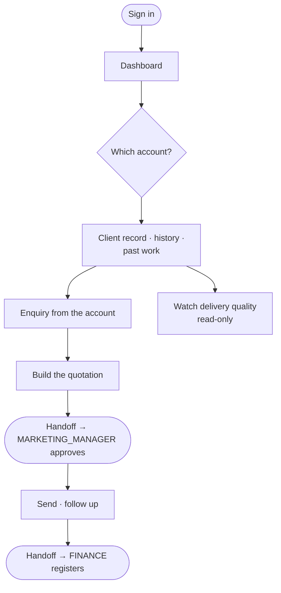

# Flow — `KEY_ACCOUNTS_MANAGER`

**Device:** laptop and phone, often at the client's office.
**Landing screen:** the Dashboard — money panels, no operational widgets.

The farmer. Owns the handful of clients that make up most of the revenue, and is
measured on keeping and growing them.

---

## ⚠ Identical permissions to `BUSINESS_DEV_MANAGER`

The two roles **share a single branch in the code** — for module access
(`phpapp/lib/access.php:273`) and for fine-grained permissions
(`phpapp/lib/access.php:381-382`). They are two business roles with one permission
set.

That is reasonable today. It means any future change to one **silently changes the
other**, which is worth knowing before someone edits either.

---

## Main flow

### Walkthrough

1. **Sign in.** No operational widgets, same as the BDM.
2. **Work your named accounts.** You hold view access on Clients, so the history is
   there.
3. **Raise enquiries and quotations** as repeat work comes up.
4. **Approval goes elsewhere.** You cannot approve your own quotation.
5. **Watch delivery.** You have read-only sight of Dashboards — enough to know
   whether your account is being served well, not enough to intervene.

### 🔁 Handoff points

Identical to `BUSINESS_DEV_MANAGER`: you → Marketing Manager (approval) → Finance
(registration) → Branch Manager (endorsement) → coordinator (calls).

### Click count

**Task: raise a repeat quotation for a named account.** Sales (1) → Quotations (1) →
new (1) → pick the client (1) → fill the lines → save (1) = **≈ 5 clicks plus the
line items**, counted as discrete clicks on the shortest path.

### Cannot do

Approve your own quotation · reach operations · see salary or profitability.
