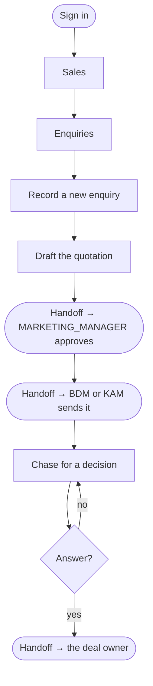

# Flow — `MARKETING_EXECUTIVE`

**Device:** desk, laptop.
**Landing screen:** the Dashboard — and it is nearly empty.

The junior in the sales office. Types up enquiries, drafts quotations for someone
else to check, and chases customers for a decision.

---

## The narrowest role in the application

Two fine-grained permissions: `crm.quote.create` and `crm.followup.manage`
(`phpapp/lib/access.php:386`). That is the whole list, and the restraint is correct.

**Navigation:** Dashboard · Search records · **Sales**. Nothing else. No Insights —
this is the only desk role holding **no dashboard permission at all**. No Money, no
Directory, no Admin.

---

## Main flow

### Walkthrough

1. **Sign in.** Sales is effectively your only destination.
2. **Record enquiries** as they arrive.
3. **Draft quotations.** `crm.quote.create` is yours.
4. **You cannot send it.** `crm.quote.send` is deliberately withheld — you draft,
   somebody else sends (`phpapp/lib/access.php:386`).
5. **Chase.** `crm.followup.manage` is yours, and it is the part of the job that
   actually moves deals.

### 🔁 Handoff points

- **You → the Marketing Manager.** *A drafted quotation needing approval.*
- **You → the BDM or KAM.** *An approved quotation to send.*
- **You → the deal owner.** *The customer's answer.*

### Click count

**Task: record an enquiry and draft a quotation from it.** Sales (1) → Enquiries (1)
→ new (1) → fill and save (1) → raise quote (1) → fill the lines → save (1) =
**≈ 6 clicks plus the line items**, counted as discrete clicks on the shortest path.

### Cannot do

Send a quotation · approve one · see any money figure · reach operations · open a
dashboard.
