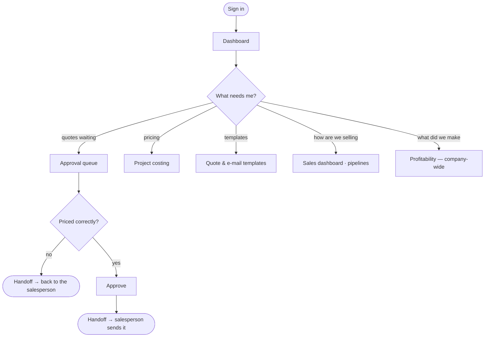

# Flow — `MARKETING_MANAGER`

**Device:** desk, laptop.
**Landing screen:** the Dashboard — money panels, no operational widgets.

Runs the commercial function above the individual salespeople. Owns pricing
discipline, the quotation templates, and the approval of deals needing a second
signature.

---

## Main flow

### Walkthrough

1. **Sign in.** Scope is `offices => 'ALL'`, `sbus => 'ALL'`
   (`phpapp/lib/access.php:384`) — the whole company.
2. **Work the approval queue.** You uniquely hold `crm.quote.approve` among the sales
   roles. This is the control that stops a salesperson approving their own deal.
3. **Check the pricing.** Project costing builds team cost into man-day and lump
   rates with a margin.
4. **Own the templates.** `crm.template.manage`.
5. **Watch the funnel.** Sales dashboard, pipelines, conversion by stage.
6. **Look at profitability.** You hold `data.profitability` and `data.revenue`.

### 🔁 Handoff points

- **Salespeople → you.** *Quotations needing approval.*
- **You → the salesperson.** *Approved, or sent back with a reason.*
- **You → Finance.** *Indirectly — an accepted quote becomes theirs to register.*

### Click count

**Task: approve a quotation.** Dashboard → the quotes-to-approve card (1) → open the
quote (1) → **approve** (1) = **≈ 3 clicks**, counted as discrete clicks on the
shortest path, excluding review time. The count and the list were made to agree in
commit `fd0c182`.

### Cannot do

Touch any call, job or voucher · manage users or settings · see salaries.

> ⚠ **This role has company-wide profitability** — `data.profitability` plus
> `data.revenue`, scoped `ALL`/`ALL` (`phpapp/lib/access.php:384`). That is broader
> financial reach than the Operation Manager who actually delivers the work.
> Defensible for a commercial director; worth an explicit decision rather than an
> inherited default. In `99-gaps-and-risks.md`.
