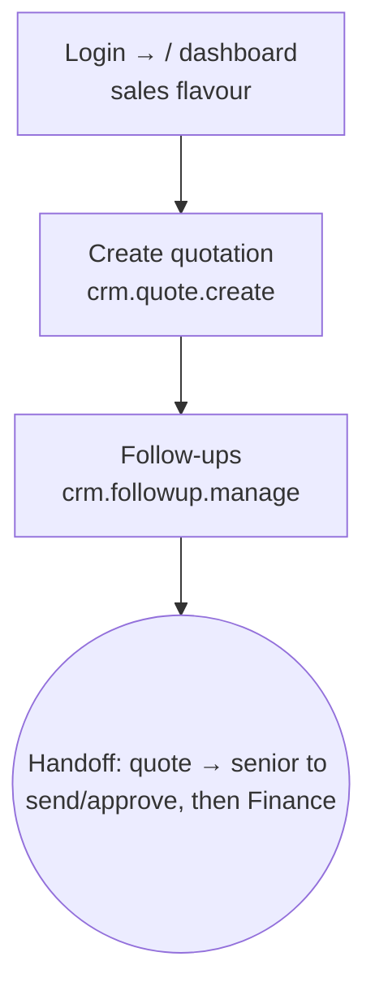

# Flow — MARKETING_EXECUTIVE

Junior sales: creates quotes and does follow-ups within their own office. Desk/mobile.
Scope OWN/OWN. Permissions: `access.php:460-461`.

- **Landing:** `/` dashboard, sales flavour (via `crm.quote.create`). Sees Sales and Directory (clients); **no Insights** (no `mod.reports.view`).
- **Can:** create/edit inquiries & quotes, manage follow-ups; view orders/sales-reports/clients.
- **Cannot:** send or approve quotes, touch operations or money, manage users.
- **Handoff:** a drafted quote is sent/approved by a senior sales role, then registered by Finance.
- Most common task = draft a quote (through the quote form).
