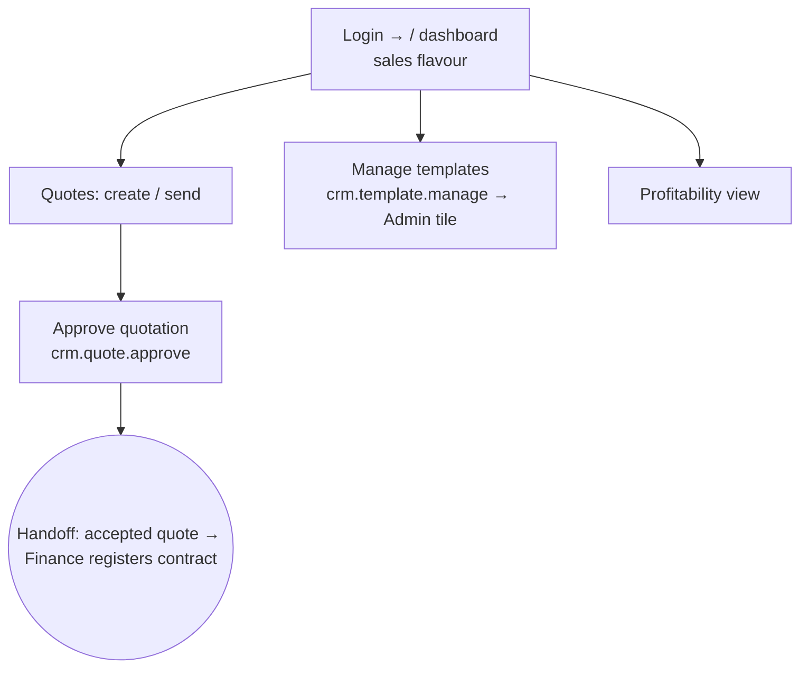

# Flow — MARKETING_MANAGER

Senior sales/marketing: can **approve** quotations and manage templates across all
offices. Desk-first. Scope ALL/ALL. Permissions: `access.php:458-459`.

- **Landing:** `/` dashboard, sales flavour. Sees Sales (incl. pre-order checklist via `crm.quote.approve`, `areas.php:51`), Money (profitability), Insights, Directory, and the Admin **Document-templates** tile (via `crm.template.manage`, `areas.php:222`).
- **Can:** the full quote lifecycle incl. **approve**; manage quote/e-mail templates; see revenue/profitability.
- **Cannot:** run operations, register contracts, manage users/settings.
- **Handoff:** accepted quote → Finance's "contracts to register".
- **Quirk:** the Admin area appears for this role **only** because of the templates tile — no user/settings access. See `99-gaps-and-risks.md`.
- Most common task = approve a quotation (open quote → Approve, ~2 clicks).
