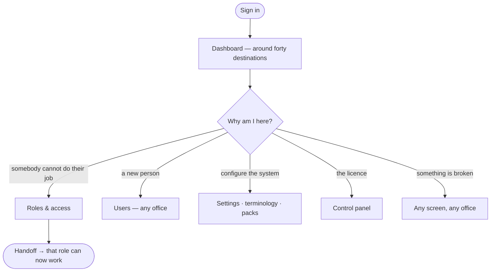

# Flow — `MASTER_ADMIN`

**Device:** desk, laptop. Infrequent — this is who you become to fix something nobody
else can fix.
**Landing screen:** the Dashboard, everything visible.

---

## Main flow

### Walkthrough

1. **Sign in.** The rail carries around forty destinations, which is why it has a
   search box and folding groups (`phpapp/views/layout_top.php:75-84`).
2. **Edit what a role may do.** Settings → Roles & access. **You are the only role
   that can** — the check asks for the master bypass flag, not a permission
   (`phpapp/lib/ops.php:2412`). Note that `ADMIN`, despite holding every permission,
   cannot reach this screen.
3. **Manage anyone.** `users.manage.global`.
4. **Configure.** Settings, terminology, industry packs, service scope.
5. **Fix anything.** You bypass every permission check (`phpapp/lib/access.php:452`).

### The one thing you cannot do, and it is deliberate

**Open a module the company has not bought.** The licence check runs *before* your
bypass (`phpapp/lib/access.php:452-455`). The reasoning in the code is sound: an
unbought module is not a permissions question, and a Master Admin who could open it
would be looking at a screen the customer cannot be supported on.

### 🔁 Handoff points

- **Everyone → you.** *Anything nobody else can do.*
- **You → everyone.** *A permission change takes effect on their next request.*

### Click count

**Task: grant a permission to a role.** Admin (1) → Roles & permissions (1) → pick
the role (1) → tick the permission (1) → save (1) = **≈ 5 clicks**, counted as
discrete clicks on the shortest path.

### The real control on this role is organisational

Nothing is withheld by permission. Give it to as few people as possible and rely on
the audit log rather than on restrictions.

> ⚠ **Audit for the `ADMIN` role.** It is a second Master Admin in all but name —
> anyone carrying it has your power without appearing to.
>
> ✅ It used to be the fallback for any role the system did not recognise, so a typo'd
> role had it too. That is fixed (`phpapp/lib/access.php:440`): an unrecognised role
> now grants nothing and is logged. **Before deploying that change, find those
> accounts** — they have been running as administrators and will now have no access
> at all. See `99-gaps-and-risks.md` risk 1.
