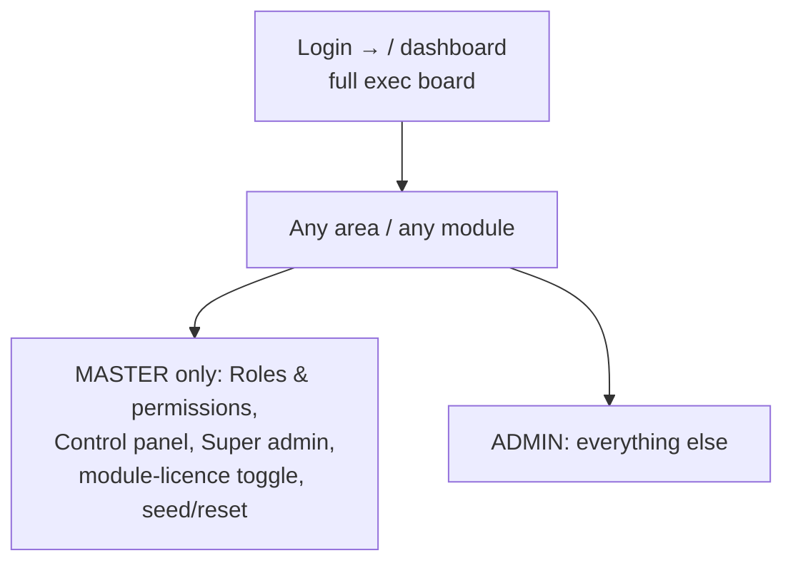

# Flow — MASTER_ADMIN and ADMIN

These two are documented together because they share the same defaults (all
permissions, all modules, ALL/ALL scope — `access.php:437-438,328`); the difference is
the **master bypass**.

## MASTER_ADMIN
- **Who:** the installation's root key (`is_superuser`). Meant to be one/few.
- **Can:** everything — `can()` returns true for all (`access.php:530`); admin-only tiles show (Roles & permissions `areas.php:209`, Control panel `:226`, Super admin); module-licence toggle and seed/reset are master-only (`ops.php:6812,2531+`).
- **Must never:** be routinely restricted or used for daily data entry — it has no guardrail. Keep it as the recovery key (see the recovery note in `99-gaps-and-risks.md`).

## ADMIN (legacy)
- **Who:** a full administrator that is **not** the super-user, so it is governed by permissions and **can be narrowed**. Also the fallback role for an unknown role string (`access.php:483`).
- **Can:** all areas and modules by default; but `is_master()`-only tiles (Roles & permissions, Control panel) are hidden unless also super-user.
- **Must never:** be assumed unbreakable — a per-user override or role change can strip it (this caused the recent lock-out). Always keep a real `MASTER_ADMIN` as the recovery key.
- **Recovery (if locked out with no master):** `reset-admin.txt` in the app folder, or `config.local.php` admin password change, or a phpMyAdmin `UPDATE users SET is_superuser=1 …` — see `99-gaps-and-risks.md`.
