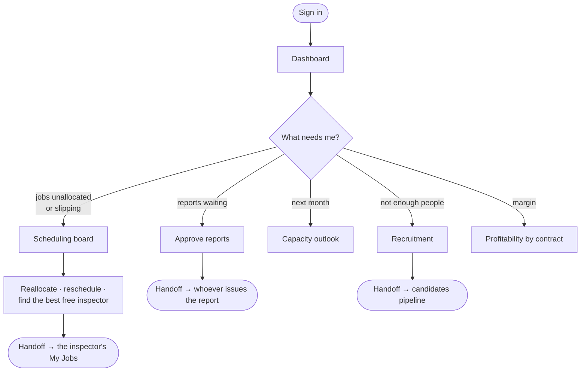

# Flow — `OPERATION_MANAGER`

**Device:** desk, laptop, several times a day.
**Landing screen:** the standard Dashboard.

Runs the delivery engine one level under the Branch Manager. Owns the schedule as a
whole rather than individual calls.

---

## Main flow

### Walkthrough

1. **Sign in.** You hold the operations and utilisation dashboards, plus revenue and
   profitability — but **not salary** (`phpapp/lib/access.php:375`). You can see what
   a contract made without seeing what individuals are paid.
2. **Work the schedule.** Your job is the shape of the whole month, not one call.
   Reassignment, rescheduling and the assignment console are all open to you.
3. **Approve reports.** You hold `idems.finalize`. As with every approver, you cannot
   also be the one who issues what you approved (commit `6d7c7da`).
4. **Look ahead.** Capacity outlook tells you whether next month's booked work fits
   the people you have.
5. **Fix the shortfall.** You hold edit rights on Hiring, so a capacity gap becomes a
   requisition without leaving the area.
6. **Watch the margin.** Profitability by contract is open to you precisely so you can
   be held to it.

### 🔁 Handoff points

- **The coordinator → you.** *Anything they cannot resolve — a job nobody is free
  for, a client escalating.*
- **You → the inspector.** *A reallocated job moves to the new inspector's My Jobs
  immediately.*
- **You → the Branch Manager.** *Margin problems and anything needing money you do
  not control.*

### Click count

**Task: reassign a job to a different inspector.** Dashboard → open jobs (1) → open
the job (1) → reassign (1) → pick the inspector (1) → save (1) = **≈ 5 clicks**,
counted as discrete clicks on the shortest path, excluding any competence or
conflict warning that sends you back to re-pick.

### Voucher approval is yours

Since risk 3 was fixed, approving an engineer's monthly claim belongs to **you, the
Branch Manager, or that engineer's named reporting manager**
(`VOUCHER_APPROVER_ROLES`, `phpapp/lib/ops.php:4870`) — not to the coordinator who
prepared it. Nobody may approve a claim they submitted themselves, you included.

Where an engineer has no reporting manager set on their record, you are the only
route besides the Branch Manager. Setting `reports_to_id` under Masters → Engineers
spreads that load.

### Cannot do

Manage users · change settings · see salaries · delete calls · register contracts.
