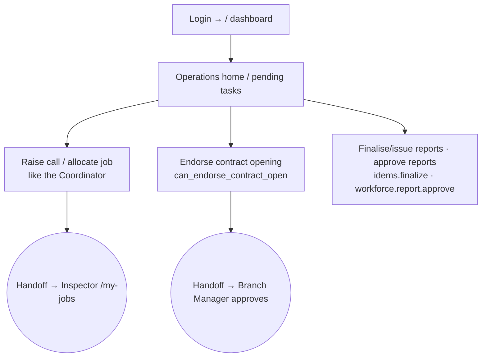

# Flow — OPERATION_MANAGER

Head of delivery for a branch/unit: owns getting calls scheduled, jobs allocated and
reports out. Desk-first. Scope **OWN/OWN**. Permissions: `access.php:448-450`.

- **Landing:** `/` dashboard (ops emphasis). Does the full coordinator operational flow (raise call, allocate, close — see `coordinator.md`) plus management actions.
- **Endorses** contract openings (`can_endorse_contract_open()`, `contracts.php:473-477`) → handoff to the Branch Manager to approve.
- **Approves reports** (`workforce.report.approve`) and can **finalise/issue** (`idems.finalize`) — subject to approver≠issuer (`idems.php:4460`).
- Sees profitability (`data.profitability`) and revenue, **not** salary or credit.
- **Must never:** manage users/settings; see salary/credit figures.
- Most common task = same as coordinator (raise call ~4 clicks / allocate ~3 clicks).
