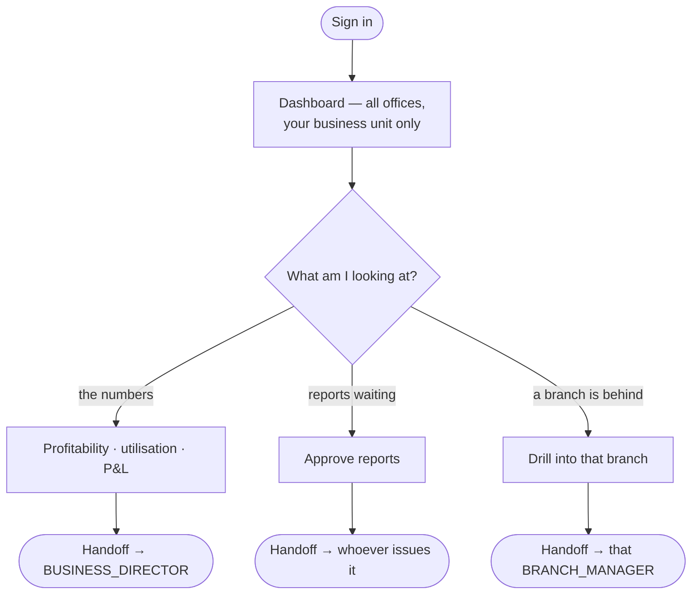

# Flow — `SBU_HEAD`

**Device:** desk, laptop. Weekly and monthly rather than daily; travels.
**Landing screen:** the Dashboard, all four panels.

Runs one line of business across **every** branch. Where a Branch Manager asks "how
did Vadodara do?", you ask "how did welding inspection do, everywhere?"

---

## Main flow

### Walkthrough

1. **Sign in.** Your scope is `offices => 'ALL'`, `sbus => 'OWN'`
   (`phpapp/lib/access.php:367`) — every office, one business unit. The exact mirror
   of the Branch Manager.
2. **Read the numbers.** All four dashboards and all four money permissions are yours.
3. **Approve reports.** Despite being read-only on every module, you hold
   `idems.finalize` and `workforce.report.approve` (`phpapp/lib/access.php:367`) —
   a business-unit head signing off technical work is exactly what an accreditation
   body expects.
4. **Drill into a branch.** You can see it; fixing it belongs to its Branch Manager.

### 🔁 Handoff points

- **Branch Managers → you.** *Their branch's contribution to your unit.*
- **You → the Business Director.** *Your unit's performance.*
- **You → a Branch Manager.** *Anything needing operational action.*

### Click count

**Task: check this month's margin for your business unit.** Dashboard → Money (1) →
Profitability (1) → set the period (1) = **≈ 3 clicks**, counted as discrete clicks on
the shortest path.

### Cannot do

Create or edit any operational record · manage users · change settings · reach
another business unit.

> ✅ **"Read-only on every module" is now true.** This role used to sit in the
> management tier, which the job and voucher routes mistook for operational
> authority. `OPS_ROLES` (`phpapp/lib/access.php:55`) now names only the roles that
> actually run operations, and this is not one of them — so you can no longer
> allocate, edit or reassign a job, and the voucher register refuses you. Approving
> **reports** is unaffected: that comes from `idems.finalize` and
> `workforce.report.approve`, which are yours by right. See `99-gaps-and-risks.md`
> risk 4.
>
> ⚠ **One thing survives.** You can still *close* a job, because the close route
> checks only `mod.jobs.view`. That is risk 5, still open.
