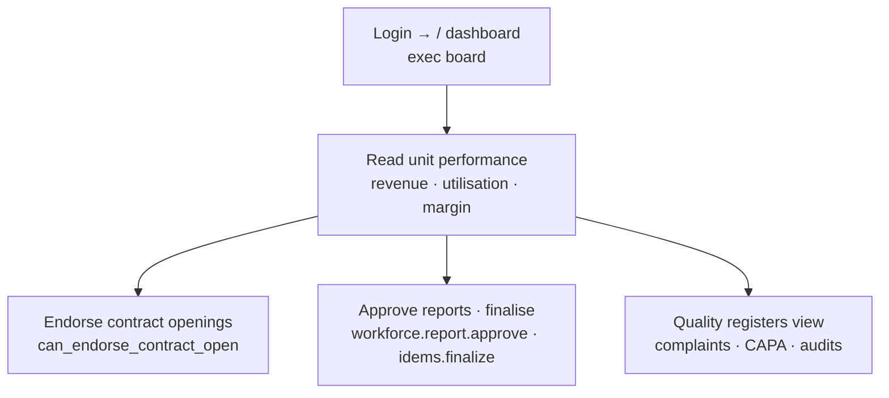

# Flow — SBU_HEAD (Business Unit Head)

Owns one business unit's numbers and sign-offs across branches. Desk-first. Scope
**offices ALL, sbus OWN** (`access.php:441-442`) — sees every branch but only their unit.

- **Landing:** `/` exec dashboard (all `data.*` figures, `access.php:441`).
- **Can:** see all money figures for their SBU; endorse contract openings; approve and finalise reports; view a broad module set (`access.php:330-331`).
- **Cannot:** manage users or settings; act outside their SBU's data.
- **Handoffs:** endorses contracts → Branch Manager approves; approves/issues reports from inspectors.
- Most common task = review dashboards + approve reports (~3 clicks to approve a report).
