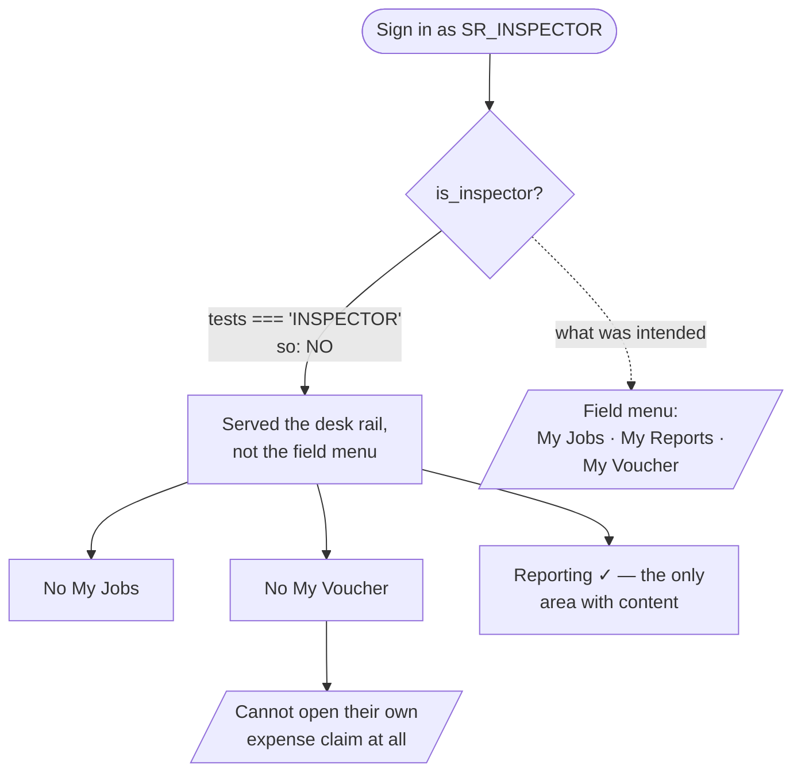
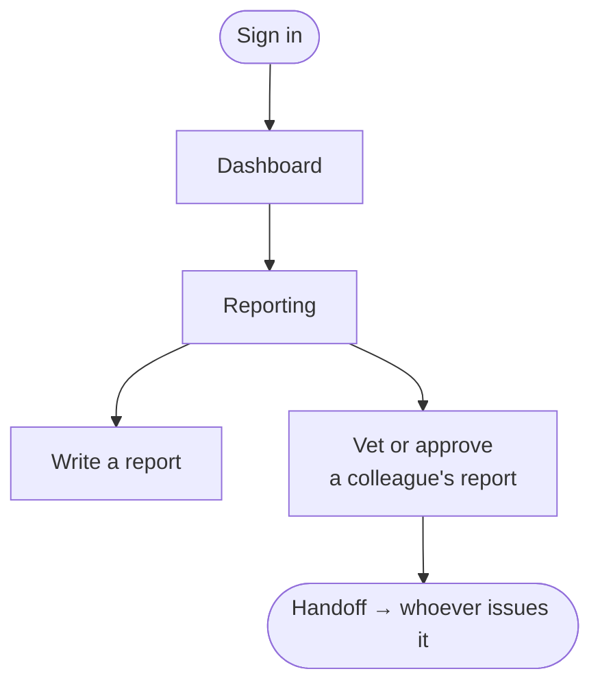

# Flow — `SR_INSPECTOR`

**Intended device:** phone, in the field.
**Actual device served:** the desk interface.

---

## ⚠ This role is declared but not wired up

Do not assign anyone to it yet.

The role exists in the role list (`phpapp/lib/access.php:18`) and has sensible
defaults (`phpapp/lib/access.php:391-395`) — and **no other file in the application
ever tests for it.** A search across every PHP file finds it only in `access.php`, in
an unrelated list of job *designations* (`phpapp/lib/ops.php:31`), and in seed data.

### What that means in practice

| What should happen | What actually happens | Why |
|---|---|---|
| Gets the phone-first field menu | Gets the desk area rail | `is_inspector()` tests `=== 'INSPECTOR'` only (`phpapp/lib/ops.php:549`) |
| Sees only their own records | Sees their whole office's records | the `self` scope flag tests `=== 'INSPECTOR'` too (`phpapp/lib/access.php:439`) |
| Can open their own monthly voucher | **Cannot open a voucher at all** | the register offers the "mine" path to `INSPECTOR` and the desk path to the management tier; a Senior Inspector is neither (`phpapp/lib/ops.php:4857-4863`) |

**That third row is the serious one.** Promote your best inspector to Senior
Inspector and they lose access to their own expense claim.

This is not recorded in `phpapp/PENDING.md`, so it does not appear to be a deliberate
omission.

---

## What does work today

1. **Reports.** Edit rights on the IDEMS module (`phpapp/lib/access.php:285`).
2. **Approve reports.** `idems.finalize` (`phpapp/lib/access.php:395`) — and as with
   every approver, you cannot also issue what you approved (commit `6d7c7da`).

### Click count

**Task: approve a colleague's report.** Dashboard → Reporting (1) → the report
register (1) → open the report (1) → approve (1) = **≈ 4 clicks**, counted as
discrete clicks on the shortest path, excluding reading time.

---

## Recommendation

**Leave senior people on `INSPECTOR`.** Naming someone as an approver works today
without a role change — approval works by being the *resolved approver* on the report
type, not by holding this role (`phpapp/lib/access.php:391-395`). Use this role only
after the three gaps above are fixed. See `99-gaps-and-risks.md`.
