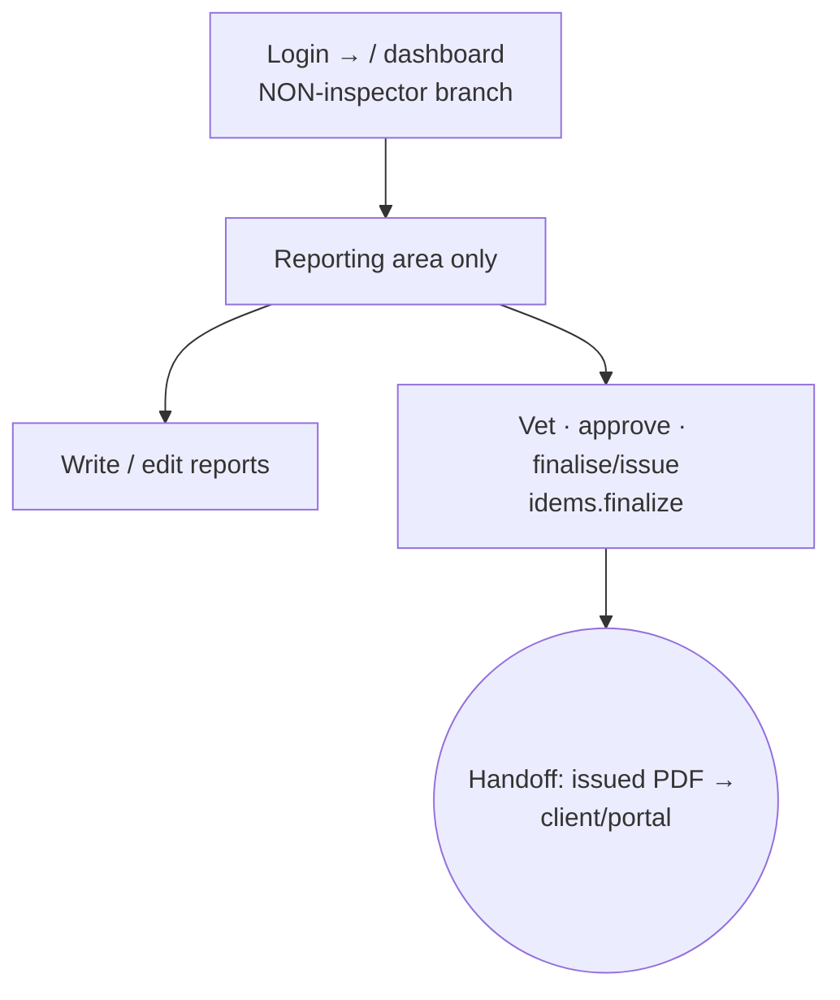

# Flow — SR_INSPECTOR (Senior Inspector)

An experienced inspector who also acts as an approver / can finalise reports.
Phone in the field + desk for approvals. Permissions: `idems.finalize` only
(`access.php:466-470`); `idems` module edit (`:360`).

- **Landing:** `/` dashboard — but the **non-inspector** branch (no "My Jobs" KPIs).
- **Sees:** the normal area rail with **only Reporting** (from `mod.idems.view`) + Dashboard/Search — **not** the inspector "My work" menu.
- **Can:** create/edit reports, vet, act on approval steps, and finalise/issue (`idems.finalize`) — subject to approver≠issuer (`idems.php:4460`).
- **⚠ Important quirk:** because `is_inspector()` matches the literal `INSPECTOR` only (`ops.php:549`), a Senior Inspector does **not** get the phone-first inspector home, My Jobs, site check-in, or My Voucher menu that a plain INSPECTOR gets. This is almost certainly unintended — see `99-gaps-and-risks.md` (ranked). Until fixed, a Senior Inspector who also does field work is missing their field UI.
- Most common task = approve/finalise a report (~2-3 clicks from the pending-tasks panel).
