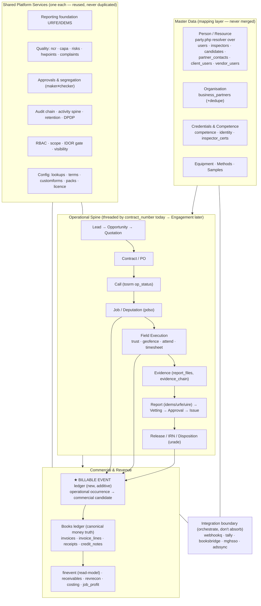

# 03 — Target Architecture (Phase D)

Defines the ITOP target as it maps onto the **existing** EXAACT tables and
engines, plus the additive migration path to get there. Every element below is
either KEEP/EXTEND/CONNECT of something that exists, or a small named BUILD.
Nothing here removes or rewrites a working subsystem. Read after
`01-current-state-inventory.md` and `02-gap-and-reuse-map.md`.

Design law (inherited, non-negotiable — `docs/phase-2/02-canonical-application-model.md`
§79/80): **read through the named canonical engine; converge via read-views and
mapping layers, never table merges; migrations are additive and idempotent.**

---

## 1. The layered target (one platform, four layers)



The only structurally new object is the **Billable Event ledger** (★). Everything
else is a KEEP/EXTEND/CONNECT of a named existing engine.

---

## 2. Person / Resource master (EXTEND — no table merge)

**Target:** one human, seen whole, moving through lifecycle states
(Lead → Prospect → Candidate → … → Mobilizing → Deployed → Inspector → Available →
Demobilized → Redeployment pool → Alumni) while **history is preserved and records
are never duplicated.**

**How, on existing code:** keep the six backing stores exactly as they are; keep
`lib/party.php` as the resolver (`party_key`, `party_records_for`,
`party_roles_of`, `party_render_also`). Add a **read-time lifecycle projection**
`person_state(kind,id)` that derives the current state from the records that
already exist (has a candidate row in stage X → "Candidate"; linked to an active
job → "Deployed"; `inspectors.status` → "Available/Inactive"; etc.). No state is
stored redundantly; the projection is the single place that names it.

- **Additive only:** optionally one nullable `party_key` column cached on each
  store (via `ensure_column`) to speed resolution — never required, never a merge.
- **Directive satisfied:** "use lifecycle transitions, don't duplicate a person
  into another database." **Law satisfied:** mapping layer, not a table merge.
- **Classification:** EXTEND. No new permission, no destructive migration.

---

## 3. Operational spine & the Engagement question (KEEP now, DEFER the entity)

**Today:** the spine is real and threaded by the **`contract_number` string**;
`engagement()` (`lib/engagement.php`) is a read-only grouping over it. The
first-class Engagement entity is deliberately deferred (§80).

**Target path (non-destructive, staged):**
1. **Now:** keep `contract_number` as the thread. Fix the *disconnects* that make
   the spine look broken — vestigial `calls.status=CLOSED`, `jobs.stage`, and the
   metrics that read them (see `02` §3 / R10). These are REFACTOR, additive.
2. **Later (only if the string proves limiting):** introduce a first-class
   `engagements` table **additively** — add a nullable `engagement_id` to
   calls/jobs/quotations/invoices via `ensure_column`, **backfill from
   `contract_number`**, and **dual-read** (prefer id, fall back to string) until
   parity is proven. Never drop `contract_number`. Classification: **DEFER →
   BUILD**, sequenced *after* the Billable Event slice.

---

## 4. ★ Billable Event ledger (the one strategic BUILD)

### 4.1 Why it is genuinely new
`finevent.php` is a read-model whose earliest event is **QUOTE_ACCEPTED /
INVOICE_ISSUED** — it cannot see the operational occurrence that *earns* a charge.
"Billable" today is a **value on the call/job** (`calls.billable_value/rate/qty/
basis` → carried to the job → read by `books_billable_jobs()` at invoice time).
That covers inspection/deputation jobs only, is derived on the fly, and has **no
place to hold "approved to bill but not yet invoiced", disputes, or non-job
sources** (report issue, approved OT, candidate joined, milestone). The directive's
core promise — *operational work must never disappear before reaching billing* —
needs a **persisted bridge**.

### 4.2 What it is (and is not)
- **Is:** an additive ledger of *billable candidates*, each row bound to the
  operational occurrence that produced it, with a small lifecycle and a link to the
  invoice line that eventually consumes it.
- **Is not:** a second money truth. **The books ledger stays canonical for money.**
  Once a billable event is invoiced, its amount is **reconciled against the
  `invoice_lines` row** it maps to (like §29 keeps legacy vs ledger honest), so it
  can never drift.

### 4.3 Additive schema sketch (idempotent — `CREATE TABLE IF NOT EXISTS`)
```
billable_events
  id
  source_module     -- 'idems' | 'job' | 'timesheet' | 'recruit' | 'call'
  source_kind       -- 'REPORT_ISSUED' | 'IRN' | 'JOB_CLOSED' | 'TIMESHEET_APPROVED'
                    --  | 'OT_APPROVED' | 'CANDIDATE_JOINED' | 'MILESTONE'
  source_id         -- id in the source table (report_docs.id, jobs.id, …)
  party_id          -- client (business_partners.id)
  contract_number   -- the existing spine thread (engagement_id later, additive)
  office_id, sbu    -- for scope_clause() + roll-ups
  service_type      -- from existing lookups
  qty, unit         -- reuse charge_unit lookup / billable_basis vocabulary
  rate, rule        -- rate source + calc rule reference
  amount            -- qty*rate (advisory until invoiced; then = invoice_line)
  status            -- PENDING → APPROVED → BILLED → (CANCELLED | DISPUTED)
  invoice_line_id   -- set when consumed by books_line_add (nullable)
  created_at, created_by, approved_at, approved_by
  UNIQUE(source_module, source_kind, source_id)   -- idempotent: one event per occurrence
```
One bootstrap probe line in `index.php` (`SELECT id FROM billable_events LIMIT 1`)
so uploads auto-migrate, per the README recipe.

### 4.4 Lifecycle (new object → must be added to `docs/03-object-lifecycles.md`)

```mermaid
stateDiagram-v2
  [*] --> PENDING : derived from an approved operational occurrence (idempotent upsert)
  PENDING --> APPROVED : commercial review (finance.reconcile / existing gate)
  APPROVED --> BILLED : consumed into an invoice line (books_line_add sets invoice_line_id)
  PENDING --> CANCELLED : occurrence reversed / not chargeable (reason)
  APPROVED --> DISPUTED : client dispute (reason) --> APPROVED on resolution
  BILLED --> [*] : reconciled to invoice_lines; amount is now the ledger's
```

Statuses and the one new permission (if any beyond the existing
`finance.reconcile`) are proposed here and **confirmed with the user before code**,
per `CLAUDE.md` and the guardrails.

### 4.5 How it connects (all reuse)
- **In (derivation):** thin idempotent hooks at existing approval points — report
  **issue** (`idems` finalize), **job close** (already the `books_billable_jobs`
  trigger, now generalized), **timesheet/OT approval** (`pdso`/`timesheet`),
  **candidate joined** (`recruit`, reusing the placement-fee path). Each hook is an
  upsert keyed by the UNIQUE constraint — safe to run more than once.
- **Out (invoicing):** `books_billable_jobs()` becomes `books_billable_events()`
  (superset), so the existing invoice flow lists *all* billable candidates, not
  just closed jobs; consuming one into `books_line_add()` stamps `invoice_line_id`
  and flips status → BILLED.
- **Read surfaces:** feeds the Commercial cockpit (unbilled / billing-ready /
  disputed) and the §27 money timeline as a new pre-invoice band — reusing
  `finevent`'s renderer, not a new one.
- **Classification:** BUILD (additive, reconciled). Highest-value new work.

---

## 5. Mobilization readiness & Gate Pass (CONNECT + small BUILD)

**Target:** one view answering *"what is blocking this person from mobilizing?"*
composed from gates that already exist — competence (`work.assign` gate), identity
docs + `site_doc_requirements`, medical/police/safety as **configurable checklist
items**, PPE/asset (`assets`), travel, and a gate-pass step.

- **CONNECT:** a readiness read-model over `dep_checklist` (pdso) + competence +
  identity + `site_doc_requirements`, returning per-requirement status.
- **Configurable:** checklist definitions via `customforms` + `decisionrules` +
  lookups — no hardcoded client rules (directive Part 3).
- **Small BUILD:** a minimal `gate_pass` request/approval record if none exists —
  additive, one lifecycle added to the lifecycles doc.
- **Sequenced:** Priority 2 (after Competence vault, before/with Billable Event's
  timesheet source).

---

## 6. Shared services & integration boundary (KEEP / INTEGRATE)

- **Reuse, never duplicate:** URFE/IDEMS (reporting), the approvals+segregation
  pattern, the audit chain + activity spine + retention + DPDP, RBAC/scope/IDOR,
  and the config engines (lookups/terms/customforms/packs/licence).
- **Orchestrate, don't absorb:** payroll and accounting posting, job boards,
  messaging, biometrics — all through the existing integration layer
  (`webhookq` generic outbox with retry/backoff, `tally`, `booksbridge`,
  `adssync`, `mghsso`). EXAACT remains the operational brain; specialist systems
  stay external. (Directive Part 18/23 AVOID list respected — no proprietary
  payroll calc, no generic ERP/LMS/marketplace/BIM.)

---

## 7. Additive migration strategy (how "no destruction" is enforced mechanically)

1. **New tables:** `CREATE TABLE IF NOT EXISTS` in the owning engine's migrate();
   **new columns:** `ensure_column($table,$col,$def)` (adds only if missing).
2. **Bootstrap probe:** one `SELECT` against each newest table/column in
   `index.php` so a single uploaded file auto-upgrades a live MySQL DB (README §4).
3. **Never** drop, rename, or repurpose a live column in a migration. Convergence
   of dual-truth (R9 cost, §29 invoice snapshot) is done by **dual-read + a
   reconciliation check**, and a reader is switched **only after** reconciliation
   proves parity.
4. **Docs in lockstep:** any new status → `docs/03-object-lifecycles.md`; any
   permission/module change → `docs/02-permission-matrix.md`; both in the same
   commit as the code.
5. **Regression before commit:** `phpapp/tests/` + `php -l` on changed files;
   positive/negative/boundary/offline/permission cases per directive Part 27.
6. **Reversibility:** every slice is rollback-able by turning its module gate off
   and/or dropping its additive table — no existing data touched.

---

## 8. Implementation roadmap (Phase F sequencing)

| # | Slice | Class | New tables/cols (additive) | Reuses | Depends on |
|---|---|---|---|---|---|
| **P1** | Technical Competence / Credential Vault | EXTEND | requirement-set config (or `custom_forms`) | competence, identity, inspector_certs, lookups | — |
| **P2** | Mobilization readiness + Gate Pass | CONNECT +sm. BUILD | `gate_pass` (minimal) | pdso, competence, identity, customforms | P1 |
| **P3** | Inspection execution polish (offline sync-state, QAP packs) | KEEP/IMPROVE | none | idems, urfe, uire, PWA | — |
| **P4** | ★ Billable Event ledger + Commercial cockpit | BUILD | `billable_events` | idems, jobs, timesheet, recruit, books, finevent | P1–P2 (timesheet/competence sources) |
| **P5** | Consolidation: vestigial statuses, cost/invoice dual-truth | REFACTOR | none (dual-read) | ops, costing, books, §29 | ongoing |
| **P6** | Product-package presets + role cockpits | CONFIGURE | none | packs, licence, module gates, area homes | any |
| **Later** | First-class Engagement entity | DEFER→BUILD | `engagements` + nullable `engagement_id` | engagement, spine | P4 |

Each row becomes its own change-control record (Part 25) and its own reversible
commit. **No code until the row's record is approved.**

---

## 9. Open decisions for you (before Phase F)

1. **Billable Event ownership:** confirm it reuses `finance.reconcile` for the
   APPROVED step, or whether you want a dedicated `billing.approve` permission
   (new permission → needs your sign-off).
2. **First slice:** confirm we start at **P1 (Competence vault)** as recommended,
   or reorder (e.g. Billable Event first because it's the headline differentiator —
   at the cost of needing its timesheet/competence sources stubbed).
3. **Engagement entity:** confirm it stays **deferred** until after P4 (recommended),
   or you want it planned earlier.
